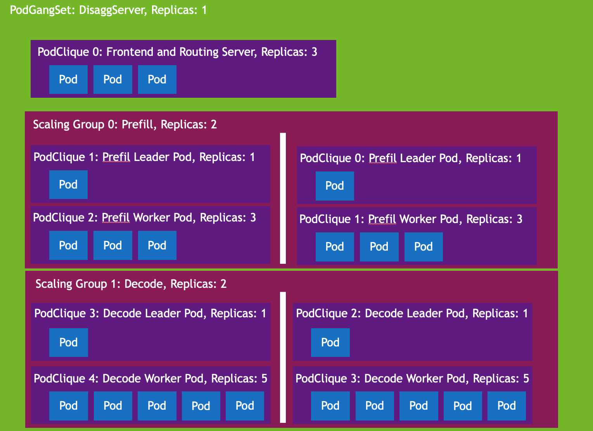
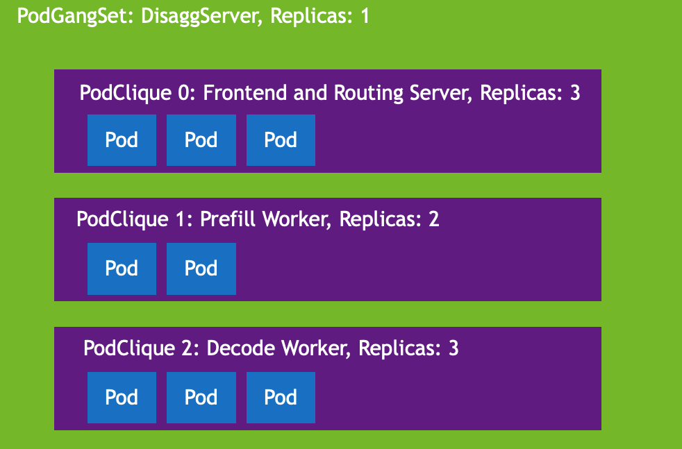
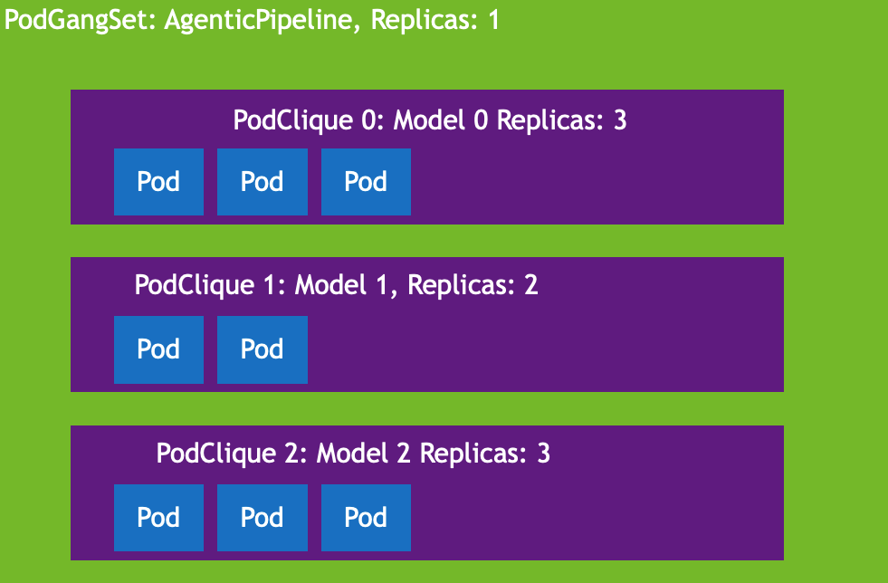
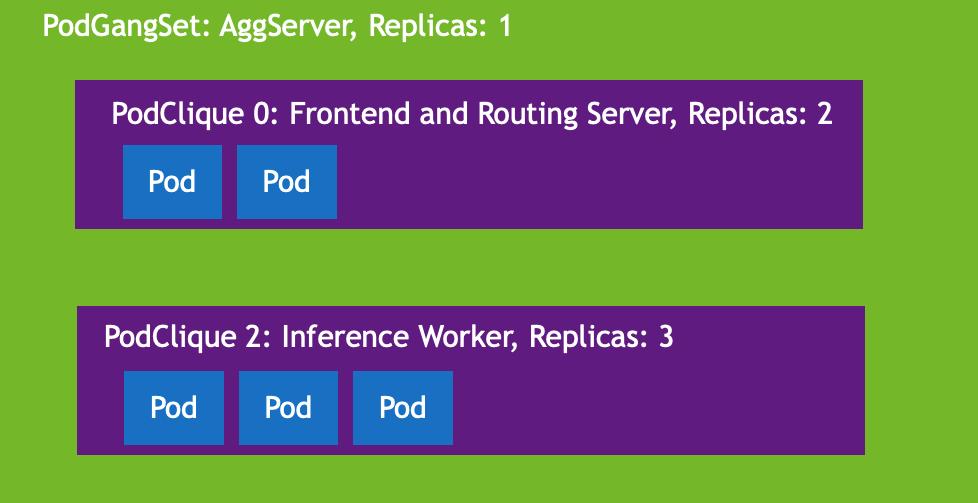

:construction_worker: `This project site is currently under active construction, keep watching for announcements as we approach alpha launch!`

# Grove: 

Grove is an open-source Kubernetes Custom Resource (CR) and scheduling framework purpose-built for orchestrating workloads where the fundamental unit of scaling for some components is a group of pods, rather than a single pod, while other components operate as standard deployments. It allows you to represent multiple such components within a single CR, enabling them to start up reliably and communicate efficiently through gang scheduling and topology-aware placement.

Grove was originally motivated by the challenges of orchestrating multinode, disaggregated inference systems. It provides a single control plane that allows users to represent, configure, and scale prefill, decode, and any other components like routing within a single CR. However it is flexible enough to represent all manner of systems, and cleanly models anything from "traditional" single node aggregated inference to agentic pipelines with multiple models. 

---

## 🌲 Why Grove?

Modern inference systems are often no longer single-pod workloads. They involve multiple components running across many nodes, often requiring coordination, colocation, custom roles, and precise startup ordering.

Grove makes this complexity manageable by providing the following:

### ⚙️ Key Capabilities

- ✅ **Declarative Super-Pod Orchestration**  
  Define tightly coupled pod groups with explicit role-based logic. E.g. a group of pods that scale together where one pod is a leader and the rest are workers

- ✅ **Gang Scheduling**  
  Ensure all pods in a super-pod are scheduled together to prevent resource deadlocks.

- ✅ **Multi-Component Coordination**  
  Cleanly represent patterns like prefill/decode disaggregation with independent scaling and resource allocation.

- ✅ **Topology-Aware Placement**  
  Schedule pods close together (rack-aware, spine-aware, etc.) to optimize network performance—powered.

- ✅ **Custom Startup Dependencies**  
  Specify which roles must be ready before others launch without brittle startup scripts. Pod startup is decoupled from pod creation

- ✅ **Unified Control Plane**  
  Manage inference workers, request routers, and frontend servers together using a single resource definition.

## 🧩 Core Concepts

| Concept        | Description |
|----------------|-------------|
| **PodGangSet** | The top-level Grove object that defines a group of components managed together. Supports replication and availability-zone-aware deployment. |
| **PodClique**  | A group of pods representing a specific role (e.g., leader, worker). Each clique has independent configuration and scaling logic. |
| **ScalingGroup** | A set of PodCliques that scale and schedule together as a logical super-pod. Ideal for tightly coupled roles like prefill and decode. |

---

## 📦 Example Use Cases

- Multi-node, Disaggregated Inference for large models (DeepSeek-R1, Llama-4-Maverick)

- Single-node, Disaggregated Inference

- Agentic Pipeline of Models

- "Standard" Aggregated Single Node or Single GPU Inference

---

