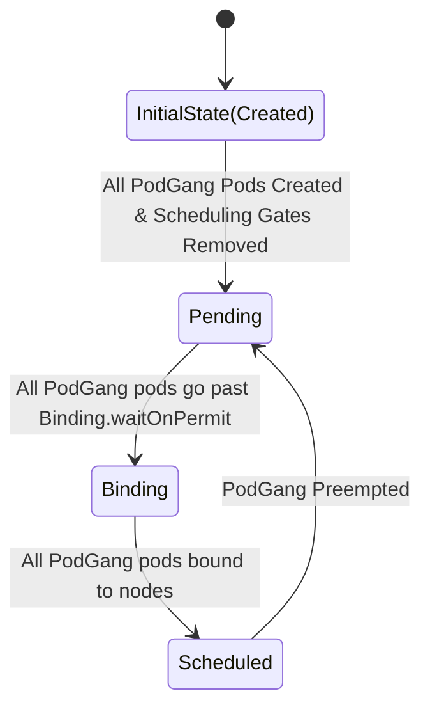

# Design and Implementation Notes

## Scheduler PodGang type

### Gang semantics in the presence of MinReplicas

* If `PodClique.Spec.ScaleConfig` is defined then `PodGang.Spec.MemberCliques[i].MinReplicas` should be set to `PodClique.Spec.ScaleConfig.MinReplicas`. Else, 
`PodGang.Spec.MemberCliques[i].MinReplicas` should be set to respective `PodClique.Spec.Replicas`.

* PodGang gang-scheduling semantics:
  * Guaranteed for pods `PodGang.Spec.MemberCliques[i].PodReferences[0:(MinReplicas-1)]`.
  * Best-effort for pods `PodGang.Spec.MemberCliques[i].PodReferences[MinReplicas:]`.

* PodGang gang-termination and gang-restart semantics:
  * When the number of running pods in `PodGang.Spec.MemberCliques[i].PodReferences[]` < `PodGang.Spec.MemberCliques[i].MinReplicas`,
  then gang-termination will be triggered after `PodGang.Spec.TerminationDelay`. If pending pods get scheduled within `PodGang.Spec.TerminationDelay`
  and minReplica constraints are satisfied, then gang-termination will not be triggered.
  * Gang-termination semantics will terminate all pods in the PodGang.
  * After gang-termination, PodGang pods will be re-created.

## FSM for PodGang

This section details the different phases that a PodGang can be in, and the transitions between them. The phases are as follows:

**Initial State:**

Initial state is going to be empty. `PodGang.Status.SchedulingPhase` will not be set.

**Pending:**

Trigger-1: All pods as defined in the `PodGang` are created with their scheduling gate removed.
Trigger-2: When a previously `Scheduled` PodGang is preempted.
Transition `PodGang.Status.SchedulingPhase` to `Pending`.

**Binding**

Trigger: When all pods in the `PodGang` go past binding phase `waitOnPermit`.
Transition `PodGang.Status.SchedulingPhase` to `Binding`.

**Scheduled**

Trigger: When all pods in the `PodGang` are bound to node(s) and are therefore scheduled.
Transition `PodGang.Status.SchedulingPhase` to `Scheduled`.

> We also discussed another phase called `AdmissionError` but I have incomplete notes on this state and I do not currently 
> recollect if we finally decided to use this state or just use `Pending` state instead.

## Rolling update flow in Operator

> THIS SECTION IS INCOMPLETE and will be updated with details of maxSurge and maxUnavailable.

* Operator creates pods belonging to one replica of PodGangSet with scheduling gate set.
* Operator creates a new `PodGang` resource and sets `PodGang.Status.SchedulingPhase` to `Created`.
* It optionally sets `PodGang.Spec.PreferredReuseReservationRef` to refer to the old `PodGang` resource. The predicate on which this will be set will be described later.
* Operator removes the scheduling gate from the pods in the new `PodGang` resource.

## Computing network placement score

Topograph provides an ability to compute `top-score` which is within [0, 1] (higher the better).
Instead of having a dependency on `Topograph` to compute the network placement score, initial decision is to move that logic into the scheduler plugin.
Once the top-score is computed then it will updated in `PodGang.Status.PlacementScore`.