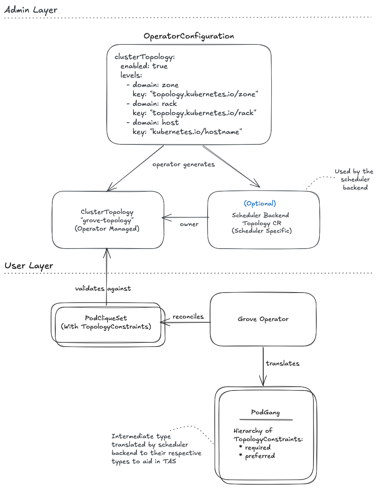

# GREP-244: Topology Aware Scheduling

<!-- toc -->
- [Summary](#summary)
- [Motivation](#motivation)
  - [Goals](#goals)
  - [Non-Goals](#non-goals)
- [Proposal](#proposal)
  - [User Stories](#user-stories)
    - [Story 1](#story-1)
    - [Story 2](#story-2)
    - [Story 3](#story-3)
  - [Limitations/Risks &amp; Mitigations](#limitationsrisks--mitigations)
    - [Topology Constraints Only Guaranteed for Initial Deployment](#topology-constraints-only-guaranteed-for-initial-deployment)
    - [Operational Complexity](#operational-complexity)
    - [Topology Configuration Drift](#topology-configuration-drift)
    - [Topology Aware Cluster Autoscaling](#topology-aware-cluster-autoscaling)
    - [Workload Portability](#workload-portability)
- [Design Details](#design-details)
  - [Cluster Admin API](#cluster-admin-api)
    - [Supported Topology domains:](#supported-topology-domains)
    - [Validation](#validation)
    - [Operator Startup behavior](#operator-startup-behavior)
    - [Topology Configuration Updates](#topology-configuration-updates)
  - [ClusterTopology custom resource](#clustertopology-custom-resource)
  - [Topology Constraints in PodCliqueSet](#topology-constraints-in-podcliqueset)
    - [Validation](#validation-1)
  - [PodGang: Scheduler API Enhancements](#podgang-scheduler-api-enhancements)
  - [Monitoring](#monitoring)
  - [Dependencies](#dependencies)
  - [Test Plan](#test-plan)
- [Alternatives](#alternatives)
<!-- /toc -->

## Summary

AI Inference workloads require low-latency data transfer between model layers or shards. Topology-aware placement of such workloads is critical to maximize performance on GPU scale-out clusters. This GREP proposes a unified topology model in Grove and introduces new API for users to define scheduling constraints that will guarantee topology optimized placement of their workloads.

## Motivation

In multi-node disaggregated AI inference workloads, minimizing time-to-first-token (TTFT) and maximizing tokens per second (TPS) are key objectives. This requires optimal placement of prefills and decodes across Kubernetes nodes. These applications are highly sensitive to network latency and bandwidth, as model shards, leaders, and workers frequently exchange large volumes of data. Topology-aware scheduling is therefore essential to: 

* Maximize network locality and leverage high-bandwidth interconnects.
* Minimize network hops between interdependent components.
* Co-locate related model shards within the same topology domain (rack/zone/host group). 

Since different inference workloads have distinct communication patterns and packing needs, an advanced scheduler, such as KAI, is necessary to ensure topology optimized workload scheduling. Workload operators must be able to declaratively specify their topology and packing requirements when defining `PodCliqueSet`s. Combining expressive workload intent with topology-aware scheduling unlocks significant latency and throughput improvements for production-scale, multi-node LLM inference.

### Goals

* Define a uniform cluster topology model for any Kubernetes cluster across cloud providers and on-prem clusters.
* Enable cluster administrator to declaratively specify the cluster network topology (manually or auto-generated by a tool) as a startup configuration option for Grove operator.
* Extend the existing Grove declarative APIs to provide a way to define hierarchical topology pack constraints at `PodCliqueSet`, `PodCliqueScalingGroup` and `PodClique` levels.
* Enhance existing Grove scheduler APIs (`PodGang`) to translate user-defined topology constraints defined in `PodCliqueSet` to cluster-specific scheduling constraints.
* Automatically generate and synchronize relevant custom resources for the downstream schedulers that implement topology-aware-scheduling.

### Non-Goals

* Honoring defined pack constraints for scale-outs for any `Scale` subresource in a `PodCliqueSet`.
* Support for multiple active cluster topologies thus allowing to configure which cluster topology to use at the `PodCliqueSet` level.
* Define and honor pack constraints for proportional scaling amongst scaling groups. For e.g. one wishes to proportionally scale decodes and prefills in a disaggregated inference workload and ensure that decodes and prefills for every such scale are packed optimally.
* Automatic topology suggestion based on workload characteristics.
* Support for externally-created `ClusterTopology` custom resources is planned for future iteration. Initial implementation only supports operator-managed `ClusterTopology`.

## Proposal



Grove implements topology-aware scheduling through a two layer approach:

**Admin Layer:** 
Grove defines a ClusterTopology CRD and exclusively manages the lifecycle of a ClusterTopology CR of a reserved name. Administrators configure topology hierarchy solely through `OperatorConfiguration`, and Grove creates a single operator-managed `ClusterTopology` resource named "grove-topology". This ensures a predictable, centrally-managed topology configuration.

> NOTE: Support for externally-created `ClusterTopology` custom resources will be added in subsequent iterations, allowing more flexible topology management scenarios. However, this is explicitly out of scope for the initial implementation.

Additionally, `Grove` operator will also create and manage any custom topology resource that is required by the scheduler backend. As an example: `KAI` scheduler requires that `Topology` custom resource be created with an ordered list of node labels prior to scheduling any workload that defines topology constraints.

> NOTE: In the first iteration, any scheduler backend specific topology resource will be created during the `Grove` operator startup. This will potentially change once pluggable scheduler backend support is enabled.

**User Layer:**
Workload developers can specify topology constraints at three hierarchical levels (`PodCliqueSet`, `PodCliqueScalingGroup`, and `PodClique`) using domain names. The operator validates these constraints against the operator-managed ClusterTopology using two key validation rules:

1. *Domain existence*: All topology domains referenced in workload's topology constraints must exist in the ClusterTopology CR. This ensures workloads only reference valid, configured topology levels.
2. *Topology Constraint Hierarchy*:  Topology levels are ordered by their total network distance in each level, from maximum (`region`) down to minimum (`numa`). When topology constraints are hierarchically applied to a workload from  PodCliqueSet → PodCliqueScalingGroup → PodClique, each level's  constraints must be set to equal or lower than the parent level workload primitive. A child resource cannot specify a higher topology domain  than its parent. For example, if PodCliqueSet specifies `rack`, then PodCliqueScalingGroup can specify `rack` (equal), `host` (lower), or `numa` (lowest), but not `zone` or `region` (higher).  

After validation, the operator translates the topology domain names (e.g., "rack", "host") into cluster-specific topology keys (e.g., "topology.kubernetes.io/zone", "kubernetes.io/hostname") and configures these hierarchical topology keys in the `PodGang` API . The `PodGang` serves as an intermediate representation that will eventually be mapped to the specific types that the configured scheduler backend understands. This abstraction allows workload portability across clusters with different topology configurations and scheduler implementations.

**Workload portability across clusters**

Grove via `ClusterTopology` defines a uniform set of 

### User Stories

#### Story 1

As a cluster admin who manages multiple clusters, I would like a capability to configure `Grove` to use infrastructure provider specific node labels mapped to uniform topology domains, thus allowing migration of workloads across clusters without impacting the topology pack constraints defined on `PodCliqueSet` resources.

#### Story 2

As an AI application developer running disaggregated inference workloads at scale, I need my multi-node prefill and decode tasks to be co-located within a high-performance network domain to minimize the KV cache transfer latency. Grove's topology model should allow me to specify my locality requirement as a scheduling constraint so that my application runs with deterministic performance.

#### Story 3

As a software developer of benchmarking applications, when I request only 2 GPUs from a 8-GPU node, I want the two GPUs to be allocated on the same NUMA node along with all the CPUs. This will optimize communication costs between the host and device resulting in benchmark performance improvements. On GPU generations before NVSwitch, this optimization is also critical to optimize GPU-GPU communication costs over NVLink.

### Limitations/Risks & Mitigations

#### Topology Constraints Only Guaranteed for Initial Deployment

Topology-aware scheduling constraints are only guaranteed to be honored during the initial deployment of a PodCliqueSet. In several scenarios, these constraints may not be satisfied:

**Scale-Out scenarios:**

*Scale-Out of PodClique:* 
This will result in creation of additional Pods. There is no guarantee that the topology constraints will be honoured for these additional Pods as that is subject to resource availability.

*Scale-Out of PodCliqueScalingGroup:*
This results in creation of a new `PodGang`. At present there is no way to correlate multiple `PodGang`s to KAI scheduler as belonging to a single PCS replica. If there is a topology constraint defined at the `PodCliqueSet` level, then without the association amongst `PodGang`s it is not possible to enforce that all Pods that are part of the correlated PodGangs respect the topology constraint defined for a `PodCliqueSet` replica.

Consider the following example:

```yaml
apiVersion: grove.io/v1alpha1
kind: PodCliqueSet
metadata:
  name: hierarchical-inference
spec:
  replicas: 2
  template:
    topologyConstraint:
      packDomain: zone  # Each replica within a zone
    cliques:
      - name: p-leader
        topologyConstraint:
          packDomain: host  # Each leader on its own host
        spec:
          replicas: 2
      - name: p-worker
        spec:
          replicas: 4  # Workers spread across hosts in the rack
    podCliqueScalingGroups:
      - name: prefill
        topologyConstraint:
          packDomain: "block"
        replicas: 3
        minAvailable: 1
        cliqueNames:
          - p-worker
          - p-leader     
```

In the above `PodCliqueSet` for replica indexes 1 and 2 (above the `minAvailable`) of `prefill` PodCliqueScalingGroup two new scaled `PodGang`s will be created. Each `PodGang` will have `p-leader` and `p-worker` PodClique Pods which should all be scheduled such that they are packed within topology domain `block`. However there is no guarantee that these `block` topology domains should be within the same `zone` (topology constraint on a PodCliqueSet replica) for a single PodCliqueSet replica.

**Pod Rescheduling Scenarios**

Pods have to rescheduled when:

* When there are higher priority pods which wish to use resources that are used by a lower priority workload Pods.
* Node failures or maintenance which causes pod evictions.
* Explicit deletion of Pods

Without resource reservation for `PodCliqueSet`, the scheduler cannot satisfy topology constraints since other workloads might consume the resources in preferred node-pod placements.

#### Operational Complexity

Providing a way to define cluster topology entails that the cluster administrators must:

* Understand the cluster network topology.
* Ensure that the nodes are correctly labeled with the topology information.
* Define appropriate topology levels in `OperatorConfiguration` when configuring the `Grove` operator.

While validations will be provided to ensure that an admin does not configure an unsupported topology domain, however there is no way for `Grove` operator to ensure that the node labels that are mapped to each topology domain are in line with the ones that will be put onto nodes in a kubernetes cluster.

**Mitigation**

* Adequate documentation will be provided to the cluster administrators to help them properly configure topology levels in `OperatorConfiguration`.
* Tools like [Topograph](https://github.com/NVIDIA/topograph) can be leveraged to automate discovery of cluster network topology and ensuring that topology levels are added as labels on Kubernetes Node(s).

#### Topology Configuration Drift

If the topology configuration changes (e.g. adding or removing levels), existing workload (`PodCliqueSet`) may have invalid topology constraints.

**Mitigation:**
Grove operator will:

* Remove invalid topology constraints from the `PodGang` resource(s) that are created for a `PodCliqueSet`.
* Clearly eflect that the one or more topology levels are no longer available by setting appropriate status conditions on respective `PodCliqueSet` resources.
* Ensure that the validating webhook rejects new `PodCliqueSet` resources to be created which have one or more invalid topology constraints.

#### Topology Aware Cluster Autoscaling 

When there are insufficient nodes to gang schedule PodGangs created from a PodCliqueSet, cluster autoscalers need to provision additional nodes. However, there is currently *no support from any cluster autoscaling solution* to launch nodes that would match the topology-aware scheduling (TAS) constraints defined within a PodGang. Underline reason is that no public cloud provider today provides APIs offering an ability to specify preferences on topology placements when launching instances. In addition none of the existing cluster autoscaling solutions (CA - [Issue#8783](https://github.com/kubernetes/autoscaler/issues/8783), Karpenter) have first class support for gang scheduled pod groups. 

*Impact:* `PodGang`'s with strict topology constraints may remain unscheduled indefinitely.

**Mitigation**

There are ways in which you can either minimize the need for on-demand scaling or reduce the risk of pods remaining in pending state.

* Leverage cloud provider capabilities 

  * AWS provides [Cluster Placement Groups](https://docs.aws.amazon.com/AWSEC2/latest/UserGuide/placement-groups.html)
  * GCP provides [Compact Placement Policies](https://docs.cloud.google.com/compute/docs/instances/use-compact-placement-policies)
  * Azure provides [Proximity Placement Groups](https://learn.microsoft.com/en-us/azure/virtual-machines/co-location)

  However these might not always give you the best packing as they only offer best-effort placement of newly launched nodes. So the best bet is to club placement policies with capacity reservation.

#### Workload Portability

`PodCliqueSet` with strict topology constraints may not always be portable across clusters which are created with different topology configurations. For example: A workload requiring "block" level packing may fail on a cluster that does not define this topology level.

**Mitigation**

Validating webhook for `PodCliqueSet` will reject resources that are created with unsupported topology constraints.

## Design Details

> NOTE: For brevity we will refer to topology aware scheduling as `TAS`.

### Cluster Admin API

Topology levels will be defined by a cluster admin as part of `OperatorConfiguration`

```go
// OperatorConfiguration defines the configuration for the Grove operator.
type OperatorConfiguration struct {
  TopologyAwareScheduling TopologyAwareSchedulingConfiguration `json:"topologyAwareScheduling"`
}

// TopologyAwareSchedulingConfiguration defines the configuration for topology-aware scheduling.
type TopologyAwareSchedulingConfiguration struct {
	// Enabled indicates whether topology-aware scheduling is enabled.
	Enabled bool `json:"enabled"`
	// Levels is a list of topology levels.
	// Used to create/update the ClusterTopology CR at operator startup.
	// +optional
	Levels []corev1alpha1.TopologyLevel `json:"levels,omitempty"`
}

```

Example `OperatorConfiguration` (only shows TAS configuration for brevity):
```yaml
apiVersion: operator.config.grove.io/v1alpha1
kind: OperatorConfiguration
...
topologyAwareScheduling:
  enabled: true
  levels:
    - domain: region
      key: "topology.kubernetes.io/region"
    - domain: zone
      key: "topology.kubernetes.io/zone"
    - domain: datacenter
      key: "topology.kubernetes.io/datacenter"
    - domain: rack
      key: "topology.kubernetes.io/rack"
    - domain: host
      key: "kubernetes.io/hostname"
    ...
```

> NOTE: The above values for `key` is just an example and will/can be different for different infrastructure providers.

#### Supported Topology domains:

Topology domains are sorted by their total network distance in descending order from maximum to minimum.

| Domain       | Description                                         |
| ------------ | --------------------------------------------------- |
| `region`     | Cloud provider region                               |
| `zone`       | Availability zone within a region                   |
| `datacenter` | Physical data center within a zone                  |
| `block`      | Large switching block or network segment            |
| `rack`       | Physical rack containing multiple hosts             |
| `host`       | Individual host (virtual/server)                    |
| `Numa`       | NUMA (Non-Uniform Memory Access) node within a host |

A topology domain provides an infrastructure agnostic identifier for a topology level and thus allows the same workload to be deployed across clusters hosted by any cloud provider or private data centers. Across `GCP`, `AWS` and `Azure` it has been observed that the network topology node labels differ. It was thus a natural choice to define a uniform topology convention which can be used by workload designers when creating `PodCliqueSet` resources. Using `ClusterTopology` CR, Grove operator then maps these uniform topology domains to infrastructure provider specific topology node labels. 

#### Validation

`OperatorConfiguration` is validated upon starting of `Grove` operator. If `TopologyAwareScheduling.Enabled` is true, then following is checked:

* At least one `TopologyLevel` should be set.
* For each `TopologyLevel`, its `TopologyDomain` should be one of the supported topology domains as mentioned above.
* Each `TopologyLevel` should be unique, neither the domain nor the key should be duplicated.

> NOTE: There is no validation done for `TopologyLevel.Key` (which is a node label) as that can be different across cloud providers and on-prem data centers. The only exception is the node label for `host` since that is set by the `kubelet`.

If any of the validation fails then the operator will exit with a non-zero error code and an appropriate error message which will be visible in the logs of the operator `Pod`.

#### Operator Startup behavior

When `Grove` operator starts, it checks if TAS is enabled. 

**TAS is enabled**

* Validate TAS configuration.

* Create or Update `ClusterTopology` custom resource.

* Creates/Updates/Recreates the scheduler backend topology CR. Example: For KAI scheduler it either creates `Topology` CR (if it does not exist) or it re-creates (deletes + creates) the `Topology` CR if it needs an update. A re-create is required as the KAI `Topology` CR is currently immutable. 

  > NOTE: In future the responsibility to create scheduler backend specific topoplogy custom resource(s) will be the responsibility of the scheduler backend.

If any of the create/update/delete of `ClusterTopology` CR or/and scheduler backend specific topology CR fails then the operator exits with a non-zero exit code and a clear message indicating the issue.

**TAS is disabled**

* Delete any existing `ClusterTopology` CR.
* In the first iteration, scheduler backend specific topology CR is created with `ClusterTopology` CR as its owner. This link is established via `OwnerReference`. When `ClusterTopology` CR is deleted, then scheduler backend specific topology CR will also be cascade deleted. 

Deletion failures are non-fatal. These will be logged and the operator will continue.

#### Topology Configuration Updates

`OperatorConfiguration` is mounted as an immutable `ConfigMap` to the operator. To make any changes to the TAS configuration via `OperatorConfiguration`, the `Grove` operator needs to be restarted with the changed `OperatorConfiguration`.

In the first iteration, since `ClusterTopology` is completely managed by the  operator, an authorizer webhook will prevent deletion of `ClusterTopology` or any direct changes to `ClusterTopology`. All changes should flow from updating the `OperatorConfiguration` only.

> NOTE: This might change in the future when we add support for externally managed `ClusterTopology` custom resources.

### ClusterTopology custom resource

`ClusterTopology` is a custom resource that defines an ordered list of topology levels from largest to smallest network distance. Each `TopologyLevel` is a pair of topology domain and a node label key specific for the infrastructure provider.

ClusterTopology Go API:

```go
// TopologyDomain represents a predefined topology level in the hierarchy.
type TopologyDomain string

const (
    TopologyDomainRegion     TopologyDomain = "region"
    TopologyDomainZone       TopologyDomain = "zone"
    TopologyDomainDataCenter TopologyDomain = "datacenter"
    TopologyDomainBlock      TopologyDomain = "block"
    TopologyDomainRack       TopologyDomain = "rack"
    TopologyDomainHost       TopologyDomain = "host"
    TopologyDomainNuma       TopologyDomain = "numa"
)

// ClusterTopologySpec defines the topology hierarchy specification.
type ClusterTopologySpec struct {
    // Levels is an ordered list of topology levels.
    // The order in this list defines the hierarchy (index 0 = highest level with maximum total network distance).
    // This field is immutable after creation.
    // +kubebuilder:validation:MinItems=1
    // +kubebuilder:validation:MaxItems=7
    // +kubebuilder:validation:XValidation:rule="self.all(x, self.filter(y, y.domain == x.domain).size() == 1)",message="domain must be unique across all levels"
    // +kubebuilder:validation:XValidation:rule="self.all(x, self.filter(y, y.key == x.key).size() == 1)",message="key must be unique across all levels"
    Levels []TopologyLevel `json:"levels"`
}

type TopologyLevel struct {
    // Domain is the predefined level identifier used in TopologyConstraint references.
    // Must be one of: region, zone, datacenter, block, rack, host, numa
    // +kubebuilder:validation:Required
    // +kubebuilder:validation:Enum=region;zone;datacenter;block;rack;host;numa
    Domain TopologyDomain `json:"domain"`

    // Key is the node label key that identifies this topology domain.
    // Must be a valid Kubernetes label key (qualified name).
    // Examples: "topology.kubernetes.io/zone", "kubernetes.io/hostname"
    // +kubebuilder:validation:Required
    // +kubebuilder:validation:MinLength=1
    // +kubebuilder:validation:MaxLength=63
    // +kubebuilder:validation:Pattern=`^(([A-Za-z0-9][-A-Za-z0-9_.]*)?[A-Za-z0-9]/)?([A-Za-z0-9][-A-Za-z0-9_.]*)?[A-Za-z0-9]$`
    Key string `json:"key"`
}
```

### Topology Constraints in PodCliqueSet

`PodCliqueSet` API has been enhanced, allowing users to specify topology constraints. A new type `TopologyConstraint` has been introduced which allows users to define `required` topology constraints that must be satisfied for the scheduling to succeed. 

```go
// TopologyConstraint defines topology placement requirements.
type TopologyConstraint struct {
	// PackDomain specifies the topology domain for grouping replicas.
	// Controls placement constraint for EACH individual replica instance.
	// Must be one of: region, zone, datacenter, block, rack, host, numa
	// Example: "rack" means each replica independently placed within one rack.
	// Note: Does NOT constrain all replicas to the same rack together.
	// Different replicas can be in different topology domains.
	// +kubebuilder:validation:Enum=region;zone;datacenter;block;rack;host;numa
	PackDomain TopologyDomain `json:"packDomain"`
}
```

`TopologyConstraint` can be specified at three levels:

At `PodCliqueSet` you can set the constraints using:

```go
// PodCliqueSetTemplateSpec defines a template spec for a PodGang.
// A PodGang does not have a RestartPolicy field because the restart policy is predefined:
// If the number of pods in any of the cliques falls below the threshold, the entire PodGang will be restarted.
// The threshold is determined by either:
// - The value of "MinReplicas", if specified in the ScaleConfig of that clique, or
// - The "Replicas" value of that clique
type PodCliqueSetTemplateSpec struct {
  ...
  	// TopologyConstraint defines topology placement requirements for PodCliqueSet.
	// +optional
	TopologyConstraint *TopologyConstraint `json:"topologyConstraint,omitempty"`
  ...
}
```

At `PodCliqueScalingGroup` level you can set the topology constraint using:

```go
// PodCliqueScalingGroupConfig is a group of PodClique's that are scaled together.
// Each member PodClique.Replicas will be computed as a product of PodCliqueScalingGroupConfig.Replicas and PodCliqueTemplateSpec.Spec.Replicas.
// NOTE: If a PodCliqueScalingGroupConfig is defined, then for the member PodClique's, individual AutoScalingConfig cannot be defined.
type PodCliqueScalingGroupConfig struct {
  ...
  // TopologyConstraint defines topology placement requirements for PodCliqueScalingGroup.
	// Must be equal to or stricter than parent PodCliqueSet constraints.
	// +optional
	TopologyConstraint *TopologyConstraint `json:"topologyConstraint,omitempty"`
  ...
}
```

`TopolgyConstraint` defined at the `PodCliqueScalingGroup` level should be:

* Equal to or lower than the one that is defined at `PodCliqueSet` level. 
* Equal to or higher than the constraints defined for each constituent `PodClique`.

At `PodClique` level you can set the topology constraint using:

```go
// PodCliqueTemplateSpec defines a template spec for a PodClique.
type PodCliqueTemplateSpec struct {
  ...
  // TopologyConstraint defines topology placement requirements for PodClique.
	// Must be equal to or stricter than parent resource constraints.
	// +optional
	TopologyConstraint *TopologyConstraint `json:"topologyConstraint,omitempty"`
  ...
}
```

`TopologyConstraint` defined at the `PodClique` level should be lower than or equal to the ones defined for the parent resources a.k.a (`PodCliqueScalingGroup` and `PodCliqueSet`).

Example PodCliqueSet with topology constraints (For brevity many parts of the PodCliqueSet spec has been omitted):

```yaml
apiVersion: grove.io/v1alpha1
kind: PodCliqueSet
metadata:
  name: disaggregated-inference
spec:
  replicas: 1
  template:
    topologyConstraint:
      packDomain: "zone"
    cliques:
      - name: router
        topologyConstraint:
          packDomain: "block"
        spec:
          roleName: router
          replicas: 1
          podSpec:
            ...    
      - name: p-leader
        topologyConstraint:
          packDomain: "rack"
        spec:
          roleName: prefill-leader
          replicas: 1
          podSpec:
            ...
      - name: p-worker
        topologyConstraint:
          packDomain: "rack"
        spec:
          roleName: prefill-worker
          replicas: 4
          podSpec:
            ...
      - name: d-leader
        topologyConstraint:
          packDomain: "rack"
        spec:
          roleName: decode-leader
          replicas: 1
          podSpec:
            ...
      - name: d-worker
        topologyConstraint:
          packDomain: "rack"
        spec:
          roleName: decode-worker
          replicas: 2
          podSpec:
            ...
    podCliqueScalingGroups:
      - name: prefill
        topologyConstraint:
          packDomain: "block"
        replicas: 2
        minAvailable: 1
        cliqueNames:
          - p-worker
          - p-leader
      - name: decode
        topologyConstraint:
          packDomain: "rack"
        replicas: 2
        minAvailable: 1
        cliqueNames:
          - d-worker
          - d-leader
```

The above example is only a representation of how users can set topology constraints at different levels to control how the pods are going to be packed during the initial deployment.

#### Validation

Existing validating webhook which validates `PodCliqueSet`, has been enhanced to additionally check topology constraints.

*Rule-1: Check for supported TopologyDomains*

* All topology domains that are referenced in the `PodCliqueSet` must be amongst the defined topology levels in the `ClusterSnapshot` CR. If a non-supported topology domain is found then creation of the `PodCliqueSet` will be rejected.
* Topology domains for an already deployed `PodCliqueSet` cannot be changed. Validating webhook will reject such updates on the `PodCliqueSet`.

*Rule-2: Check for Hierarchical strictness*

As you traverse down the resource hierarchy (PodCliqueSet → PodCliqueScalingGroup → PodClique), topology constraint levels must become equal or lower. A child resource cannot specify a broader topology domain than its parent. If this rule is violated, then the creation of the `PodCliqueSet` will be rejected by the validating webhook.

Example:

| Parent | Child   | Valid? | Reason                                                       |
| ------ | ------- | ------ | ------------------------------------------------------------ |
| `rack` | `host`  | ✅ Yes  | `host` is lower than `rack`                    |
| `rack` | `rack`  | ✅ Yes  | Equal is allowed                                             |
| `rack` | `numa`  | ✅ Yes  | `numa` is lowest                                          |
| `host` | `rack`  | ❌ No   | `rack` is higher than `host`                                |
| `zone` | `block` | ✅ Yes   | `zone` is higher than `block` |

These two validation rules ensure that workloads can only reference valid topology levels and maintain logical topology nesting throughout the resource hierarchy.

### PodGang: Scheduler API Enhancements

Grove operator translates the hierarchical topology constraints to infrastructure specific node labels in the `PodGang` scheduler API. 

The following additional types have been defined to capture the topology constraints. Provision has been made to capture:

* `Required` topology constraints which are hard requirements for the scheduler to consider.  These constraints are guaranteed to be satisfied.
* `Preferred` topology constraints are soft requirements and often point to the best possible packing that can be achieved.

```go
// TopologyConstraint defines topology packing constraints with required and preferred levels.
type TopologyConstraint struct {
	// PackConstraint defines topology packing constraint with required and preferred levels.
	// Operator translates user's level name to corresponding topologyKeys.
	// +optional
	PackConstraint *TopologyPackConstraint `json:"packConstraint,omitempty"`
}

// TopologyPackConstraint defines a topology packing constraint.
// Each of Required and Preferred fields hold a topologyKey, e.g. "kubernetes.io/hostname" ( these are key of labels added on nodes).
type TopologyPackConstraint struct {
	// Required defines a topology constraint that must be satisfied as a hard requirement. The workload will not be
	// scheduled if this constraint cannot be satisfied. Generally, it is easier for the scheduler to satisfy constraints
	// on topology domains with larger compute capacity, (e.g. zone or datacenter), than smaller domains, (e.g. host or
	// numa). Holds topologyKey (not level name) translated from user's packLevel specification.
	// Example: "topology.kubernetes.io/rack"
	// +optional
	Required *string `json:"required,omitempty"`
	// Preferred defines best-effort topology constraint. Topology domains that provide the most optimized performance
	// with dense packing (e.g. host or numa) are typically used as preferred constraints for topology packing. It might be
	// harder to satisfy these constraints if the topology domains are limited in compute  capacity. Since it is preferred
	// constraint, it is therefore not binding on the scheduler to mandatorily satisfy this packing constraint. Scheduler
	// can fall back to higher topology levels (upto Required constraint) if preferred cannot be satisfied.
	// Example: "kubernetes.io/hostname"
	// +optional
	Preferred *string `json:"preferred,omitempty"`
}
```

`TopologyConstraint`s can be defined at multiple levels:

**PodGangSpec.TopologyConstraint**

This is the top level constraint defined at the `PodGang` level that applies to al the `PodGroup`s in the `PodGang`.  We have two varients of `PodGang`s:

* `PodGang` that comprises of minimum number of replicas across all standalone `PodClique` and `PodCliqueScalingGroup`s that together make a workload functional. At present we also name this as the `base` PodGang. For the base PodGang, `TopologyConstraint` is the value of `PodCliqueSetTemplateSpec.TopologyConstraint` (`spec.template.topologyConstraint`)
* `PodGang`that is created for every replica of `PodCliqueScalingGroup` above the `minAvailable` as specified in `spec.template.podCliqueScalingGroups[x].minAvailable`. At present we call these as `scaled` PodGang. For the scaled PodGang, `TopologyConstraint` is the value of `PodCliqueScalingGroupConfig.TopologyConstraint` (`spec.template.podCliqueScalingGroups[x].topologyConstraint`). 
  * In case there is no topology constraint defined at `spec.template.podCliqueScalingGroups[x].topologyConstraint` then it will inherit the topology constraint  defined at `spec.template.topologyConstraint` if defined.
  

**PodGangSpec.TopologyConstraintGroupConfigs**

Users can define topology constraints that are applied for all constituent `PodClique`s in a `PodCliqueScalingGroup` (`spec.template.podCliqueScalingGroups[x].topologyConstraint`).

> NOTE: This field is used only for `Base` PodGangs. For `Scaled` PodGangs this will be empty.


**PodGroup.TopologyConstraint**

Users can define topology constraints at the `PodClique` level (`spec.template.cliques[x].topologyConstraint`) This will be captured in `PodGroup.TopologyConstraint`. 

```go
// PodGangSpec defines the specification of a PodGang.
type PodGangSpec struct {
	// PodGroups is a list of member pod groups in the PodGang.
	PodGroups []PodGroup `json:"podgroups"`
	// TopologyConstraint defines topology packing constraints for entire pod gang.
	// This is the top level topology constraint that applies to all PodGroups in the PodGang.
	// Updated by operator on each reconciliation when PodCliqueSet topology constraints change.
	// +optional
	TopologyConstraint *TopologyConstraint `json:"topologyConstraint,omitempty"`
	// TopologyConstraintGroupConfigs defines TopologyConstraints for a strict subset of PodGroups.
	// +optional
	TopologyConstraintGroupConfigs []TopologyConstraintGroupConfig `json:"topologyConstraintGroupConfigs,omitempty"`
  ...
}

// PodGroup defines a set of pods in a PodGang that share the same PodTemplateSpec.
type PodGroup struct {
	// Name is the name of the PodGroup.
	Name string `json:"name"`
  ...
	// TopologyConstraint defines topology packing constraints for this PodGroup.
	// Enables PodClique-level topology constraints.
	// Updated by operator when PodClique topology constraints change.
	// +optional
	TopologyConstraint *TopologyConstraint `json:"topologyConstraint,omitempty"`
}

```

### Monitoring

**PodCliqueSet Status Conditions**

It is possible that one or more topology constraints defined on a deployed `PodCliqueSet` are no longer available because the cluster admin decided to make changes to the `ClusterTopology`. It is therefore important to create visibility that one or more topology levels are no longer available. A new `metav1.Condition` has been introduced for `PodCliqueSet`.

```go
// PodCliqueSetStatus defines the status of a PodCliqueSet.
type PodCliqueSetStatus struct {
  ...
	// Conditions represents the latest available observations of the PodCliqueSet by its controller.
	// +optional
	Conditions []metav1.Condition `json:"conditions,omitempty"`
	...
}

```

Condition: `TopologyLevelsUnavailable`
Condition States:

| Status    | Reason                              | Description                                                  |
| --------- | ----------------------------------- | ------------------------------------------------------------ |
| `Unknown` | `ClusterTopologyNotFound`           | When `ClusterTopology` CR is not longer existing             |
| `True`    | `ClusterTopologyLevelsUnavailable`  | When one or more topology levels used by a deployed `PodCliqueSet` are no longer present in `ClusterTopology` |
| `False`   | `AllClusterTopologyLevelsAvailable` | All topology levels used by a deployed `PodCliqueSet` are amongst the supported topology levels as defined in `ClusterTopology` |


### Dependencies

**Scheduler backend with Topology Aware Scheduling Support**

Currently the only scheduler backend that supports hierarchical TAS is [KAI Scheduler](https://github.com/NVIDIA/KAI-Scheduler). See [here](https://github.com/NVIDIA/KAI-Scheduler/tree/main/docs/topology) for more information. 
Follow [instructions](https://github.com/NVIDIA/KAI-Scheduler?tab=readme-ov-file#installation) to install KAI scheduler which also will install the required `Topology` CR which gets automatically created by Grove operator.

> NOTE: However, Grove Operator is not limited to one scheduler backend and any other scheduler providing TAS functionality can be plugged in as well.

**Nodes labeled with Topology specific labels**

To enable the scheduler to select/filter nodes that satisfy the topology constraints defined for a `PodCliqueSet` it is essential that the topology specific lables are set on kubernetes `Node` objects.

### Test Plan

**Unit tests** for TAS has been implemented in the following packages:

* `OperatorConfiguration` validation tests are present at `operator/api/config/validation/validation_test.go`
* Core API helper function tests are included at `operator/api/core/v1alpha1/clustertopology_test.go`
* Validating webhook specific validation tests are present at `operator/internal/webhook/admission/pcs/validation/topologyconstraints_test.go`
* Reconciler specific tests that inspect `PodCliqueSet` topology constraints and update the `PodGang` resource are present at `operator/internal/controller/podcliqueset/components/podgang/syncflow_test.go`

**E2E tests** are defined in [Issue#305](https://github.com/ai-dynamo/grove/issues/305).

## Alternatives

An alternative was discussed to allow cluster admin to externally create `ClusterTopology` CR and provide a controller in Grove whose responsibility would be to reconcile creates/updates/deletes on externally managed `ClusterTopology` resource. Grove operator can then be started by specifying the name  of the `ClusterTopology` CR.

In the initial iteration, we wanted to take complete control over the lifecycle of the `ClusterTopology` CR and also reduce the effort for a cluster admin to manage such resource(s). In future we will auto-detect cluster topology via tools similar to [Topograph](https://github.com/NVIDIA/topograph) and extend it to also automatically create `ClusterTopolofy` CR.
