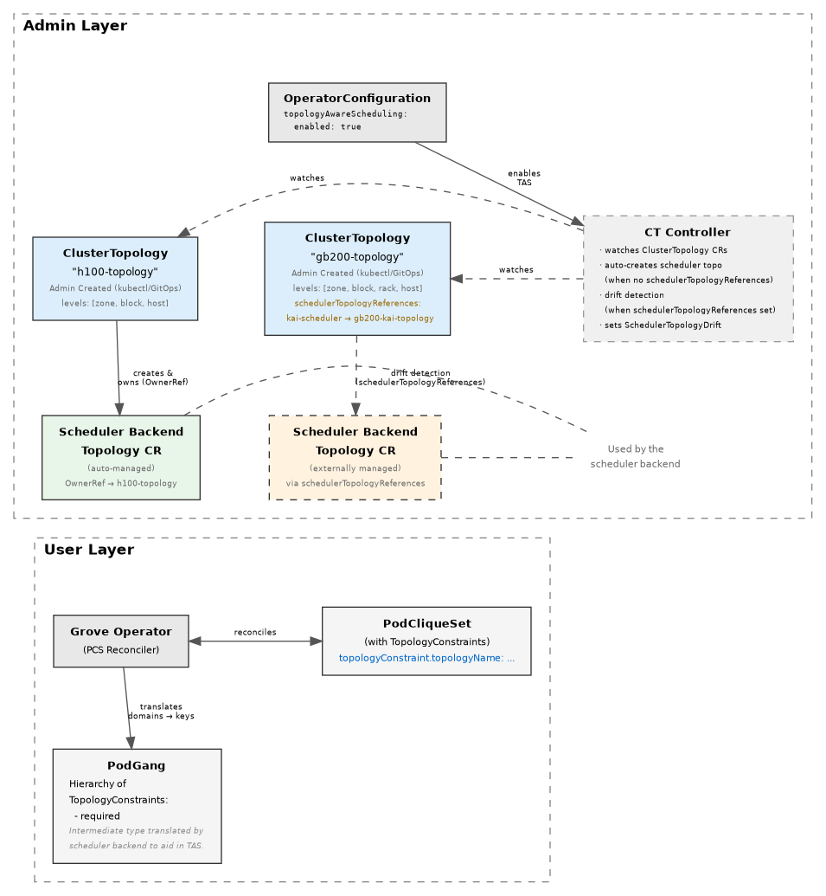
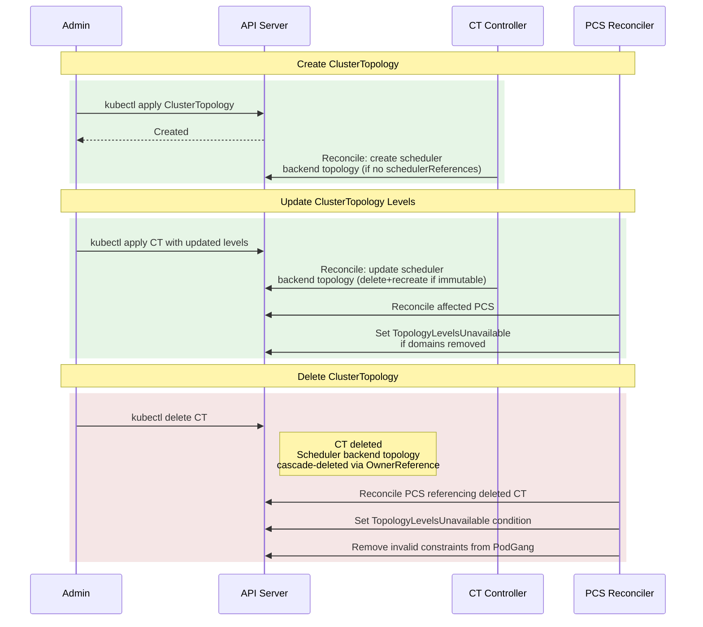

# GREP-244: Topology Aware Scheduling

<!-- toc -->
- [Summary](#summary)
- [Motivation](#motivation)
  - [Goals](#goals)
  - [Non-Goals](#non-goals)
- [Proposal](#proposal)
  - [User Stories](#user-stories)
    - [Story 1: Workload Portability](#story-1-workload-portability)
    - [Story 2: Disaggregated Inference Locality](#story-2-disaggregated-inference-locality)
    - [Story 3: NUMA-Aware GPU Benchmarking](#story-3-numa-aware-gpu-benchmarking)
    - [Story 4: Heterogeneous GPU Clusters](#story-4-heterogeneous-gpu-clusters)
  - [Limitations/Risks &amp; Mitigations](#limitationsrisks--mitigations)
    - [Topology Constraints Only Guaranteed for Initial Deployment](#topology-constraints-only-guaranteed-for-initial-deployment)
    - [Operational Complexity](#operational-complexity)
    - [Topology Configuration Drift](#topology-configuration-drift)
    - [Topology Aware Cluster Autoscaling](#topology-aware-cluster-autoscaling)
    - [Workload Portability](#workload-portability)
    - [ClusterTopology Deletion](#clustertopology-deletion)
    - [Topology Level Updates](#topology-level-updates)
    - [Topology Name Immutability](#topology-name-immutability)
- [Design Details](#design-details)
  - [Cluster Admin API](#cluster-admin-api)
    - [Topology Domains](#topology-domains)
    - [Validation](#validation)
    - [Controller Reconciliation](#controller-reconciliation)
    - [Topology Configuration Updates](#topology-configuration-updates)
  - [ClusterTopology custom resource](#clustertopology-custom-resource)
    - [Scheduler Backend Topology](#scheduler-backend-topology)
    - [ClusterTopology Lifecycle](#clustertopology-lifecycle)
  - [Topology Constraints in PodCliqueSet](#topology-constraints-in-podcliqueset)
    - [Topology Reference](#topology-reference)
    - [Validation](#validation-1)
  - [PodGang: Scheduler API Enhancements](#podgang-scheduler-api-enhancements)
  - [Backward Compatibility](#backward-compatibility)
    - [Existing PodCliqueSets with topology constraints but no <code>topologyName</code>](#existing-podcliquesets-with-topology-constraints-but-no-topologyname)
  - [Monitoring](#monitoring)
    - [PodCliqueSet Status Conditions](#podcliqueset-status-conditions)
  - [Dependencies](#dependencies)
  - [Test Plan](#test-plan)
- [Alternatives](#alternatives)
  - [Fully Operator-Managed Topologies from Configuration Profiles](#fully-operator-managed-topologies-from-configuration-profiles)
<!-- /toc -->

## Summary

AI Inference workloads require low-latency data transfer between model layers or shards. Topology-aware placement of such workloads is critical to maximize performance on GPU scale-out clusters. This GREP proposes a unified topology model in Grove and introduces new API for users to define scheduling constraints that will guarantee topology optimized placement of their workloads.

In clusters with heterogeneous hardware, a single topology definition cannot accurately represent different interconnect hierarchies. This GREP also extends the topology API to support multiple admin-created ClusterTopology resources watched and reconciled by the Grove controller, enabling the cluster to be partitioned into segments with distinct topology hierarchies. Each ClusterTopology defines its own set of node label keys, so nodes matching one topology's labels are naturally separated from nodes matching another. Workloads select the appropriate partition via a topology reference on PodCliqueSet.

## Motivation

In multi-node disaggregated AI inference workloads, minimizing time-to-first-token (TTFT) and maximizing tokens per second (TPS) are key objectives. This requires optimal placement of prefills and decodes across Kubernetes nodes. These applications are highly sensitive to network latency and bandwidth, as model shards, leaders, and workers frequently exchange large volumes of data. Topology-aware scheduling is therefore essential to:

* Maximize network locality and leverage high-bandwidth interconnects.
* Minimize network hops between interdependent components.
* Co-locate related model shards within the same topology domain (rack/zone/host group).

Since different inference workloads have distinct communication patterns and packing needs, an advanced scheduler, such as KAI, is necessary to ensure topology optimized workload scheduling. Workload operators must be able to declaratively specify their topology and packing requirements when defining `PodCliqueSet`s. Combining expressive workload intent with topology-aware scheduling unlocks significant latency and throughput improvements for production-scale, multi-node LLM inference.

AI clusters often contain heterogeneous hardware with different interconnect characteristics. Each hardware type may require a distinct topology definition for optimal scheduling. For example, a cluster with both 3-level (zone > block > host) DGX H100 nodes and 4-level (zone > block > rack > host) GB200 NVL72 racks cannot be accurately represented by a single topology definition. Supporting multiple ClusterTopology resources allows administrators to effectively split the cluster along hardware boundaries, where each topology definition captures the interconnect hierarchy of a specific hardware segment. This enables:

* **Cluster Partitioning by Hardware**: Each ClusterTopology defines its own node label keys, naturally partitioning the cluster into segments. Workloads targeting a specific topology are scheduled only on nodes that match that topology's labels.
* **Accurate Infrastructure Modeling**: Administrators can define topologies matching their actual hardware rather than forcing a single approximation across different interconnect hierarchies.
* **Workload Portability**: Users specify topology domains (e.g., "rack", "block") without embedding infrastructure-specific label keys into their workload definitions.

### Goals

* Define a uniform cluster topology model for any Kubernetes cluster across cloud providers and on-prem clusters.
* Enable cluster administrator to declaratively specify the cluster network topology (manually or auto-generated by a tool) as ClusterTopology resources applied to the cluster.
* Extend the existing Grove declarative APIs to provide a way to define hierarchical topology pack constraints at `PodCliqueSet`, `PodCliqueScalingGroup` and `PodClique` levels.
* Enhance existing Grove scheduler APIs (`PodGang`) to translate user-defined topology constraints defined in `PodCliqueSet` to cluster-specific scheduling constraints.
* Automatically generate and synchronize relevant custom resources for the downstream schedulers that implement topology-aware-scheduling.
* Define a mechanism for the Grove controller to watch and reconcile admin-created ClusterTopology resources.
* Extend the PodCliqueSet API to reference a specific ClusterTopology.

### Non-Goals

* Honoring defined pack constraints for scale-outs for any `Scale` subresource in a `PodCliqueSet`.
* Define and honor pack constraints for proportional scaling amongst scaling groups. For e.g. one wishes to proportionally scale decodes and prefills in a disaggregated inference workload and ensure that decodes and prefills for every such scale are packed optimally.
* Automatic topology discovery or inference from node labels.
* Dynamic topology switching for running workloads.
* Cross-topology scheduling within a single PodCliqueSet.

## Proposal



Grove implements topology-aware scheduling through a two-layer approach:

**Admin Layer:**
Grove defines a ClusterTopology CRD. Administrators create ClusterTopology resources directly via kubectl or GitOps, defining the topology hierarchy for each hardware segment in the cluster. The Grove controller watches all ClusterTopology resources and reconciles them.

Each ClusterTopology can optionally include a `schedulerReferences` field that maps the topology to scheduler backend resources. This field exists to decouple the lifecycle of Grove from the scheduler backend. A scheduler backend such as KAI may be deployed and operational before Grove is installed, and workloads may already be submitted to it with topology constraints independently of Grove. By referencing an existing scheduler backend topology resource rather than always creating one, Grove can be introduced into a cluster without disrupting the scheduler backend's existing topology configuration or the workloads already using it.

For example, the KAI scheduler requires a `Topology` custom resource for each ClusterTopology. When `schedulerReferences` is empty, the operator automatically creates the scheduler backend topology CR with an `OwnerReference` to the corresponding ClusterTopology, ensuring cascade deletion. When `schedulerReferences` contains entries, the operator treats the referenced scheduler backend topology as externally managed and performs drift detection instead (see [Scheduler Backend Topology](#scheduler-backend-topology)).

```yaml
# Admin-created ClusterTopology for DGX H100 nodes.
# No schedulerReferences — the operator auto-creates the scheduler backend topology.
apiVersion: grove.io/v1alpha1
kind: ClusterTopology
metadata:
  name: h100-topology
spec:
  levels:
    - domain: zone
      key: topology.kubernetes.io/zone
    - domain: block
      key: kubernetes.io/rack
    - domain: host
      key: kubernetes.io/hostname
---
# Admin-created ClusterTopology for GB200 NVL72 racks.
# schedulerReferences maps to an externally-managed KAI Topology resource.
apiVersion: grove.io/v1alpha1
kind: ClusterTopology
metadata:
  name: gb200-topology
spec:
  levels:
    - domain: zone
      key: topology.kubernetes.io/zone
    - domain: block
      key: example.com/nvl-block
    - domain: rack
      key: example.com/nvlink-domain
    - domain: host
      key: kubernetes.io/hostname
  schedulerReferences:
    - schedulerName: kai-scheduler
      reference: gb200-kai-topology
```

**User Layer:**
Workload developers can specify topology constraints at three hierarchical levels (`PodCliqueSet`, `PodCliqueScalingGroup`, and `PodClique`) using domain names. They select which topology to use via the `topologyName` field inside the PCS-level `topologyConstraint`, which is required when `packDomain` is specified.

The operator validates these constraints against the referenced ClusterTopology using three key validation rules:

1. *Domain existence*: All topology domains referenced in workload's topology constraints must exist in the ClusterTopology CR. This ensures workloads only reference valid, configured topology levels.
2. *Topology Constraint Hierarchy*: Topology levels are ordered by their position in the ClusterTopology's levels array (index 0 = broadest scope). When topology constraints are hierarchically applied to a workload from PodCliqueSet → PodCliqueScalingGroup → PodClique, each level's constraints must reference a domain that is equal to or narrower (higher index) than the parent level's domain. A child resource cannot specify a broader topology domain than its parent. For example, if the referenced ClusterTopology defines levels `[zone, block, host]` and the PodCliqueSet specifies `block`, then PodCliqueScalingGroup can specify `block` (equal) or `host` (narrower), but not `zone` (broader).
3. *Topology reference*: The `topologyName` must reference an existing ClusterTopology. The field is immutable after creation.

After validation, the operator translates the topology domain names (e.g., "rack", "host") into cluster-specific topology keys (e.g., "topology.kubernetes.io/zone", "kubernetes.io/hostname") using the referenced ClusterTopology and configures these hierarchical topology keys in the `PodGang` API. The `PodGang` serves as an intermediate representation that will eventually be mapped to the specific types that the configured scheduler backend understands. This abstraction allows workload portability across clusters with different topology configurations and scheduler implementations.

**Workload portability across clusters**

Grove, via `ClusterTopology`, allows administrators to define topology domain names (e.g. `rack`, `zone`, `host`) that abstract away infrastructure-specific node labels. Domain names are free-form strings — administrators choose names that describe their infrastructure hierarchy. Workloads specify topology constraints using these domain names, and the operator resolves them to the correct label keys for the target cluster. When different clusters use the same domain naming conventions, workloads can be migrated without changing their topology constraints.

### User Stories

#### Story 1: Workload Portability

As a cluster admin who manages multiple clusters, I would like a capability to configure `Grove` to use infrastructure provider specific node labels mapped to uniform topology domains, thus allowing migration of workloads across clusters without impacting the topology pack constraints defined on `PodCliqueSet` resources.

#### Story 2: Disaggregated Inference Locality

As an AI application developer running disaggregated inference workloads at scale, I need my multi-node prefill and decode tasks to be co-located within a high-performance network domain to minimize the KV cache transfer latency. Grove's topology model should allow me to specify my locality requirement as a scheduling constraint so that my application runs with deterministic performance.

#### Story 3: NUMA-Aware GPU Benchmarking

As a software developer of benchmarking applications, when I request only 2 GPUs from a 8-GPU node, I want the two GPUs to be allocated on the same NUMA node along with all the CPUs. This will optimize communication costs between the host and device resulting in benchmark performance improvements. On GPU generations before NVSwitch, this optimization is also critical to optimize GPU-GPU communication costs over NVLink.

#### Story 4: Heterogeneous GPU Clusters

As a cluster administrator managing a cluster with different GPU architectures, I want to define separate topologies for each architecture to partition the cluster into hardware-specific segments. Each topology captures the interconnect hierarchy of its hardware, and workloads targeting a specific topology are scheduled only on nodes whose labels match that topology's definitions.

For a concrete example with DGX H100 and GB200 NVL72 hardware demonstrating the H100 and GB200 paths, see [Story 4: Heterogeneous GPU Cluster Example](story-4-heterogeneous-gpu-example.md).

### Limitations/Risks & Mitigations

#### Topology Constraints Only Guaranteed for Initial Deployment

Topology-aware scheduling constraints are only guaranteed to be honored during the initial deployment of a PodCliqueSet. In several scenarios, these constraints may not be satisfied:

**Scale-Out scenarios:**

*Scale-Out of PodClique:*
This will result in creation of additional Pods. There is no guarantee that the topology constraints will be honoured for these additional Pods as that is subject to resource availability.

*Scale-Out of PodCliqueScalingGroup:*
This results in creation of a new `PodGang`. At present there is no way to correlate multiple `PodGang`s to KAI scheduler as belonging to a single PCS replica. If there is a topology constraint defined at the `PodCliqueSet` level, then without the association amongst `PodGang`s it is not possible to enforce that all Pods that are part of the correlated PodGangs respect the topology constraint defined for a `PodCliqueSet` replica.

Consider the following example:

```yaml
apiVersion: grove.io/v1alpha1
kind: PodCliqueSet
metadata:
  name: hierarchical-inference
spec:
  replicas: 2
  template:
    topologyConstraint:
      topologyName: h100-topology
      packDomain: zone  # Each replica within a zone
    cliques:
      - name: p-leader
        topologyConstraint:
          packDomain: host  # Each leader on its own host
        spec:
          replicas: 2
      - name: p-worker
        spec:
          replicas: 4  # Workers spread across hosts in the rack
    podCliqueScalingGroups:
      - name: prefill
        topologyConstraint:
          packDomain: "block"
        replicas: 3
        minAvailable: 1
        cliqueNames:
          - p-worker
          - p-leader
```

In the above `PodCliqueSet` for replica indexes 1 and 2 (above the `minAvailable`) of `prefill` PodCliqueScalingGroup two new scaled `PodGang`s will be created. Each `PodGang` will have `p-leader` and `p-worker` PodClique Pods which should all be scheduled such that they are packed within topology domain `block`. However there is no guarantee that these `block` topology domains should be within the same `zone` (topology constraint on a PodCliqueSet replica) for a single PodCliqueSet replica.

**Pod Rescheduling Scenarios**

Pods have to rescheduled when:

* When there are higher priority pods which wish to use resources that are used by a lower priority workload Pods.
* Node failures or maintenance which causes pod evictions.
* Explicit deletion of Pods

Without resource reservation for `PodCliqueSet`, the scheduler cannot satisfy topology constraints since other workloads might consume the resources in preferred node-pod placements.

#### Operational Complexity

Providing a way to define cluster topology entails that the cluster administrators must:

* Understand the cluster network topology.
* Ensure that the nodes are correctly labeled with the topology information.
* Create appropriate `ClusterTopology` resources via kubectl or GitOps.

CEL validation on the CRD ensures that domain names and node label keys are unique within a ClusterTopology. However, there is no way for `Grove` operator to ensure that the node labels mapped to each topology domain are in line with the ones actually present on nodes in the kubernetes cluster.

**Mitigation**

* Adequate documentation will be provided to the cluster administrators to help them properly create and manage `ClusterTopology` resources.
* Tools like [Topograph](https://github.com/NVIDIA/topograph) can be leveraged to automate discovery of cluster network topology and ensuring that topology levels are added as labels on Kubernetes Node(s).

#### Topology Configuration Drift

ClusterTopology levels can be updated in-place by administrators. When levels are changed — for example, removing or renaming a domain — existing PodCliqueSets that reference removed domains are affected.

**Mitigation:**

Grove operator will:

* Clearly reflect that one or more topology levels are no longer available by setting a `TopologyLevelsUnavailable` status condition on the respective `PodCliqueSet` resources (see [PodCliqueSet Status Conditions](#podcliqueset-status-conditions)).
* Remove invalid topology constraints from the `PodGang` resource(s) that are created for a `PodCliqueSet`.
* Ensure that the validating webhook rejects new `PodCliqueSet` resources that reference topology domains not present in the referenced ClusterTopology.

#### Topology Aware Cluster Autoscaling

When there are insufficient nodes to gang schedule PodGangs created from a PodCliqueSet, cluster autoscalers need to provision additional nodes. However, there is currently *no support from any cluster autoscaling solution* to launch nodes that would match the topology-aware scheduling (TAS) constraints defined within a PodGang. Underline reason is that no public cloud provider today provides APIs offering an ability to specify preferences on topology placements when launching instances. In addition none of the existing cluster autoscaling solutions (CA - [Issue#8783](https://github.com/kubernetes/autoscaler/issues/8783), Karpenter) have first class support for gang scheduled pod groups.

*Impact:* `PodGang`'s with strict topology constraints may remain unscheduled indefinitely.

**Mitigation**

There are ways in which you can either minimize the need for on-demand scaling or reduce the risk of pods remaining in pending state.

* Leverage cloud provider capabilities

  * AWS provides [Cluster Placement Groups](https://docs.aws.amazon.com/AWSEC2/latest/UserGuide/placement-groups.html)
  * GCP provides [Compact Placement Policies](https://docs.cloud.google.com/compute/docs/instances/use-compact-placement-policies)
  * Azure provides [Proximity Placement Groups](https://learn.microsoft.com/en-us/azure/virtual-machines/co-location)

  However these might not always give you the best packing as they only offer best-effort placement of newly launched nodes. So the best bet is to club placement policies with capacity reservation.

#### Workload Portability

`PodCliqueSet` with strict topology constraints may not always be portable across clusters which are created with different topology configurations. For example: A workload requiring "block" level packing may fail on a cluster that does not define this topology level.

**Mitigation**

Validating webhook for `PodCliqueSet` will reject resources that are created with unsupported topology constraints.

#### ClusterTopology Deletion

When an administrator deletes a ClusterTopology resource, any PodCliqueSets that still reference the deleted topology are affected. The PCS reconciler detects this and sets the `TopologyLevelsUnavailable` condition to `True` with reason `ClusterTopologyNotFound`. Invalid topology constraints are removed from the PodGang resources created for those PodCliqueSets.

**Mitigation**

* Administrators should migrate or delete PodCliqueSets that reference a topology before deleting the ClusterTopology resource. The kubectl query described in [Monitoring](#monitoring) identifies which PodCliqueSets reference a given topology.
* The `TopologyLevelsUnavailable` condition on affected PodCliqueSets clearly surfaces which workloads lost their topology configuration.

#### Topology Level Updates

ClusterTopology `spec.levels` can be updated in-place. When an administrator removes or renames topology domains, PodCliqueSets that use those domains are affected — their topology constraints may reference domains that no longer exist.

**Mitigation**

* The PCS reconciler detects when referenced topology domains are no longer present and sets the `TopologyLevelsUnavailable` condition to `True` with reason `ClusterTopologyLevelsUnavailable`. Invalid topology constraints are removed from the PodGang resources so the scheduler no longer enforces them. Already-running pods are not evicted.
* For auto-managed scheduler backend topologies, the CT controller deletes and recreates the scheduler backend topology CR when levels change (since downstream resources like KAI `Topology` have immutable levels).

#### Topology Name Immutability

The `topologyName` field on a PodCliqueSet is immutable after creation. The scheduler makes placement decisions based on the referenced topology, and changing the topology reference would invalidate those decisions and the resolved node label keys in the PodGang. Users who need to change the topology reference must delete the PodCliqueSet and recreate it with the desired topology.

> NOTE: In the future, when the Grove scheduler backend is implemented, this restriction may be relaxed to allow `topologyName` changes while all pods are still pending (supporting topology retry use cases). The Grove scheduler backend will have tighter integration with the topology lifecycle, making safe re-resolution possible.

## Design Details

> NOTE: For brevity we will refer to topology aware scheduling as `TAS`.

### Cluster Admin API

Topology-aware scheduling is enabled via a flag in `OperatorConfiguration`. ClusterTopology resources are created directly by cluster administrators — the operator does not create or manage them. Each ClusterTopology optionally includes `schedulerReferences` to map topologies to scheduler backend resources.

```go
// TopologyAwareSchedulingConfiguration defines the configuration for topology-aware scheduling.
type TopologyAwareSchedulingConfiguration struct {
	// Enabled indicates whether topology-aware scheduling is enabled.
	Enabled bool `json:"enabled"`
}
```

Scheduler backend topology mappings are defined within each ClusterTopology resource via the `schedulerReferences` field (see [ClusterTopology custom resource](#clustertopology-custom-resource)).

Example `OperatorConfiguration` (TAS configuration):
```yaml
apiVersion: operator.config.grove.io/v1alpha1
kind: OperatorConfiguration
...
topologyAwareScheduling:
  enabled: true
```

ClusterTopology resources are created by the administrator separately (see [Proposal](#proposal) for full examples with and without `schedulerReferences`).

#### Topology Domains

Topology domain names are free-form strings that administrators choose to describe their infrastructure hierarchy. The order of levels in the ClusterTopology's `levels` array defines the hierarchy: index 0 is the broadest scope, and each subsequent level is narrower.

Grove provides the following well-known domain conventions as a recommendation for common deployments, but any domain name matching the pattern `^[a-z][a-z0-9-]*$` is valid:

| Domain       | Description                                         |
| ------------ | --------------------------------------------------- |
| `region`     | Cloud provider region                               |
| `zone`       | Availability zone within a region                   |
| `datacenter` | Physical data center within a zone                  |
| `block`      | Large switching block or network segment            |
| `rack`       | Physical rack containing multiple hosts             |
| `host`       | Individual host (virtual/server)                    |
| `numa`       | NUMA (Non-Uniform Memory Access) node within a host |

Using a consistent set of domain names across clusters enables workload portability — the same `PodCliqueSet` can be deployed on different clusters without changing its topology constraints, as long as each cluster's ClusterTopology maps those domain names to the correct infrastructure-specific node labels. Across `GCP`, `AWS` and `Azure` the network topology node labels differ, so the `ClusterTopology` CR maps these uniform domain names to infrastructure provider specific node labels.

#### Validation

Validation is enforced at the CRD level on ClusterTopology resources via CEL rules and kubebuilder markers:

* Within each ClusterTopology, at least one `TopologyLevel` must be set and at most 16 levels are allowed.
* Within each ClusterTopology, each `TopologyLevel` must be unique — neither the domain nor the key should be duplicated.
* `spec.levels` can be updated in-place. When domains are removed, affected PodCliqueSets are surfaced via the `TopologyLevelsUnavailable` condition.

> **Why MaxItems=16?** The CEL uniqueness rules on `spec.levels` use `self.all(x, self.filter(...))` which has O(n²) cost estimation. Without an explicit upper bound, the Kubernetes API server rejects the CRD because the estimated rule cost exceeds the validation budget. Setting `MaxItems=16` provides a generous upper bound for real-world topology hierarchies (most have 3–6 levels) while keeping the CEL cost within budget.

> NOTE: There is no validation done for `TopologyLevel.Key` (which is a node label) as that can be different across cloud providers and on-prem data centers.

If validation fails, the API server rejects the ClusterTopology create/update request.

#### Controller Reconciliation

When `Grove` operator starts with TAS enabled, the ClusterTopology controller begins watching all ClusterTopology resources in the cluster.

**ClusterTopology created**

When the controller detects a new ClusterTopology:

* For each ClusterTopology that does **not** have `schedulerReferences` entries for the active scheduler backend:
  * Automatically create the corresponding scheduler backend topology CR if it does not exist. For the KAI scheduler, this means creating a `Topology` CR with an `OwnerReference` to the corresponding ClusterTopology. When the ClusterTopology is deleted, the scheduler backend topology is cascade-deleted via the `OwnerReference`.
  * Set the `SchedulerTopologyDrift` condition to `False` after the auto-created resource is confirmed to exist and its topology levels match the ClusterTopology.
* For each ClusterTopology that **does** have `schedulerReferences` entries:
  * The named scheduler backend topology resource is assumed to be externally managed. The controller does not create it. Drift detection is handled via the `SchedulerTopologyDrift` status condition (see [Scheduler Backend Topology](#scheduler-backend-topology)).

The `SchedulerTopologyDrift` condition is reconciled on every sync — if the scheduler backend topology resource is updated externally (levels changed, resource deleted), the controller detects this and updates the condition and `schedulerTopologyStatuses` accordingly.

**ClusterTopology deleted**

When a ClusterTopology is deleted:

* Auto-managed scheduler backend topology CRs are cascade-deleted via `OwnerReference`.
* If PodCliqueSets still reference the deleted topology, the PCS reconciler detects this and sets the `TopologyLevelsUnavailable` condition at runtime.

**TAS is disabled**

* The controller does not watch ClusterTopology resources. Existing ClusterTopology resources remain in the cluster but are not acted upon.
* If PodCliqueSets reference a ClusterTopology while TAS is disabled, the validating webhook rejects the request.
* For already-deployed PodCliqueSets that have topology constraints, the PCS reconciler sets the `TopologyLevelsUnavailable` condition to `Unknown` with reason `TopologyAwareSchedulingDisabled` and removes topology constraints from their PodGang resources. This ensures that workloads are not left with stale topology constraints that the scheduler can no longer honor.

#### Topology Configuration Updates

ClusterTopology resources are managed directly by cluster administrators via kubectl or GitOps.

* New ClusterTopology resources are picked up automatically by the controller.
* Updated levels trigger re-reconciliation: the CT controller updates (or deletes and recreates) auto-managed scheduler backend topologies, and the PCS reconciler evaluates whether existing PodCliqueSets still have valid topology domains.
* Deleted ClusterTopology resources trigger `TopologyLevelsUnavailable` conditions on any PodCliqueSets that still reference them.

### ClusterTopology custom resource

`ClusterTopology` is a custom resource that defines an ordered list of topology levels from largest to smallest network distance. Each `TopologyLevel` is a pair of topology domain and a node label key specific for the infrastructure provider.

ClusterTopology Go API:

```go
// TopologyDomain represents a topology level identifier.
// Domain names are free-form strings that administrators define to match their infrastructure.
// Well-known conventions include: region, zone, datacenter, block, rack, host, numa.
type TopologyDomain string

// +kubebuilder:object:root=true
// +kubebuilder:resource:scope=Cluster,shortName=ct
// +kubebuilder:subresource:status

// ClusterTopology defines the topology hierarchy for the cluster.
type ClusterTopology struct {
    metav1.TypeMeta   `json:",inline"`
    metav1.ObjectMeta `json:"metadata,omitempty"`
    Spec   ClusterTopologySpec   `json:"spec"`
    Status ClusterTopologyStatus `json:"status,omitempty"`
}

// ClusterTopologySpec defines the topology hierarchy specification.
type ClusterTopologySpec struct {
    // Levels is an ordered list of topology levels from broadest to narrowest scope.
    // The order in this list defines the hierarchy (index 0 = broadest level).
    // +kubebuilder:validation:MinItems=1
    // +kubebuilder:validation:MaxItems=16
    // +kubebuilder:validation:XValidation:rule="self.all(x, self.filter(y, y.domain == x.domain).size() == 1)",message="domain must be unique across all levels"
    // +kubebuilder:validation:XValidation:rule="self.all(x, self.filter(y, y.key == x.key).size() == 1)",message="key must be unique across all levels"
    Levels []TopologyLevel `json:"levels"`
    // SchedulerReferences controls per-backend topology resource management.
    // For each enabled TopologyAwareSchedBackend, the operator checks whether an entry
    // for that backend exists in this list:
    // - If absent: the operator auto-creates and manages the backend's topology resource
    //   (OwnerReference set for cascade deletion).
    // - If present: the named resource is assumed to be externally managed; the operator
    //   compares its domain/key pairs and order against the ClusterTopology levels and
    //   reports any mismatch via the SchedulerTopologyDrift condition.
    // +optional
    SchedulerReferences []SchedulerReference `json:"schedulerReferences,omitempty"`
}

// SchedulerReference maps a ClusterTopology to a scheduler backend's topology resource.
type SchedulerReference struct {
    // SchedulerName is the name of the scheduler backend (e.g., "kai-scheduler").
    // +required
    SchedulerName string `json:"schedulerName"`
    // Reference is the name of the scheduler backend's topology resource.
    // +required
    Reference string `json:"reference"`
}

type TopologyLevel struct {
    // Domain is a topology level identifier used in TopologyConstraint references.
    // Administrators can use any name that describes their infrastructure hierarchy.
    // Well-known conventions: region, zone, datacenter, block, rack, host, numa
    // +kubebuilder:validation:Required
    // +kubebuilder:validation:MinLength=1
    // +kubebuilder:validation:MaxLength=63
    // +kubebuilder:validation:Pattern=`^[a-z][a-z0-9-]*$`
    Domain TopologyDomain `json:"domain"`

    // Key is the node label key that identifies this topology domain.
    // Must be a valid Kubernetes qualified label key.
    // Examples: "topology.kubernetes.io/zone", "kubernetes.io/hostname"
    // +kubebuilder:validation:Required
    // +kubebuilder:validation:MinLength=1
    // +kubebuilder:validation:MaxLength=316
    // +kubebuilder:validation:Pattern=`^(([A-Za-z0-9][-A-Za-z0-9_.]*)?[A-Za-z0-9]/)?([A-Za-z0-9][-A-Za-z0-9_.]*)?[A-Za-z0-9]$`
    Key string `json:"key"`
}

// ClusterTopologyStatus defines the observed state of a ClusterTopology.
type ClusterTopologyStatus struct {
    // ObservedGeneration is the metadata.generation of the ClusterTopology that was last reconciled.
    // Consumers can compare this to metadata.generation to determine whether the status is up to date.
    // +optional
    ObservedGeneration int64 `json:"observedGeneration,omitempty"`
    // Conditions represent the latest available observations of the ClusterTopology's state.
    // +optional
    Conditions []metav1.Condition `json:"conditions,omitempty"`
    // SchedulerTopologyStatuses reports the per-backend sync state for each scheduler reference.
    // +optional
    SchedulerTopologyStatuses []SchedulerTopologyStatus `json:"schedulerTopologyStatuses,omitempty"`
}

// SchedulerTopologyStatus reports the sync state between this ClusterTopology and a single
// scheduler backend's topology resource.
type SchedulerTopologyStatus struct {
    // SchedulerName is the scheduler backend name (matches SchedulerReference.SchedulerName).
    SchedulerName string `json:"schedulerName"`
    // Reference is the scheduler backend topology resource name (matches SchedulerReference.Reference).
    Reference string `json:"reference"`
    // InSync is true when the scheduler backend topology levels match the ClusterTopology levels.
    InSync bool `json:"inSync"`
    // SchedulerBackendTopologyObservedGeneration is the metadata.generation of the scheduler backend
    // topology resource that was last compared. Allows consumers to verify the comparison is current.
    // Zero if the resource was not found.
    // +optional
    SchedulerBackendTopologyObservedGeneration int64 `json:"schedulerBackendTopologyObservedGeneration,omitempty"`
    // Message provides detail when InSync is false (e.g., describing the mismatch).
    // +optional
    Message string `json:"message,omitempty"`
}
```

#### Scheduler Backend Topology

**Aggregate condition: `SchedulerTopologyDrift`**

The `SchedulerTopologyDrift` condition on `ClusterTopologyStatus` provides a single aggregate health signal across all scheduler backend topologies. It is `False` when all backends are in sync (healthy), and `True` when drift is detected:

| Status    | Reason                    | Description                                                                         |
| --------- | ------------------------- | ------------------------------------------------------------------------------------ |
| `False`   | `InSync`                  | All enabled topology-aware backends are in sync with the ClusterTopology levels      |
| `True`    | `Drift`                   | One or more backends have a levels mismatch, or a backend's topology CRD is not installed in the cluster |
| `Unknown` | `TopologyNotFound`        | One or more backends named in `schedulerReferences` are not enabled, or are enabled but do not implement topology management |

**Per-backend detail: `schedulerTopologyStatuses`**

The `schedulerTopologyStatuses` field provides per-backend detail. Each entry reports the sync state for a single `schedulerReferences` entry:

```yaml
status:
  observedGeneration: 3
  conditions:
    - type: SchedulerTopologyDrift
      status: "True"
      reason: Drift
      message: "1 of 2 scheduler backends out of sync"
      observedGeneration: 3
  schedulerTopologyStatuses:
    - schedulerName: kai-scheduler
      reference: h100-kai-topology
      inSync: true
      schedulerBackendTopologyObservedGeneration: 5   # generation of the kai-scheduler Topology CR
    - schedulerName: other-scheduler
      reference: h100-other-topology
      inSync: false
      schedulerBackendTopologyObservedGeneration: 2   # generation of the other-scheduler Topology CR
      message: "levels mismatch: expected [zone, block, host], got [zone, host]"
```

The `observedGeneration` on `ClusterTopologyStatus` records the ClusterTopology's `metadata.generation` that was last reconciled. Consumers can compare `status.observedGeneration` to `metadata.generation` to determine whether the status reflects the latest spec. Each `SchedulerTopologyStatus` entry also carries a `schedulerBackendTopologyObservedGeneration` recording the `metadata.generation` of the scheduler backend topology resource that was last compared, so consumers can verify the drift check was performed against the current version of that resource (zero if the resource was not found).

When a ClusterTopology's `schedulerReferences` is empty, the operator auto-manages the scheduler backend topology. The `SchedulerTopologyDrift` condition is still set — it is expected to be `False` since the operator controls both resources. The `schedulerTopologyStatuses` field will contain a single entry for the auto-managed resource.

#### ClusterTopology Lifecycle

ClusterTopology resources are cluster-scoped and define the mapping between topology domain names and infrastructure-specific node labels. They are created and managed by cluster administrators. The Grove controller watches and reconciles them.

**Creation**

Administrators create ClusterTopology resources directly via kubectl or GitOps. The Grove controller watches all ClusterTopology resources and reconciles scheduler backend topology resources based on each ClusterTopology's `schedulerReferences` field.

**Updates**

A ClusterTopology's `spec.levels` can be updated in-place by administrators. When levels change, the CT controller re-reconciles the scheduler backend topology (deleting and recreating it if the downstream resource has immutable levels, such as KAI `Topology`). The PCS reconciler evaluates affected PodCliqueSets and sets the `TopologyLevelsUnavailable` condition if any referenced domains were removed. Metadata changes (labels, annotations) are also supported.

**Deletion**

When an administrator deletes a ClusterTopology, auto-managed scheduler backend topology CRs are cascade-deleted via `OwnerReference`. If PodCliqueSets still reference the deleted topology, the PCS reconciler detects this at runtime and sets the `TopologyLevelsUnavailable` condition to `True` with reason `ClusterTopologyNotFound`. Invalid topology constraints are removed from the PodGang resources created for those PodCliqueSets.


```mermaid
sequenceDiagram
    participant Admin
    participant API as API Server
    participant Ctrl as CT Controller
    participant PCSRec as PCS Reconciler

    Note over Admin, PCSRec: Create ClusterTopology

    rect rgb(230, 245, 230)
        Admin->>API: kubectl apply ClusterTopology
        API-->>Admin: Created
        Ctrl->>API: Reconcile: create scheduler<br/>backend topology (if no schedulerReferences)
    end

    Note over Admin, PCSRec: Update ClusterTopology Levels

    rect rgb(230, 245, 230)
        Admin->>API: kubectl apply CT with updated levels
        Ctrl->>API: Reconcile: update scheduler<br/>backend topology (delete+recreate if immutable)
        PCSRec->>API: Reconcile affected PCS
        PCSRec->>API: Set TopologyLevelsUnavailable<br/>if domains removed
    end

    Note over Admin, PCSRec: Delete ClusterTopology

    rect rgb(245, 230, 230)
        Admin->>API: kubectl delete CT
        Note right of API: CT deleted<br/>Scheduler backend topology<br/>cascade-deleted via OwnerReference
        PCSRec->>API: Reconcile PCS referencing deleted CT
        PCSRec->>API: Set TopologyLevelsUnavailable condition
        PCSRec->>API: Remove invalid constraints from PodGang
    end
```

**Scheduler Backend Topology**

The operator manages the relationship between each ClusterTopology and its corresponding scheduler backend topology resources via the Scheduler Backend Framework (see [GREP-375](../375-scheduler-backend-framework/README.md)). Each registered backend that supports topology management implements the `TopologyAwareSchedBackend` optional interface:

```go
// TopologyAwareSchedBackend is an optional interface that SchedBackend
// implementations may satisfy if they manage a scheduler-specific topology CRD.
// The ClusterTopology controller type-asserts each registered backend to this
// interface at startup and calls these methods during reconciliation.
type TopologyAwareSchedBackend interface {
    // TopologyGVR returns the GroupVersionResource of the topology CRD
    // managed by this backend (e.g. KAI's "topologies.scheduling.run.ai").
    // The CT controller uses this to register dynamic watches at startup.
    TopologyGVR() schema.GroupVersionResource

    // SyncTopology creates or updates the scheduler-specific topology resource
    // for the given ClusterTopology. Called for backends not listed in
    // the ClusterTopology's schedulerReferences (auto-managed path).
    SyncTopology(ctx context.Context, ct *grovecorev1alpha1.ClusterTopology) error

    // OnTopologyDelete removes the scheduler-specific topology resource for
    // the given ClusterTopology. Called on CT deletion (auto-managed path only).
    OnTopologyDelete(ctx context.Context, ct *grovecorev1alpha1.ClusterTopology) error

    // CheckTopologyDrift compares the scheduler-specific topology resource
    // named by ref.Reference against the ClusterTopology's levels.
    // Returns (inSync, message, observedGeneration, error).
    // Called for backends listed in schedulerReferences (externally-managed path).
    CheckTopologyDrift(
        ctx context.Context,
        ct *grovecorev1alpha1.ClusterTopology,
        ref grovecorev1alpha1.SchedulerReference,
    ) (bool, string, int64, error)
}
```

**Watch registration at startup**

The CT controller iterates all registered backends at startup. For each one that implements `TopologyAwareSchedBackend`, it registers a dynamic watch on the backend's `TopologyGVR()`. Events on those CRDs (external edits, deletions) are mapped back to their owning ClusterTopology — via `OwnerReference` for auto-managed resources, or via an index on `schedulerReferences[*].reference` for externally-managed ones — and enqueue a reconciliation.

**Reconciliation per ClusterTopology**

On every reconcile, the CT controller iterates all registered `TopologyAwareSchedBackend`s and handles each according to whether it appears in the ClusterTopology's `schedulerReferences`:

*Auto-managed (`schedulerReferences` does not contain an entry for this backend):* The operator automatically creates and manages the scheduler backend topology CR with an `OwnerReference` to the ClusterTopology, by calling `SyncTopology()` on the backend. For the KAI scheduler, this means creating a `Topology` CR with the same name as the ClusterTopology. When the ClusterTopology's levels are updated, the backend deletes and recreates the downstream resource if it has immutable levels (e.g. KAI `Topology`). When the ClusterTopology is deleted, the scheduler backend topology is cascade-deleted via the `OwnerReference`.

*Externally managed (`schedulerReferences` contains an entry for this backend):* The named scheduler backend topology resource is assumed to be externally managed. The operator does not create, update, or delete it. Instead, `CheckTopologyDrift()` is called with the matching `SchedulerReference` entry — the backend compares the referenced topology resource's levels against the ClusterTopology's levels and returns the sync result.

In both cases the `SchedulerTopologyDrift` condition and `schedulerTopologyStatuses` are set, providing a consistent observability model regardless of whether the scheduler backend topology is auto-managed or externally managed.

*Degraded states:* The CT controller handles the following error cases gracefully — reconciliation is never blocked, and the issue is surfaced via `schedulerTopologyStatuses` and the aggregate `SchedulerTopologyDrift` condition:

| Situation | `schedulerTopologyStatuses[*]` | Aggregate `SchedulerTopologyDrift` |
|-----------|-------------------------------|-------------------------------------|
| `schedulerName` in `schedulerReferences` does not match any enabled backend in `OperatorConfiguration` | `inSync: false`, message: "scheduler backend `<name>` is not enabled" | `Unknown / TopologyNotFound` |
| Backend is enabled but does not implement `TopologyAwareSchedBackend` | `inSync: false`, message: "scheduler backend `<name>` does not support topology management" | `Unknown / TopologyNotFound` |
| Backend's topology CRD is not installed in the cluster | `inSync: false`, message: "topology CRD for scheduler backend `<name>` not found in cluster" | `True / Drift` |

Adding a new `TopologyAwareSchedBackend` to the operator configuration automatically extends topology management to that backend for all ClusterTopology resources — no changes to existing ClusterTopology resources are required.

### Topology Constraints in PodCliqueSet

`PodCliqueSet` API has been enhanced, allowing users to specify topology constraints. A new type `TopologyConstraint` has been introduced which allows users to define `required` topology constraints that must be satisfied for the scheduling to succeed.

```go
// TopologyConstraint defines topology placement requirements.
type TopologyConstraint struct {
	// PackDomain specifies the topology domain for grouping replicas.
	// Must reference a domain defined in the ClusterTopology's levels.
	// Controls placement constraint for EACH individual replica instance.
	// Example: "rack" means each replica independently placed within one rack.
	// Note: Does NOT constrain all replicas to the same rack together.
	// Different replicas can be in different topology domains.
	PackDomain TopologyDomain `json:"packDomain"`
}
```

`TopologyConstraint` can be specified at three levels. At the `PodCliqueSet` level, a `PodCliqueSetTopologyConstraint` struct extends `TopologyConstraint` with the `topologyName` field. At `PodCliqueScalingGroup` and `PodClique` levels, the base `TopologyConstraint` is used (no `topologyName`).

At `PodCliqueSet` you can set the constraints using:

```go
// PodCliqueSetTopologyConstraint defines topology placement requirements for PodCliqueSet.
// Extends TopologyConstraint with the topology reference (topologyName),
// which is only available at the PodCliqueSet level.
type PodCliqueSetTopologyConstraint struct {
	// TopologyName is the name of the ClusterTopology resource
	// to use for topology-aware scheduling. Required when PackDomain is specified.
	// Immutable after creation.
	// +optional
	TopologyName string `json:"topologyName,omitempty"`
	// PackDomain specifies the topology domain for grouping replicas.
	// Must reference a domain defined in the ClusterTopology's levels.
	// Controls placement constraint for EACH individual replica instance.
	// +optional
	PackDomain TopologyDomain `json:"packDomain,omitempty"`
}

// PodCliqueSetTemplateSpec defines a template spec for a PodGang.
// A PodGang does not have a RestartPolicy field because the restart policy is predefined:
// If the number of pods in any of the cliques falls below the threshold, the entire PodGang will be restarted.
// The threshold is determined by either:
// - The value of "MinReplicas", if specified in the ScaleConfig of that clique, or
// - The "Replicas" value of that clique
type PodCliqueSetTemplateSpec struct {
  ...
  	// TopologyConstraint defines topology placement requirements for PodCliqueSet,
	// including the topology reference.
	// +optional
	TopologyConstraint *PodCliqueSetTopologyConstraint `json:"topologyConstraint,omitempty"`
  ...
}
```

At `PodCliqueScalingGroup` level you can set the topology constraint using:

```go
// PodCliqueScalingGroupConfig is a group of PodClique's that are scaled together.
// Each member PodClique.Replicas will be computed as a product of PodCliqueScalingGroupConfig.Replicas and PodCliqueTemplateSpec.Spec.Replicas.
// NOTE: If a PodCliqueScalingGroupConfig is defined, then for the member PodClique's, individual AutoScalingConfig cannot be defined.
type PodCliqueScalingGroupConfig struct {
  ...
  // TopologyConstraint defines topology placement requirements for PodCliqueScalingGroup.
	// Must be equal to or stricter than parent PodCliqueSet constraints.
	// +optional
	TopologyConstraint *TopologyConstraint `json:"topologyConstraint,omitempty"`
  ...
}
```

`TopologyConstraint` defined at the `PodCliqueScalingGroup` level should be:

* Equal to or narrower (higher index) than the constraint defined at the `PodCliqueSet` level.
* Equal to or broader (lower index) than the constraints defined for each constituent `PodClique`.

At `PodClique` level you can set the topology constraint using:

```go
// PodCliqueTemplateSpec defines a template spec for a PodClique.
type PodCliqueTemplateSpec struct {
  ...
  // TopologyConstraint defines topology placement requirements for PodClique.
	// Must be equal to or stricter than parent resource constraints.
	// +optional
	TopologyConstraint *TopologyConstraint `json:"topologyConstraint,omitempty"`
  ...
}
```

`TopologyConstraint` defined at the `PodClique` level should be equal to or narrower (higher index) than the constraints defined for the parent resources (`PodCliqueScalingGroup` and `PodCliqueSet`).

Example PodCliqueSet with topology constraints (For brevity many parts of the PodCliqueSet spec has been omitted):

```yaml
apiVersion: grove.io/v1alpha1
kind: PodCliqueSet
metadata:
  name: disaggregated-inference
spec:
  replicas: 1
  template:
    topologyConstraint:
      topologyName: h100-topology
      packDomain: "zone"
    cliques:
      - name: router
        topologyConstraint:
          packDomain: "block"
        spec:
          roleName: router
          replicas: 1
          podSpec:
            ...
      - name: p-leader
        topologyConstraint:
          packDomain: "host"
        spec:
          roleName: prefill-leader
          replicas: 1
          podSpec:
            ...
      - name: p-worker
        topologyConstraint:
          packDomain: "host"
        spec:
          roleName: prefill-worker
          replicas: 4
          podSpec:
            ...
      - name: d-leader
        topologyConstraint:
          packDomain: "host"
        spec:
          roleName: decode-leader
          replicas: 1
          podSpec:
            ...
      - name: d-worker
        topologyConstraint:
          packDomain: "host"
        spec:
          roleName: decode-worker
          replicas: 2
          podSpec:
            ...
    podCliqueScalingGroups:
      - name: prefill
        topologyConstraint:
          packDomain: "block"
        replicas: 2
        minAvailable: 1
        cliqueNames:
          - p-worker
          - p-leader
      - name: decode
        topologyConstraint:
          packDomain: "host"
        replicas: 2
        minAvailable: 1
        cliqueNames:
          - d-worker
          - d-leader
```

The above example is only a representation of how users can set topology constraints at different levels to control how the pods are going to be packed during the initial deployment.

#### Topology Reference

The `topologyName` field is part of the `PodCliqueSetTopologyConstraint` struct (defined above), so it lives inside the PCS-level `topologyConstraint` block. It is required whenever `packDomain` is specified. It is not available at the `PodClique` or `PodCliqueScalingGroup` levels — child resources inherit the topology reference from the PCS.

**Example YAML:**

```yaml
apiVersion: grove.io/v1alpha1
kind: PodCliqueSet
metadata:
  name: my-inference
spec:
  template:
    topologyConstraint:
      topologyName: gb200-topology    # must match an existing ClusterTopology name
      packDomain: rack
    cliques:
      - name: worker
        topologyConstraint:           # no topologyName here — only at PCS level
          packDomain: host
```

#### Validation

Existing validating webhook which validates `PodCliqueSet`, has been enhanced to additionally check topology constraints.

*Rule-1: Check for supported TopologyDomains*

* All topology domains that are referenced in the `PodCliqueSet` must be amongst the defined topology levels in the ClusterTopology referenced by `topologyName`. If a non-supported topology domain is found then creation or update of the `PodCliqueSet` will be rejected.

*Rule-2: Check for Hierarchical strictness*

As you traverse down the resource hierarchy (PodCliqueSet → PodCliqueScalingGroup → PodClique), topology constraint levels must become equal or narrower (higher index in the ClusterTopology's levels array). A child resource cannot specify a broader topology domain than its parent. If this rule is violated, then the creation of the `PodCliqueSet` will be rejected by the validating webhook.

> NOTE: The hierarchy is determined by the position of domains in the referenced ClusterTopology's levels array.

Example (assuming levels `[zone, block, rack, host, numa]`): a parent with `rack` can have a child with `host` (narrower) or `rack` (equal), but not `zone` (broader).

*Rule-3: Topology reference validation*

* `topologyName` (in the PCS-level `topologyConstraint`) must be set if and only if any `packDomain` is set (at PCS, PCSG, or PodClique level). Setting one without the other is rejected.
* When set, the referenced ClusterTopology must exist.
* `topologyName` is immutable after creation. Updates that change the value are rejected.
* Reject if `topologyName` or any `TopologyConstraint` is set but TAS is disabled cluster-wide.

Rules 1 and 2 apply to `TopologyConstraint` fields. Rule-3 validates the `topologyName` reference. Together, these three rules ensure that workloads can only reference valid topology levels, maintain logical topology nesting throughout the resource hierarchy, and target an existing ClusterTopology.

### PodGang: Scheduler API Enhancements

Grove operator translates the hierarchical topology constraints to infrastructure specific node labels in the `PodGang` scheduler API. The operator resolves the topology as follows:
* PCS has `TopologyConstraint` set → `topologyName` is required; resolve the ClusterTopology by that name
* PCS has no `TopologyConstraint` at any level → topology does not apply

The following additional types have been defined to capture the topology constraints:

* `Required` topology constraints are hard requirements for the scheduler to consider. These constraints are guaranteed to be satisfied.

```go
// TopologyConstraint defines topology packing constraints for the scheduler.
type TopologyConstraint struct {
	// PackConstraint defines a topology packing constraint.
	// Operator translates user's level name to corresponding topologyKeys.
	// +optional
	PackConstraint *TopologyPackConstraint `json:"packConstraint,omitempty"`
}

// TopologyPackConstraint defines a topology packing constraint.
// The Required field holds a topologyKey, e.g. "kubernetes.io/hostname" (key of labels added on nodes).
type TopologyPackConstraint struct {
	// Required defines a topology constraint that must be satisfied as a hard requirement. The workload will not be
	// scheduled if this constraint cannot be satisfied. Generally, it is easier for the scheduler to satisfy constraints
	// on topology domains with larger compute capacity, (e.g. zone or datacenter), than smaller domains, (e.g. host or
	// numa). Holds topologyKey (not level name) translated from user's packLevel specification.
	// Example: "topology.kubernetes.io/rack"
	// +optional
	Required *string `json:"required,omitempty"`
}
```

`TopologyConstraint`s can be defined at multiple levels:

**PodGangSpec.TopologyConstraint**

This is the top level constraint defined at the `PodGang` level that applies to all the `PodGroup`s in the `PodGang`.  We have two variants of `PodGang`s:

* `PodGang` that comprises of minimum number of replicas across all standalone `PodClique` and `PodCliqueScalingGroup`s that together make a workload functional. At present we also name this as the `base` PodGang. For the base PodGang, `TopologyConstraint` is the value of `PodCliqueSetTemplateSpec.TopologyConstraint` (`spec.template.topologyConstraint`)
* `PodGang`that is created for every replica of `PodCliqueScalingGroup` above the `minAvailable` as specified in `spec.template.podCliqueScalingGroups[x].minAvailable`. At present we call these as `scaled` PodGang. For the scaled PodGang, `TopologyConstraint` is the value of `PodCliqueScalingGroupConfig.TopologyConstraint` (`spec.template.podCliqueScalingGroups[x].topologyConstraint`).
  * In case there is no topology constraint defined at `spec.template.podCliqueScalingGroups[x].topologyConstraint` then it will inherit the topology constraint  defined at `spec.template.topologyConstraint` if defined.


**PodGangSpec.TopologyConstraintGroupConfigs**

Users can define topology constraints that are applied for all constituent `PodClique`s in a `PodCliqueScalingGroup` (`spec.template.podCliqueScalingGroups[x].topologyConstraint`).

> NOTE: This field is used only for `Base` PodGangs. For `Scaled` PodGangs this will be empty.


**PodGroup.TopologyConstraint**

Users can define topology constraints at the `PodClique` level (`spec.template.cliques[x].topologyConstraint`) This will be captured in `PodGroup.TopologyConstraint`.

```go
// PodGangSpec defines the specification of a PodGang.
type PodGangSpec struct {
	// PodGroups is a list of member pod groups in the PodGang.
	PodGroups []PodGroup `json:"podgroups"`
	// TopologyConstraint defines topology packing constraints for entire pod gang.
	// This is the top level topology constraint that applies to all PodGroups in the PodGang.
	// Updated by operator on each reconciliation when PodCliqueSet topology constraints change.
	// +optional
	TopologyConstraint *TopologyConstraint `json:"topologyConstraint,omitempty"`
	// TopologyConstraintGroupConfigs defines TopologyConstraints for a strict subset of PodGroups.
	// +optional
	TopologyConstraintGroupConfigs []TopologyConstraint `json:"topologyConstraintGroupConfigs,omitempty"`
  ...
}

// PodGroup defines a set of pods in a PodGang that share the same PodTemplateSpec.
type PodGroup struct {
	// Name is the name of the PodGroup.
	Name string `json:"name"`
  ...
	// TopologyConstraint defines topology packing constraints for this PodGroup.
	// Enables PodClique-level topology constraints.
	// Updated by operator when PodClique topology constraints change.
	// +optional
	TopologyConstraint *TopologyConstraint `json:"topologyConstraint,omitempty"`
}

```

### Backward Compatibility

TAS is a new feature with no existing production users, so strict backward compatibility is not required at this stage. The API can evolve to the right design without being constrained by prior deployments.

The addition of multiple ClusterTopology resources and the `topologyName` field changes the topology reference model from the single-topology design. Existing PodCliqueSets without topology constraints are unaffected.

#### Existing PodCliqueSets with topology constraints but no `topologyName`

Under the previous single-topology design, PodCliqueSets could specify `topologyConstraint` without a `topologyName` — the operator implicitly resolved constraints against the single `grove-topology` ClusterTopology. After upgrading to the multi-topology design, these PCS resources are structurally invalid (the new rules require `topologyName` inside the PCS-level `topologyConstraint` when any `packDomain` is set), but they already exist in the cluster — the validating webhook only runs on create and update, not on existing resources.

The PCS reconciler must handle these gracefully during upgrade:

* **Detection**: On each reconciliation, if the PCS has any `TopologyConstraint` set (at PCS, PCSG, or PodClique level) but `topologyName` is empty, the reconciler treats this as an invalid state.
* **Condition**: The reconciler sets the `TopologyLevelsUnavailable` condition to `Unknown` with reason `TopologyNameMissing` and a message indicating that `topologyName` is required.
* **PodGang topology removal**: The reconciler removes topology constraints from the PodGang resources created for the PCS, since without a `topologyName` the domains cannot be resolved to node label keys.
* **Resolution**: The administrator must update the PCS to add `topologyName` referencing a valid ClusterTopology. The validating webhook will then validate the update normally (domain existence, hierarchy rules, etc.). Once the field is set and the referenced ClusterTopology exists with the required domains, the reconciler clears the condition and restores topology constraints on the PodGang.

This ensures that existing workloads are not silently broken — the condition makes the issue visible and the reconciler degrades gracefully by stripping unresolvable topology constraints rather than failing reconciliation entirely.

### Monitoring

**Topology usage overview**

Understanding which topologies are in use is important before attempting deletions. Administrators can list which PodCliqueSets reference each ClusterTopology using kubectl:

```bash
# List all PCSs grouped by their topology reference
kubectl get podcliquesets -A -o json | jq -r '
  .items[]
  | {
      name: .metadata.name,
      namespace: .metadata.namespace,
      topology: (.spec.template.topologyConstraint.topologyName // "<none>")
    }
  | [.topology, .namespace + "/" + .name]
  | @tsv
' | sort | column -t
```

Example output:
```
gb200-topology   ml-team/inference-llama-405b
gb200-topology   ml-team/inference-mixtral
h100-topology    ml-team/inference-llama-70b
<none>           default/simple-inference
```

#### PodCliqueSet Status Conditions

It is possible that one or more topology constraints defined on a deployed `PodCliqueSet` are no longer available because the cluster admin decided to make changes to the `ClusterTopology`. It is therefore important to create visibility that one or more topology levels are no longer available. A new `metav1.Condition` has been introduced for `PodCliqueSet`.

```go
// PodCliqueSetStatus defines the status of a PodCliqueSet.
type PodCliqueSetStatus struct {
  ...
	// Conditions represents the latest available observations of the PodCliqueSet by its controller.
	// +optional
	Conditions []metav1.Condition `json:"conditions,omitempty"`
	...
}

```

Condition: `TopologyLevelsUnavailable`
Condition States:

| Status    | Reason                              | Description                                                  |
| --------- | ----------------------------------- | ------------------------------------------------------------ |
| `True`    | `ClusterTopologyNotFound`           | When `ClusterTopology` CR is no longer existing — levels are definitively unavailable |
| `Unknown` | `TopologyAwareSchedulingDisabled`   | When TAS has been disabled cluster-wide while the PCS still has topology constraints |
| `Unknown` | `TopologyNameMissing`        | When PCS has topology constraints but no `topologyName` (upgrade from single-topology design) |
| `True`    | `ClusterTopologyLevelsUnavailable`  | When one or more topology levels used by a deployed `PodCliqueSet` are no longer present in `ClusterTopology` (e.g., the ClusterTopology levels were updated and no longer include the domains used by this PCS). The reconciler removes the invalid topology constraints from the PodGang resources so the scheduler no longer enforces them. Already-running pods are not evicted — they continue running at their current placement. |
| `False`   | `AllClusterTopologyLevelsAvailable` | All topology levels used by a deployed `PodCliqueSet` are amongst the supported topology levels as defined in `ClusterTopology` |

### Dependencies

**Scheduler backend with Topology Aware Scheduling Support**

Currently the only scheduler backend that supports hierarchical TAS is [KAI Scheduler](https://github.com/kai-scheduler/KAI-Scheduler). See [here](https://github.com/kai-scheduler/KAI-Scheduler/tree/main/docs/topology) for more information.
Follow [instructions](https://github.com/kai-scheduler/KAI-Scheduler?tab=readme-ov-file#installation) to install KAI scheduler. By default, the operator automatically creates and manages a KAI `Topology` CR for each ClusterTopology that does not have `schedulerReferences` entries for the KAI scheduler. Administrators who manage their own KAI `Topology` resources can reference them via the ClusterTopology's `schedulerReferences` field — the operator will then verify drift instead of creating the resource (see [Scheduler Backend Topology](#scheduler-backend-topology)). KAI Scheduler supports multiple `Topology` resources within a single cluster.

> NOTE: The scheduling backend determines what resources it requires. Grove Operator is not limited to one scheduler backend, and any other scheduler providing TAS functionality can be plugged in via the Scheduler Backend Framework (see [GREP-375](../375-scheduler-backend-framework/README.md)) by implementing the `TopologyAwareSchedBackend` interface described in [Scheduler Backend Topology](#scheduler-backend-topology). The `schedulerReferences` mechanism in each ClusterTopology controls whether a backend's topology resource is auto-managed by Grove or externally managed.

**Nodes labeled with Topology specific labels**

To enable the scheduler to select/filter nodes that satisfy the topology constraints defined for a `PodCliqueSet` it is essential that the topology specific labels are set on kubernetes `Node` objects.

### Test Plan

**Unit tests** for TAS has been implemented in the following packages:

* `OperatorConfiguration` validation tests are present at `operator/api/config/validation/validation_test.go`
* Core API helper function tests are included at `operator/api/core/v1alpha1/clustertopology_test.go`
* Validating webhook specific validation tests are present at `operator/internal/webhook/admission/pcs/validation/topologyconstraints_test.go`
* Reconciler specific tests that inspect `PodCliqueSet` topology constraints and update the `PodGang` resource are present at `operator/internal/controller/podcliqueset/components/podgang/syncflow_test.go`

**Unit tests** for multi-topology:

* PCS validating webhook: `topologyName` existence check on create, immutability on update, required when `TopologyConstraint` is set, rejection when TAS is disabled
* PCS reconciler: `TopologyLevelsUnavailable` condition logic — set when ClusterTopology is missing or domains are unavailable, cleared when all domains are available
* PCS reconciler: topology resolution logic that resolves `topologyName` to the correct ClusterTopology when building the PodGang

**E2E tests** are defined in [Issue#305](https://github.com/ai-dynamo/grove/issues/305).

**E2E tests** for multi-topology:

* Extend existing TAS e2e tests to include a multi-topology case: create two ClusterTopology resources with different label keys, relabel a subset of worker nodes accordingly, deploy a PCS with `topologyName` pointing to each topology, and verify that pods are placed correctly and the KAI PodGroup references the expected topology

## Alternatives

An alternative was discussed to have the operator fully manage ClusterTopology resources from topology profiles defined in `OperatorConfiguration`. In that model, administrators would not create ClusterTopology resources directly — they would define topology profiles in the operator's config, and the operator would create/delete CTs at startup.

In future we will auto-detect cluster topology via tools similar to [Topograph](https://github.com/NVIDIA/topograph) and extend it to also automatically create `ClusterTopology` CR.

### Fully Operator-Managed Topologies from Configuration Profiles

An alternative is to have the operator fully manage all ClusterTopology resources from named topology profiles defined in `OperatorConfiguration`. In this model, administrators never create ClusterTopology resources directly — they define profiles in the operator's startup config, and the operator creates a ClusterTopology for each profile at startup, labels them with `app.kubernetes.io/managed-by: grove-operator`, and ignores manually created CTs.

This model provides a single source of truth (OperatorConfiguration) and a consistent ownership model. However, it introduces several drawbacks:

* Topology management is coupled to the operator lifecycle — adding or changing a topology requires redeploying the operator.
* Administrators cannot use standard Kubernetes workflows (kubectl, GitOps, Argo CD) to manage topologies.
* Different teams cannot independently manage their own topologies without coordinating operator restarts.
* The operator must propagate level changes to downstream scheduler backend topologies (which may have their own immutability constraints).

With the admin-created model chosen in this proposal, ClusterTopology resources are standard Kubernetes resources that can be managed with familiar tooling. The Grove controller watches and reconciles them without needing to own their lifecycle. The trade-off is that there is no single configuration file that declares all topologies — administrators must manage ClusterTopology resources alongside their other cluster resources.
