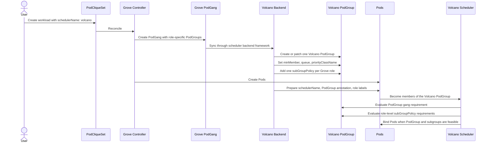

# Volcano Scheduler Backend

<!-- toc -->
- [Overview](#overview)
- [Background](#background)
  - [Prior Art](#prior-art)
- [Volcano Concepts](#volcano-concepts)
  - [PodGroup](#podgroup)
  - [SubGroupPolicy](#subgrouppolicy)
  - [Pod Annotation](#pod-annotation)
- [Scope](#scope)
  - [Supported](#supported)
  - [Not Supported Yet](#not-supported-yet)
- [Configuration](#configuration)
  - [Version Requirement](#version-requirement)
  - [Scheduler Profile](#scheduler-profile)
  - [Operator Config Validation](#operator-config-validation)
  - [Examples](#examples)
- [Design](#design)
  - [Scheduling Flow](#scheduling-flow)
  - [Mapping: PodGang -&gt; PodGroup](#mapping-podgang---podgroup)
  - [Role SubGroups](#role-subgroups)
  - [Pod Preparation](#pod-preparation)
- [Validation Behavior](#validation-behavior)
- [Future Work](#future-work)
<!-- /toc -->

## Overview

This document describes the initial implementation of [Volcano](https://volcano.sh) scheduler backend support in Grove Operator.

Grove already has a scheduler backend framework defined in [GREP-375](../375-scheduler-backend-framework/README.md). This change adds Volcano as an optional scheduler backend without changing the existing PodCliqueSet, PodGang, or Pod lifecycle.

The current scope is intentionally narrow:

- support Volcano gang scheduling through `PodGroup`
- use Volcano 1.14 `subGroupPolicy` to model each Grove role as a Volcano subgroup inside the generated `PodGroup`
- prepare Pods with `schedulerName: volcano`
- attach the official Volcano PodGroup annotation to Pods
- keep topology-aware placement as future work unless it can be expressed through Volcano's supported PodGroup fields

This proposal documents the Volcano backend behavior and the planned Volcano 1.14 subgroup extension.

## Background

All scheduler backends in Grove implement the same interface:

```go
type Backend interface {
	Name() string
	Init() error
	SyncPodGang(ctx context.Context, podGang *PodGang) error
	OnPodGangDelete(ctx context.Context, podGang *PodGang) error
	PreparePod(pod *corev1.Pod)
	ValidatePodCliqueSet(ctx context.Context, pcs *PodCliqueSet) error
}
```

This lets Grove keep its controller flow unchanged while plugging in backend-specific behavior for:

- PodGang synchronization
- Pod preparation before creation
- backend-specific PodCliqueSet validation

### Prior Art

This design follows the direction taken by other Volcano ecosystem projects after Volcano 1.14 introduced subgroup support.

[KubeRay issue #4656](https://github.com/ray-project/kuberay/issues/4656) proposes adding `subGroupPolicy` to the Volcano PodGroups generated for `RayJob` and `RayCluster`. The issue describes the same two scheduling dimensions that Grove needs: subgroup-level gang scheduling and subgroup-level network topology affinity. In the Ray case, different workgroups can have different minimum scheduling and placement requirements while still belonging to one Volcano PodGroup.

[Kthena PR #587](https://github.com/volcano-sh/kthena/pull/587) and the Kthena gang scheduling documentation use Volcano `subGroupPolicy` for role-level gang scheduling in model serving workloads. Kthena maps serving roles such as prefill and decode into Volcano subgroups so that partial role deployment does not waste resources. The Kthena documentation also states that `subGroupPolicy` requires Volcano version greater than or equal to 1.14.

Grove should adopt the same version boundary. The role-level PodGang support proposed here depends on Volcano `subGroupPolicy`, and the follow-up topology-aware scheduling work will also depend on the Volcano 1.14+ PodGroup and network topology APIs. To avoid carrying compatibility code for older Volcano releases that cannot express these semantics, the Volcano backend should require Volcano 1.14 or newer.

## Volcano Concepts

### PodGroup

Volcano uses the `PodGroup` CR (`scheduling.volcano.sh/v1beta1`) to represent a gang of Pods that should be scheduled together.

Minimal example:

```yaml
apiVersion: scheduling.volcano.sh/v1beta1
kind: PodGroup
metadata:
  name: training-job
  namespace: default
spec:
  minMember: 8
  queue: default
  priorityClassName: high-priority
```

### SubGroupPolicy

Volcano 1.14 adds `subGroupPolicy` to `PodGroup`. A subgroup is a smaller scheduling unit inside a PodGroup. It is selected by Pod labels and has its own size requirement.

This is the key Volcano feature used by this design. Grove already represents a PodGang as a collection of role-specific `PodGroup` entries. The Volcano backend maps those Grove role groups into Volcano `subGroupPolicy` entries so that each role can be scheduled as its own subgroup while still belonging to the same Volcano PodGroup.

Minimal example:

```yaml
apiVersion: scheduling.volcano.sh/v1beta1
kind: PodGroup
metadata:
  name: inference
  namespace: default
spec:
  minMember: 4
  subGroupPolicy:
    - name: prefill
      labelSelector:
        matchLabels:
          grove.io/podclique: prefill
      matchLabelKeys:
        - grove.io/podclique
      subGroupSize: 2
    - name: decode
      labelSelector:
        matchLabels:
          grove.io/podclique: decode
      matchLabelKeys:
        - grove.io/podclique
      subGroupSize: 2
```

### Pod Annotation

Volcano uses a Pod annotation to associate a Pod with its PodGroup:

```text
scheduling.k8s.io/group-name: <podgroup-name>
```

Grove writes this annotation during Pod preparation.

## Scope

### Supported

- Volcano scheduler profile registration in operator config
- operator config validation for the Volcano scheduler profile
- PodGang to PodGroup synchronization
- role-level PodGang semantics through Volcano `subGroupPolicy`
- Pod `schedulerName` preparation
- Pod Volcano group annotation injection
- workload-scoped queue selection and validation

### Not Supported Yet

- topology-aware scheduling with Volcano `networkTopology`
- HyperNode integration and `highestTierAllowed` translation
- queue lifecycle management
- PodGroup status propagation back into Grove-specific status fields

If a PodCliqueSet uses `topologyConstraint` with the Volcano backend before topology translation is implemented, the request is rejected during validation.

## Configuration

### Version Requirement

The Volcano backend requires Volcano 1.14 or newer.

The requirement is intentional rather than incidental:

- `subGroupPolicy` is the native Volcano API used to represent role-level Grove PodGang semantics.
- KubeRay and Kthena both moved toward `subGroupPolicy` immediately after Volcano 1.14 made the feature available.
- Grove's planned topology-aware scheduling support for the Volcano backend also depends on Volcano 1.14+ capabilities, including subgroup-level topology placement.

Clusters running an older Volcano release should either upgrade Volcano before enabling the Grove Volcano backend or use a different scheduler backend.

When the operator configuration includes a scheduler profile named `volcano`, the operator must treat the Volcano backend as active. During backend initialization, it should inspect the installed Volcano `podgroups.scheduling.volcano.sh` CRD and verify that `spec.subGroupPolicy` is present on `scheduling.volcano.sh/v1beta1` `PodGroup`. If the CRD is missing, the API version is unavailable, or the schema does not expose `subGroupPolicy`, the Volcano backend should fail initialization and report a clear error.

When the check fails, the operator should:

- emit a Kubernetes event explaining that the active Volcano backend requires Volcano 1.14 or newer with `PodGroup.spec.subGroupPolicy`
- log the same error with the detected missing capability
- keep Volcano-backed PodCliqueSets from being accepted or reconciled as schedulable until the capability is available

Once the cluster is upgraded and the Volcano PodGroup CRD exposes `subGroupPolicy`, the backend initialization can succeed and normal reconciliation can continue.

### Scheduler Profile

The operator adds a new scheduler profile name:

```yaml
scheduler:
  profiles:
  - name: default-scheduler
  - name: volcano
```

The `default-scheduler` profile remains supported and present in the scheduler configuration. Operators can enable Volcano alongside `default-scheduler`, and workloads can select Volcano by setting `spec.schedulerName: volcano`.

### Operator Config Validation

The operator configuration validation must include `volcano` in the supported scheduler profile names. A valid scheduler configuration may use `volcano` in `scheduler.profiles[].name`.

Validation should reject:

- `scheduler.profiles[].name: volcano` if the Volcano scheduler name is not registered as supported
- duplicate `volcano` profiles
- an empty `scheduler.profiles` list or an empty `scheduler.defaultProfileName`

Defaulting continues to ensure that `default-scheduler` is available in the profile list when the user omits it, preserving the existing operator configuration behavior while allowing `volcano` to be enabled explicitly.

Queue selection is workload-scoped through the annotation:

```go
const QueueAnnotationKey = "scheduling.grove.io/volcano-queue"
```

Behavior:

- if the queue annotation is omitted, the effective queue defaults to `default`
- for `PodCliqueSet`, the recommended entry is `metadata.annotations["scheduling.grove.io/volcano-queue"]`
- `spec.template.cliques[].annotations["scheduling.grove.io/volcano-queue"]` may repeat the same value, but must not conflict with the PodCliqueSet metadata annotation
- for direct `PodClique`, use `metadata.annotations["scheduling.grove.io/volcano-queue"]`
- validation requires the final queue to exist and be in `Open` state

### Examples

Recommended `PodCliqueSet` usage:

```yaml
apiVersion: grove.io/v1alpha1
kind: PodCliqueSet
metadata:
  name: volcano-train
  annotations:
    scheduling.grove.io/volcano-queue: gpu-training
spec:
  replicas: 1
  template:
    cliques:
      - name: worker
        spec:
          replicas: 2
          podSpec:
            schedulerName: volcano
            containers:
              - name: main
                image: busybox:1.36
                command: ["sh", "-c", "sleep 3600"]
```

Direct `PodClique` usage:

```yaml
apiVersion: grove.io/v1alpha1
kind: PodClique
metadata:
  name: worker
  namespace: default
  annotations:
    scheduling.grove.io/volcano-queue: gpu-training
spec:
  roleName: worker
  replicas: 2
  podSpec:
    schedulerName: volcano
    containers:
      - name: main
        image: busybox:1.36
        command: ["sh", "-c", "sleep 3600"]
```

If the queue annotation is omitted entirely, the effective queue is `default`.

## Design

### Scheduling Flow

The Volcano backend keeps the same Grove controller flow and changes only the backend-specific translation step.



The result is that Grove keeps `PodGang` as the portable scheduler API, while Volcano receives a native PodGroup that can express both workload-level and role-level gang scheduling.

### Mapping: PodGang -> PodGroup

Grove maps a PodGang into a Volcano PodGroup as follows:

| Grove PodGang | Volcano PodGroup | Notes |
|---|---|---|
| `metadata.name` | `metadata.name` | Same name |
| `metadata.namespace` | `metadata.namespace` | Same namespace |
| `sum(spec.podGroups[].minReplicas)` | `spec.minMember` | Overall PodGroup gang minimum |
| `spec.priorityClassName` | `spec.priorityClassName` | Direct mapping |
| `metadata.annotations["scheduling.grove.io/volcano-queue"]` on the resolved workload | `spec.queue` | Defaults to `default` |
| `spec.podGroups[]` | `spec.subGroupPolicy[]` | One Volcano subgroup per Grove role group |
| `spec.podGroups[i].name` | `spec.subGroupPolicy[i].name` | Stable subgroup name for the role |
| `spec.podGroups[i].minReplicas` | `spec.subGroupPolicy[i].subGroupSize` | Role-level gang minimum |

The operator also sets an owner reference from PodGroup to PodGang so normal Kubernetes garbage collection can clean up the Volcano resource when the Grove resource is deleted.

### Role SubGroups

Each role in a Grove PodGang becomes one Volcano subgroup. The backend uses the existing Grove PodClique label as the stable role label for the Volcano subgroup selector.

Example translation:

```yaml
apiVersion: scheduling.grove.io/v1alpha1
kind: PodGang
metadata:
  name: llm-serving
spec:
  podgroups:
    - name: prefill
      podReferences: []
      minReplicas: 2
    - name: decode
      podReferences: []
      minReplicas: 2
```

becomes:

```yaml
apiVersion: scheduling.volcano.sh/v1beta1
kind: PodGroup
metadata:
  name: llm-serving
spec:
  minMember: 4
  subGroupPolicy:
    - name: prefill
      labelSelector:
        matchLabels:
          grove.io/podclique: prefill
      matchLabelKeys:
        - grove.io/podclique
      subGroupSize: 2
    - name: decode
      labelSelector:
        matchLabels:
          grove.io/podclique: decode
      matchLabelKeys:
        - grove.io/podclique
      subGroupSize: 2
```

The PodGroup-level `minMember` preserves the whole-workload gang requirement. The role-level requirement is expressed by each `subGroupPolicy[].subGroupSize`, which is copied from the corresponding Grove `PodGroup.minReplicas`. For example, if the Grove `prefill` PodGroup requires two replicas, the generated Volcano `prefill` subgroup uses `subGroupSize: 2`, so Volcano should not treat one `prefill` Pod as an independently useful partial role.

This design does not require `networkTopology`. Later work can attach `networkTopology` to the generated Volcano PodGroup or to individual subgroup policies when Grove topology constraints are translated to Volcano HyperNode semantics.

### Pod Preparation

When the Volcano backend is selected, Grove mutates the Pod before creation:

```go
pod.Spec.SchedulerName = "volcano"
pod.Annotations["scheduling.k8s.io/group-name"] = podGangName
```

The Volcano PodGroup name is the same as the Grove PodGang name. The role subgroup selectors rely on the existing Grove labels that identify the PodClique owning each Pod.

## Validation Behavior

The initial `subGroupPolicy` integration intentionally focuses on gang scheduling and refuses topology-aware scheduling constraints that require Volcano HyperNode translation.

Examples of rejected cases:

- `spec.template.topologyConstraint`
- `spec.template.cliques[i].topologyConstraint`
- `spec.template.podCliqueScalingGroupConfigs[i].topologyConstraint`

Typical validation error:

```text
volcano scheduler backend does not support topologyConstraint on PodCliqueSet
```

This keeps the first Volcano integration limited to gang scheduling and avoids implying support for placement semantics that are not implemented yet.

## Future Work

Potential follow-up work includes:

- translate Grove topology constraints into Volcano `networkTopology`
- support subgroup-level `networkTopology` so selected roles can require stricter HyperNode placement than the whole PodGroup
- evaluate how Grove role names, PodClique names, and PodCliqueScalingGroup replica indexes should map to stable Volcano subgroup names for scaled workloads
- richer PodGroup status integration
- optional queue existence checks during initialization
- expose subgroup scheduling state in Grove status when Volcano reports enough detail
