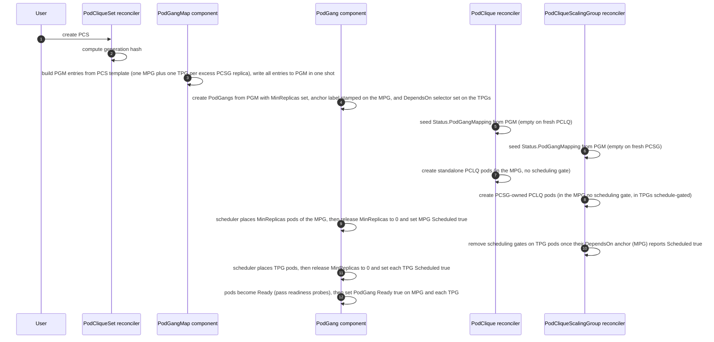
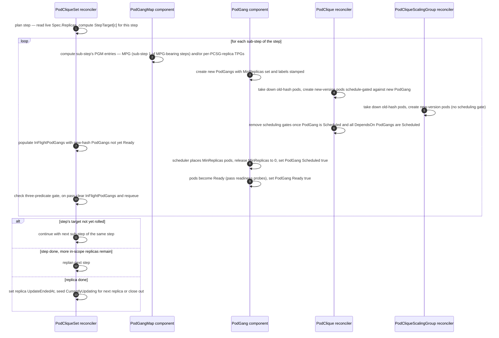
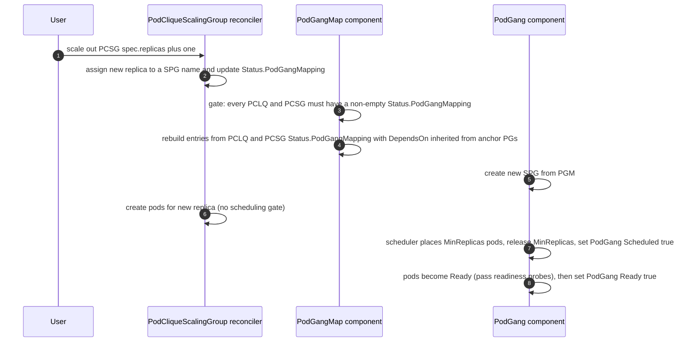
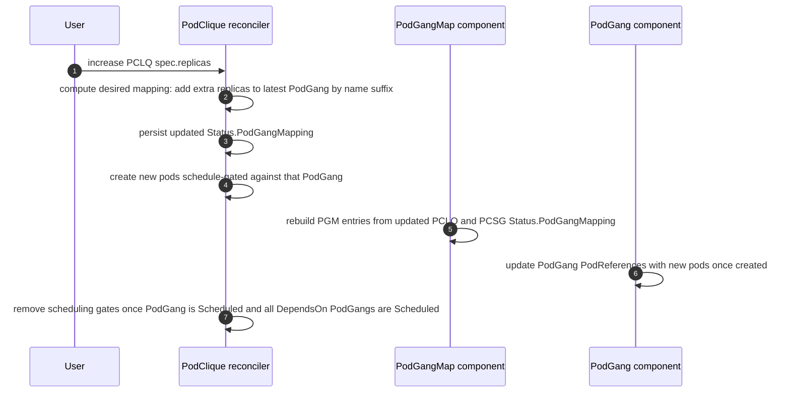
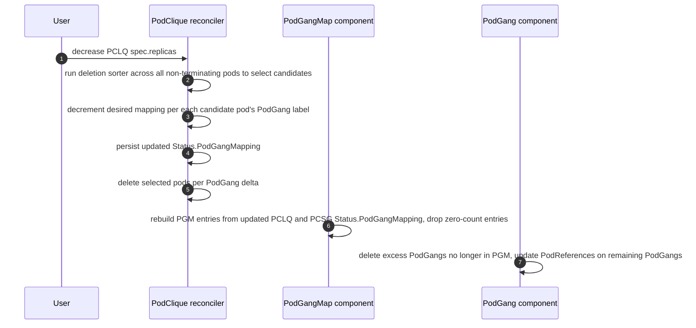

# GREP-393: Coherent Rolling Updates


<!-- toc -->
- [Summary](#summary)
- [Motivation](#motivation)
  - [Why cross-version communication is considered unsafe in Disaggregated Inference?](#why-cross-version-communication-is-considered-unsafe-in-disaggregated-inference)
  - [Goals](#goals)
  - [Non-Goals](#non-goals)
- [Abbreviations](#abbreviations)
- [Proposal](#proposal)
  - [PodGang variants](#podgang-variants)
  - [User Stories](#user-stories)
    - [Story 1](#story-1)
    - [Story 2](#story-2)
  - [Limitations/Risks &amp; Mitigations](#limitationsrisks--mitigations)
- [Design Details](#design-details)
  - [API Changes](#api-changes)
    - [UpdateStrategyType — Coherent is the default](#updatestrategytype--coherent-is-the-default)
    - [RollingUpdateConfiguration — per-component update knobs](#rollingupdateconfiguration--per-component-update-knobs)
    - [MaxUnavailable defaulting and validation](#maxunavailable-defaulting-and-validation)
    - [PodGangMap — new CRD](#podgangmap--new-crd)
    - [PodCliqueSetStatus.UpdateProgress extensions for Coherent update strategy](#podcliquesetstatusupdateprogress-extensions-for-coherent-update-strategy)
      - [Capturing MVU scope in PodCliqueSetUpdateProgress](#capturing-mvu-scope-in-podcliquesetupdateprogress)
      - [Per-replica sub-step tracking on PodCliqueSetReplicaUpdateProgress](#per-replica-sub-step-tracking-on-podcliquesetreplicaupdateprogress)
    - [PodGangMapping on PodCliqueStatus and PodCliqueScalingGroupStatus](#podgangmapping-on-podcliquestatus-and-podcliquescalinggroupstatus)
    - [Labels on PodGang resources](#labels-on-podgang-resources)
  - [Gang scheduling during initial deployment of PCS](#gang-scheduling-during-initial-deployment-of-pcs)
  - [Coherent update behavior and flow](#coherent-update-behavior-and-flow)
    - [Actors and responsibilities](#actors-and-responsibilities)
    - [PodGangMap as source of truth — directionality flip](#podgangmap-as-source-of-truth--directionality-flip)
    - [Rules of MPG composition](#rules-of-mpg-composition)
      - [Step plan](#step-plan)
        - [Worked example](#worked-example)
      - [Per-sub-step gate](#per-sub-step-gate)
    - [Coherent update flow](#coherent-update-flow)
      - [Bootstrap (initial PCS deploy)](#bootstrap-initial-pcs-deploy)
      - [One coherent update step](#one-coherent-update-step)
      - [Steady-state PGM follower (post-update)](#steady-state-pgm-follower-post-update)
      - [Steady-state standalone PCLQ scale-out](#steady-state-standalone-pclq-scale-out)
      - [Steady-state standalone PCLQ scale-in](#steady-state-standalone-pclq-scale-in)
    - [PodGang.MinReplicas lifecycle and conditions](#podgangminreplicas-lifecycle-and-conditions)
      - [Why standalone-PCLQ PodGroups release MinReplicas but PCSG-member PodGroups do not](#why-standalone-pclq-podgroups-release-minreplicas-but-pcsg-member-podgroups-do-not)
    - [Gang termination suppression during updates](#gang-termination-suppression-during-updates)
    - [DependsOn and scheduling order](#dependson-and-scheduling-order)
    - [PodGang naming convention](#podgang-naming-convention)
    - [Illustration by example](#illustration-by-example)
      - [Case A — Clean divisibility](#case-a--clean-divisibility)
      - [Case B — Residual and leftover](#case-b--residual-and-leftover)
      - [Case E — Single-component update](#case-e--single-component-update)
      - [Case H — Invalid: MaxUnavailable &lt; MinAvailable](#case-h--invalid-maxunavailable--minavailable)
      - [Case I — Invalid: RollingUpdate on a PCSG-owned PCLQ template](#case-i--invalid-rollingupdate-on-a-pcsg-owned-pclq-template)
  - [PodGang label preservation contract](#podgang-label-preservation-contract)
  - [Update concurrency](#update-concurrency)
  - [Handling scale-outs and scale-ins during update](#handling-scale-outs-and-scale-ins-during-update)
  - [Monitoring](#monitoring)
  - [Dependencies](#dependencies)
  - [Graduation Criteria](#graduation-criteria)
<!-- /toc -->

## Summary

Disaggregated inference architectures split LLM serving into distinct phases — most commonly (but not limited to) **prefill** (context generation) and **decode** (token generation) — running as separate, independently scalable components. While this can improve throughput and hardware utilisation, it introduces a hard operational constraint during version upgrades: prefill and decode instances that communicate must always run compatible software versions. This proposal introduces **Coherent Rolling Updates** for `PodCliqueSet`, enabling availability-preserving software upgrades that progress in bounded steps. Each step pairs an atomic **Minimum Viable Unit (MVU)** — the smallest set of components that must come up together at the new version to remain compatible — with subsequent tail sub-steps that drain the remainder under a per-component **`MaxUnavailable`** disruption budget. `Coherent` is the default `UpdateStrategy` for `PodCliqueSet`.

## Motivation

Inference frameworks (e.g., vLLM, SGLang, TensorRT-LLM) support disaggregated LLM serving, where stages like prefill and decode run as separate, networked components. While this can improve throughput and resource efficiency, it complicates standard deployment practices. A standard Kubernetes rolling update inevitably creates a period where old and new version pods run at the same time and may communicate. In disaggregated systems, this cross-version communication is unsafe, so applications must prevent it. However, once cross-version communication is disabled, rolling updates introduce another issue: different components often update at different rates, which leads to mismatched pools of compatible instances. For example, you might still have many old-version prefill instances running while most old-version decode instances have already been replaced. Since old prefill can only talk to old decode, a portion of the prefill capacity becomes unusable due to the lack of matching decode capacity. This kind of mismatch reduces effective end-to-end serving capacity during the update. Our goal is to design a rolling update strategy that maintains balanced, compatible capacity across components, with operator control over how much capacity may be unavailable at any moment.

### Why cross-version communication is considered unsafe in Disaggregated Inference?

AI inference frameworks are evolving rapidly as new architectures/models are released, prioritising performance optimisations over backwards compatibility between versions. In aggregated serving this is generally acceptable — model instances are self-contained within pods of the same version, so internal format changes are invisible to the deployment layer. In disaggregated serving, however, as explained above, a naive rolling update could result in cross-version communication where an old-version prefill may attempt a KV-cache transfer to a new-version decode. Across versions, any number of things can change and break this contract — the KV-cache data layout (dtype, dimension ordering, block size), the protocol used for the transfer handshake, even user-specified updates to the sharding strategy across new versions etc. Ultimately since the kv-cache managers are not backwards compatible and often optimized there is no guarantee that cross version communication is safe and its fairly likely that it is not safe.

### Goals

* Enable rolling updates at a user-chosen granularity: the user selects which components to update in one event, and the system replaces them in lockstep within each MVU so cross-version mixing within the boundary is impossible.
* Each MVU is gang-scheduled as a single unit, so an MVU's pods either come up together at the new version or none of them do.
* Preserve `PodCliqueSet` availability during rolling updates to serve incoming traffic with sets of compatible interdependent components.
* Provide a per-component **`MaxUnavailable`** knob that bounds the worst-case disruption per step, so operators can dial the tradeoff between rollout speed and serving capacity preserved during the rollout.

### Non-Goals

* Ensure equal or better topology optimized placement of the workload after rolling update.
* Explicit support for `maxSurge`. A future iteration will add `maxSurge` to the same per-component update configuration that carries `MaxUnavailable` today.
* User-configurable concurrency control during a coherent update — neither the number of `PodCliqueSet` replicas updated simultaneously nor the number of MVU steps in flight per replica is configurable in the current iteration. Both default to one. Configurable knobs will be supported in future.
* `scale-out` and `scale-in` of scale sub-resources (`PodClique`, `PodCliqueScalingGroup`, `PodCliqueSet`) during a coherent update. The current iteration rejects these operations PCS-wide for the duration of an in-flight coherent update — see [Handling scale-outs and scale-ins during update](#handling-scale-outs-and-scale-ins-during-update) for the precise scope and rationale. Narrower per-replica scoping and otherwise composing scale operations with an in-flight coherent update will be supported in future iterations.
* Rollback and roll-forward of `PodCliqueSet` revisions. Tracking PCS revision history and providing operator-driven rollback / roll-forward to a prior version will be supported in future.
* Solving cross-version communication between updating and existing components. This iteration leaves that concern to the application — the data plane is responsible for ensuring traffic respects version compatibility. As stated in [Motivation](#motivation), the goal of Coherent is to design a rolling update strategy that maintains balanced, compatible capacity across components, with operator control over how much capacity may be unavailable at any moment. A primitive for application-level routing or proportional traffic selection by revision can be added in a future increment if the need arises.

## Abbreviations

Throughout this proposal we will be using these short forms for brevity:

| Long Form             | Short Form |
| --------------------- | ---------- |
| PodCliqueSet          | PCS        |
| PodCliqueScalingGroup | PCSG       |
| PodClique             | PCLQ       |
| PodGang               | PG         |
| BasePodGang           | BPG        |
| ScaledPodGang         | SPG        |
| MVUPodGang            | MPG        |
| TailPodGang           | TPG        |
| PodGangMap            | PGM        |
| Minimal Viable Unit   | MVU        |

> ***NOTE:*** `BPG`, `SPG` , `TPG `and `MPG` are abbreviations introduced only to differentiate different types of `PodGang` resources and are not new custom resources. `PGM` is a new custom resource introduced by this GREP..

## Proposal

The GREP introduces a new rolling update strategy, named **Coherent Rolling Updates**, based on the concept of a **Minimal Viable Unit** (a.k.a. MVU).

An MVU is **the set of `MinAvailable` replicas of every component the user has changed in this update event**. The user implicitly defines the compatibility boundary: it is exactly the set of components touched in this update event. Changing only one component (e.g. only `decode`) produces an MVU that contains MinAvailable replicas of just that component; changing multiple components in a single update event (e.g. `prefill` and `decode` together for a non-backward-compatible upgrade) produces an MVU that contains MinAvailable replicas of each.

Components the user has not changed in this update event are not part of the MVU. They continue to run unhindered in their existing PodGangs and are not co-rolled. This is what makes Coherent updates granular: the disruption per update event is bounded by what the user actually changed.

If pods in different PodCliques can't communicate safely across disaggregation boundaries because their software versions are incompatible, updating all pods in an MVU as a unit (rather than individually) eliminates mixed-version imbalance for the components inside the boundary the user has drawn.

### PodGang variants

To realise the MVU model on top of Grove's existing scheduling primitives, Coherent introduces three new kinds of `PodGang` and retains two legacy ones from prior strategies. The full set used throughout this proposal is:

| Name              | Legacy / New | When created | What it holds |
| ----------------- | ------------ | ------------ | ------------- |
| **BPG** (Base PodGang)           | Legacy | Initial deployment under pre-Coherent strategies. | One per PCS replica. Carries `MinAvailable` replicas of every standalone `PodClique` and every `PodCliqueScalingGroup`. |
| **SPG** (Scaled PodGang)         | Legacy / New | One per PCSG replica above `MinAvailable` — created at initial deployment under pre-Coherent strategies, or during steady-state PCSG scale-out after a coherent update. Under the legacy naming convention the name is `<pcs-name>-<replica>-scaled-<n>`; under the new convention (post first coherent update) the name follows `<pcs-name>-<replica>-<unix-nano>`. Structurally the same as a TPG but created outside an update window. | A single PCSG replica. |
| **MPG** (Minimum-Viable PodGang) | New    | Initial deployment under `Coherent`, and again at the first sub-step of every MPG-bearing step of a coherent update. | The smallest PodGang that satisfies availability — `MinAvailable` replicas of every standalone `PodClique` and every `PodCliqueScalingGroup` in scope. Plays the same role BPG used to, but is generated fresh on each MPG-bearing step rather than persisted across updates. |
| **TPG** (Tail PodGang)           | New    | During a coherent update, alongside an MPG. | PCSG replicas above `MinAvailable` that need to roll in lockstep with the MPG. Depends on the MPG via `DependsOn`, so the scheduler places it only after the MPG is up. |

A single PCS replica can hold a mix of these variants at any given moment — for example, mid-update a replica might still have its old-hash MPG and TPGs present alongside a new-hash MPG and new-hash TPGs, until the old gangs are fully drained.

BPG and SPG are listed only because pre-existing `PodCliqueSet` resources created with the `RollingRecreate` strategy continue to operate against PodGangs of those shapes, and the implementation has to keep recognising them. The intent is that every `PodCliqueSet` eventually adopts `Coherent`, at which point BPG and the legacy SPG naming can be removed from the codebase entirely. A `PodCliqueSet` can opt in by switching its `UpdateStrategy` to `Coherent`; the first coherent update after the switch drains the legacy BPG/SPGs and generates MPG/TPG/SPG (under the new naming convention) to replace them.

### User Stories

#### Story 1

As a platform engineer operating a disaggregated inference deployment (e.g., prefill and decode components) using modern inference frameworks (such as vLLM, SGLang, or TensorRT-LLM), I need to safely roll out new software versions where components are not backward compatible across versions. During an upgrade, prefills running the old version must not attempt to communicate with decodes running the new version (and vice versa), as this can lead to crashes, corrupted KV transfers, or undefined behavior.

The system must update prefill and decode pods together as a single atomic unit (MVU), ensuring that at no point does an old-version prefill hand off a KV-cache block to a new-version decode, or vice versa. While the update is in progress, replicas that have not yet been updated must continue serving traffic using only old-version components, and replicas that have already been updated must serve using only new-version components. The update should proceed replica-by-replica (or MVU-by-MVU within a replica) without requiring a full deployment restart, so that overall serving capacity is preserved throughout the rollout.

#### Story 2

As an ML infrastructure team member deploying a disaggregated inference system where the prefill tier and decode tier are updated on different release cadences, I need to independently update only the decode `PodClique` (e.g., to pick up a memory-efficiency fix) without touching the prefill `PodClique`. The system should recognise this as a backward-compatible, single-component update, replace decode pods incrementally — at most `MaxUnavailable` decode pods at a time so the rest continue serving — and leave prefill pods untouched, all without requiring a full MVU replacement.

### Limitations/Risks & Mitigations

The current iteration of Coherent Rolling Updates carries the following known limitations. Each is a deliberate scope boundary, with planned follow-up where applicable.

1. **No surge-style availability headroom during a coherent update.** Coherent always replaces in place — pods of an updated component are taken down before their new-version replacements are created.

   *Mitigation:* operators who need additional availability headroom during a coherent update can either:
   - Provision more replicas at the PCLQ / PCSG level (so MinAvailable < Replicas, and the surplus continues serving while the MinAvailable floor is rolled), or
   - Provision more PCS replicas (so a fraction of the fleet is always at a non-updating replica index).

2. **Initial PCS deployment retains the BPG / SPG composition.** A freshly created `PodCliqueSet` lays out one BPG-shaped PodGang carrying the full standalone-PCLQ count plus `MinAvailable` of every PCSG, plus one SPG-shaped PodGang per PCSG replica above `MinAvailable`. Names follow the unified [PodGang naming convention](#podgang-naming-convention), but the composition matches the legacy layout.

   The cost of this layout shows up at gate removal: scheduling gates on every SPG's pods are lifted in a single batch once the BPG anchor reports `Scheduled=True`. The backend scheduler then sees the full pool of SPG pods become eligible at the same instant. Under capacity pressure, the scheduler's choice of placement order — which SPG it places first — determines the running distribution across PCSGs, and the scheduler is free to favour one PCSG over another. The result can be a skewed allocation of running replicas across PCSGs, even though every SPG was eligible. The MPG / TPG layout produced during coherent updates does not have this issue because gate removal is paced by sub-steps and `MaxUnavailable`, so only a small batch of TPGs becomes eligible at a time.

   *Mitigation:* none in this iteration. The first coherent update on a `PodCliqueSet` naturally evolves the layout into MPG/TPG shape under the step/sub-step algorithm. A future iteration will evolve the initial layout to match.

3. **Preemption between sub-steps can stall the rollout.** Predicate 3 of the [Per-sub-step gate](#per-sub-step-gate) requires that no in-scope component's `Ready` count fall below `replicas[c] - maxUnavailable[c]` before the next sub-step takes more pods down. If preemption or unrelated pod loss drops the count below that floor between sub-steps, the orchestrator stalls until availability recovers. This matches Kubernetes Deployment behavior under `maxUnavailable` and is the right safety behavior, but it can leave a coherent update parked indefinitely if preemption persists.

   *Mitigation:* operators experiencing repeated stalls should inspect `Status.UpdateProgress.CurrentlyUpdating[].ErrorMessage` and address the underlying capacity/preemption pressure on the cluster. Future work may add a configurable stall timeout that escalates to a user-visible event.

## Design Details

### API Changes

This section consolidates every API surface added or modified to support Coherent Rolling Updates.

#### UpdateStrategyType — Coherent is the default

A new value `Coherent` is introduced on `UpdateStrategyType`. It is the **default** `UpdateStrategy` for a `PodCliqueSet`.

```go
// +kubebuilder:validation:Enum={Coherent,RollingRecreate,OnDelete}
type UpdateStrategyType string

const (
    // CoherentStrategy indicates a multi-step incremental update whose cadence is
    // governed by the current replica ratios among the components of the PodCliqueSet
    // under update. Each step takes down a proportional slice of every updated
    // component together, so the surviving capacity at any moment remains a
    // version-compatible, ratio-preserving subset of the workload. Each step pairs
    // an MVU PodGang (carrying MinAvailable replicas of every updated component) with
    // subsequent tail sub-steps that drain the per-step remainder under each
    // component's MaxUnavailable budget. This is the default update strategy.
    CoherentStrategy UpdateStrategyType = "Coherent"
)

type PodCliqueSetUpdateStrategy struct {
    // Default is Coherent.
    // +kubebuilder:default=Coherent
    Type UpdateStrategyType `json:"type,omitempty"`
}
```

The strategy type is uniform across all components of a `PodCliqueSet`. Per-component disruption budgets (`MaxUnavailable` today; `MaxSurge` later) live on each component's `RollingUpdate` configuration — see [RollingUpdateConfiguration — per-component update knobs](#rollingupdateconfiguration--per-component-update-knobs).

#### RollingUpdateConfiguration — per-component update knobs

`RollingUpdateConfiguration` is a new sub-struct that carries per-component update-time knobs. It attaches to each `PodCliqueTemplateSpec` (alongside its `Spec`) and to each `PodCliqueScalingGroupConfig` (alongside its `MinAvailable`). The struct is optional; the PCS defaulting webhook fills it in.

```go
// RollingUpdateConfiguration carries per-component knobs that bound disruption
// during a rolling update. Applies to both the Coherent and RollingRecreate
// strategies; ignored for OnDelete. See `MaxUnavailable defaulting and
// validation` below for defaulting and validation rules.
type RollingUpdateConfiguration struct {
    // MaxUnavailable is the maximum number of pods (for a standalone PodClique) or
    // PodCliqueScalingGroup replicas (for a PCSG) that may be unavailable at any
    // moment during an update for this component.
    // +optional
    MaxUnavailable *int32 `json:"maxUnavailable,omitempty"`
    // MaxSurge will be added in a future iteration.
}

type PodCliqueTemplateSpec struct {
    Name string `json:"name"`
    // ... existing fields ...
    Spec PodCliqueSpec `json:"spec"`
    // RollingUpdate is the per-component update configuration for this
    // standalone PodClique. Standalone-only; rejected by the validating webhook
    // when set on a template whose name appears in any
    // PodCliqueScalingGroupConfig.CliqueNames.
    // +optional
    RollingUpdate *RollingUpdateConfiguration `json:"rollingUpdate,omitempty"`
}

type PodCliqueScalingGroupConfig struct {
    Name         string  `json:"name"`
    CliqueNames  []string `json:"cliqueNames"`
    MinAvailable *int32  `json:"minAvailable,omitempty"`
    // RollingUpdate is the per-component update configuration for this PCSG.
    // +optional
    RollingUpdate *RollingUpdateConfiguration `json:"rollingUpdate,omitempty"`
    // ... existing fields ...
}
```

**Why a sub-struct rather than a bare field on the component template?**
`MaxUnavailable` is the first of an expected group of update-time knobs (`MaxSurge` is next). Grouping them under a named struct keeps related fields together, scopes the standalone-only validation rule to the parent rather than each individual field, and avoids the API churn of adding sibling top-level fields one at a time.

**Why on each component rather than on `UpdateStrategy`?**
The strategy type is a single PCS-wide choice — every component rolls under the same strategy. The disruption budget, in contrast, is naturally per-component: in the [worked examples](#illustration-by-example), `F`, `P`, and `D` each have their own `MaxUnavailable`. Putting `RollingUpdate` on each component keeps the budget next to the component it bounds and lets the validating webhook reject standalone-only constraints on PCSG-owned templates without a second indirection through the strategy.

#### MaxUnavailable defaulting and validation

`MaxUnavailable` is optional on the spec. The PCS defaulting webhook fills it in based on `Spec.UpdateStrategy.Type` so that downstream code always sees an explicit value, and the validating webhook rejects spec combinations that would violate the strategy's mechanics.

**Defaulting.** Applied by the PCS defaulting webhook, per strategy:

- `Coherent` → defaults to `MinAvailable` of the same component.
- `RollingRecreate` → defaults to `1`.
- `OnDelete` → not defaulted. The orchestrator does not consume `MaxUnavailable` under this strategy.

The two defaults are chosen for internal consistency with the strategy's own mechanics. Coherent's MVU sub-step takes down `MinAvailable` pods of every updated component at once; any default below `MinAvailable` would put the very first sub-step over budget, so `MaxUnavailable = MinAvailable` is the smallest internally consistent value. RollingRecreate replaces pods one at a time and has no MVU sub-step, so `1` is the natural minimum and matches operator expectations for a Deployment-style rollout. Operators who want a different value set the field explicitly; the defaulting webhook only fills it in when unset.

**Validation.** Applied by the PCS validating webhook:

- `MaxUnavailable < MinAvailable` on any component is rejected, regardless of strategy.
- `RollingUpdate` set on a `PodCliqueTemplateSpec` whose name appears in any `PodCliqueScalingGroupConfig.CliqueNames` is rejected. PCSG-owned `PodCliques` draw their budget from the owning PCSG's `RollingUpdate.MaxUnavailable`; setting it on the member template is meaningless and a likely operator mistake.

**Strategy-flip safety.** If the user later switches `UpdateStrategy.Type` (e.g. `RollingRecreate` → `Coherent`) without explicitly setting `MaxUnavailable`, the previously-defaulted value (e.g. `1`) sticks — the defaulting webhook only defaults *unset* fields. The `MaxUnavailable < MinAvailable` rule closes this loop: under `Coherent`, the previously-defaulted `1` is below `MinAvailable` for any component with `MinAvailable >= 2`, and admission rejects the PCS until the operator sets an appropriate value. No strategy-conditional check at runtime is needed.

#### PodGangMap — new CRD

`PodGangMap` (PGM) is a new namespaced custom resource that captures the **desired-state mapping between PodGangs and their constituent PodClique pod counts and PodCliqueScalingGroup replica indices** for a single `PodCliqueSet` replica. One `PodGangMap` exists per PCS replica, named `<pcs-name>-<pcs-replica-index>`.

`PodGangMap` has no `Status` subresource as it only captures the desired-state. Mappings captured in this resource are read by the `PodGang` in PCS reconciler, `PodClique` component in PCSG reconciler and `Pod` component in PCLQ reconciler.

```go
type PodGangMap struct {
    metav1.TypeMeta   `json:",inline"`
    metav1.ObjectMeta `json:"metadata,omitempty"`
    Spec              PodGangMapSpec `json:"spec,omitempty"`
}

type PodGangMapSpec struct {
    // PodCliqueSetReplicaIndex is the index of the PodCliqueSet replica this map belongs to.
    PodCliqueSetReplicaIndex int32 `json:"podCliqueSetReplicaIndex"`
    // Entries is the ordered list of desired PodGangs for this PodCliqueSet replica.
    // +listType=map
    // +listMapKey=name
    Entries []PodGangEntry `json:"entries"`
}

type PodGangEntry struct {
    // Name is the name of the PodGang this entry corresponds to.
    Name string `json:"name"`
    // PodCliqueSetGenerationHash is the PCS generation hash that pods in this PodGang must match.
    PodCliqueSetGenerationHash string `json:"podCliqueSetGenerationHash"`
    // PodCliques maps standalone PodClique name to the number of pods that belong to this PodGang.
    // +optional
    PodCliques map[string]int32 `json:"podCliques,omitempty"`
    // PCSGReplicaIndices maps PodCliqueScalingGroup config name to the PCSG replica indices
    // that belong to this PodGang.
    // +optional
    PCSGReplicaIndices map[string][]int32 `json:"pcsgReplicaIndices,omitempty"`
    // Labels are stamped on the materialized PodGang resource by the PodGang component.
    // The PodGangMap component populates this with labels needed for scheduling-order semantics
    // (see [DependsOn and scheduling order]) and any additional labels future iterations require.
    // +optional
    Labels map[string]string `json:"labels,omitempty"`
    // DependsOn is a label selector identifying sibling PodGangs whose pods must be scheduled
    // before pods in this entry's PodGang have their scheduling gates removed. A nil selector
    // means no dependency. See [DependsOn and scheduling order] for the selector authoring rules.
    // +optional
    DependsOn *metav1.LabelSelector `json:"dependsOn,omitempty"`
}
```

> **NOTE:** 
> The `+listType=map` and `+listMapKey=name` annotations on `Entries` are load-bearing on the API contract:
>
> - **Server-side merge semantics.** Patches against `PodGangMap` are merged by entry name rather than replacing the entire `Entries` slice atomically. Each reconcile emits minimal per-entry patches, and changes to one entry never clobber unrelated entries.
> - **Uniqueness of `Entries[*].Name`.** The API server rejects any object where two entries share the same name. This matches the operator's invariant that every PodGang name within a PCS replica is unique, and saves the PodGangMap component from having to defend against duplicates at runtime.
>
> These annotations should be preserved on any future modification of the field.

The `Labels` field is the mechanism by which the PodGangMap component conveys per-entry labels to the PodGang component. It keeps the materialized-PodGang label set under the PodGangMap component's authoring control without requiring per-label fields in the PGM schema — additional labels can be introduced in the future by populating this map, and labels can be removed simply by omitting them.

The role of `PodGangMap` in the update flow — and the directionality flip between update and steady state — is described in [Coherent update behavior and flow](#coherent-update-behavior-and-flow).

#### PodCliqueSetStatus.UpdateProgress extensions for Coherent update strategy

##### Capturing MVU scope in PodCliqueSetUpdateProgress

Two new fields are added to `PodCliqueSetUpdateProgress` to capture the **set of components in scope** for the current coherent update. This set is the user-declared compatibility boundary that the MVU floor must hold across, and it drives the step plan ([Step plan](#step-plan)) for every step.

```go
type PodCliqueSetUpdateProgress struct {
    // ... existing fields ...

    // UpdatedStandalonePodCliques captures the names of standalone PodCliques in scope for the
    // current coherent update. The set is established at update start from PodCliques whose pod
    // templates changed in the PCS spec change that triggered the update, and is preserved for
    // the lifetime of the update. On a mid-flight PCS spec change it is updated by merge — see
    // below. Only populated for Coherent.
    // +optional
    UpdatedStandalonePodCliques []string `json:"updatedStandalonePodCliques,omitempty"`

    // UpdatedPodCliqueScalingGroups captures the config names of PodCliqueScalingGroups in scope
    // for the current coherent update. Same establishment and lifetime semantics as
    // UpdatedStandalonePodCliques; a PCSG is in scope when any of its member PodCliques' pod
    // templates changed in the triggering PCS spec change. Only populated for Coherent.
    // +optional
    UpdatedPodCliqueScalingGroups []string `json:"updatedPodCliqueScalingGroups,omitempty"`
}
```

**Why a frozen set rather than a live computation.** The in-scope set is the compatibility boundary the user implicitly declared when they edited the PCS spec — "these are the components that must roll together to remain version-compatible." Recomputing it live from per-PCLQ status every reconcile would not preserve this intent: as components finish rolling, a live recompute would shrink the set and the orchestrator would continue creating MPGs against a smaller and smaller MVU floor, breaking the original compatibility-boundary guarantee. The set is therefore established at update start and held fixed for the lifetime of the update.

**Establishment.** When a PCS hash advance is first observed and no coherent update is in flight, the set is built from components whose pod templates differ between the new PCS spec and what each child PCLQ is currently running. Concretely: a standalone PCLQ is added if its target template (computed from the new PCS spec) differs from its `Status.CurrentPodTemplateHash`; a PCSG is added if any of its member PCLQs satisfies the same condition. Components whose pod templates did not change in this PCS spec change are not added — they may have their `Status.CurrentPodCliqueSetGenerationHash` advance synchronously to the new PCS hash without rolling any pods, but they are not part of this update's MVU compatibility boundary.

**Mid-flight PCS spec change.** If the user mutates the PCS spec again while an earlier coherent update is still in flight, the in-scope set is updated by **merge**, not by replacement:

```
new in-scope set =
    { components whose pod templates changed in this latest PCS spec change }
    ∪
    { components from the previous in-scope set that have not yet fully converged }
```

Components from the previous in-scope set that have already fully converged drop out — the user did not touch them again, and their roll is complete. Components from the previous in-scope set that are still mid-roll stay in scope. Components touched only by the latest spec change join the set. The merge avoids spurious re-rolling of components that were not changed in the latest PCS spec change and were already at the previous target.


##### Per-replica sub-step tracking on PodCliqueSetReplicaUpdateProgress

`PodCliqueSetReplicaUpdateProgress` gains two coherent-specific fields:

```go
type PodCliqueSetReplicaUpdateProgress struct {
    // ... existing fields ...

    // InFlightPodGangs are the names of PodGangs created in the current sub-step
    // for this replica. The orchestrator waits for all of them to reach
    // PodGangConditionTypeReady=True before advancing to the next sub-step.
    // +optional
    InFlightPodGangs []string `json:"inFlightPodGangs,omitempty"`

    // ErrorMessage captures the reason the update of this replica is stalled or failing, if any.
    // +optional
    ErrorMessage *string `json:"errorMessage,omitempty"`
}
```

`InFlightPodGangs` is the orchestrator's hand-off to the PodGangMap component and back, and provides visibility into which PodGangs are currently being driven to `Ready`. The mechanism, on every sub-step:

- While `InFlightPodGangs` is empty, the PodGangMap component computes the next sub-step's entries — creating the new-hash PodGangs that the sub-step requires and draining pods off the corresponding old-hash entries.
- The orchestrator reads PGM, picks the new-hash entries created in this sub-step that are not yet `Ready`, and writes their names into `InFlightPodGangs`.
- The orchestrator waits for every listed PodGang to reach `PodGangConditionTypeReady=True` (together with the other predicates from [Per-sub-step gate](#per-sub-step-gate)).
- Once the predicates hold, the orchestrator clears `InFlightPodGangs`, which signals the PodGangMap component to compute the next sub-step's entries.

The field is per-replica so that future configurable concurrency across replicas does not require a schema change.

#### PodGangMapping on PodCliqueStatus and PodCliqueScalingGroupStatus

Both `PodCliqueStatus` and `PodCliqueScalingGroupStatus` gain a `PodGangMapping` field that captures the per-PodGang composition for that owner. The shapes differ — PCLQ is keyed by PodGang and valued by pod count; PCSG is keyed by PodGang and valued by the list of PCSG replica indices belonging to that PodGang — but the role each field plays in the design is identical.

```go
type PodCliqueStatus struct {
    // ... existing fields ...

    // PodGangMapping captures the desired state of per-PodGang pod distribution.
    // During an update, this is derived from the PodGangMap resource — PodGangMap is the
    // single source of truth during updates. In steady state (post-update) this field becomes
    // the source of truth: scale-out and scale-in are reflected here, and PodGangMap is then
    // synced from this field.
    // Key is the PodGang name; value is the number of pods of this PodClique associated with
    // that PodGang.
    PodGangMapping map[string]int32 `json:"podGangMapping,omitempty"`
}

type PodCliqueScalingGroupStatus struct {
    // ... existing fields ...

    // PodGangMapping captures the desired state of per-PodGang replica distribution.
    // Same directionality semantics as PodCliqueStatus.PodGangMapping.
    // Key is the PodGang name; value is the list of PCSG replica indices associated with
    // that PodGang.
    PodGangMapping map[string][]int32 `json:"podGangMapping,omitempty"`
}
```

**Why are these fields needed at all, given that `PodGangMap` already captures per-PodGang composition?**  
It is the directionality flip already described in [PodGangMap as source of truth — directionality flip](#podgangmap-as-source-of-truth--directionality-flip): during a coherent update PGM drives and these status fields are followers; in steady state these status fields are authoritative and PGM is rebuilt from them. PGM has a single writer (the PodGangMap component, owned by the PodCliqueSet reconciler), so any per-owner scale-in or scale-out decision needs a place to live within the owner's own reconciler before the PodGangMap component picks it up. That place is `Status.PodGangMapping`.

What forces the field to exist is steady-state scale-in, but the *reason* the decision must be local — and therefore stored on the owner's status — is different for PCLQ and PCSG:

- **PodClique (standalone).** When `PodClique.Spec.Replicas` shrinks, the PodClique reconciler's pod component picks the pods to remove using a deletion sorter that considers pod-template-hash mismatch, readiness, age, and other heuristics over the live pod set. The chosen pods can come from any of the existing PodGangs and the pick is **non-deterministic from outside** the pod component — it depends on which pods exist at that instant. The pod component records the per-PodGang decrement in `PodCliqueStatus.PodGangMapping` during a scale-in, since only it knows which PodGang each removed pod was associated with.
- **PodCliqueScalingGroup.** When `PodCliqueScalingGroup.Spec.Replicas` shrinks, the PodCliqueScalingGroup reconciler's PodClique component runs a deterministic tier walk over the existing PodGang names — legacy SPG entries first, then unified-naming entries — sorted by trailing PodGang-name suffix descending, and pops the highest replica index from each entry until the scale-in count is satisfied. So although the PCSG-side pick is fully deterministic, the work — selecting which entry to drain and which replica index to pop from it — still happens inside the PodCliqueScalingGroup reconciler. The PodCliqueScalingGroup reconciler records the resulting decrement in `PodCliqueScalingGroupStatus.PodGangMapping` so the PodGangMap component can rebuild PGM from it on the next reconcile.

In both cases the directionality contract is the same: the scale decision is made and persisted by the owning reconciler in its own `Status.PodGangMapping`; the PodGangMap component, in its steady-state path, gates on every standalone PCLQ and every PCSG having a non-empty `Status.PodGangMapping`, then reconstructs PGM entries from the union of those mappings. During a coherent update the directionality is reversed — the owning reconciler's pod / PodClique component overwrites `Status.PodGangMapping` from PGM each reconcile.

#### Labels on PodGang resources

In addition to the standard PCS-managed-resource labels mirrored by the PodGang component (`grove.io/part-of`, `grove.io/component`, `grove.io/managed-by`, etc.), every `PodGang` resource managed by Coherent carries the following coherent-update-specific labels:

| Label | Purpose |
| --- | --- |
| `grove.io/podcliqueset-replica-index` | The PCS replica this PodGang belongs to. Allows the operator to identify the owning replica without parsing the PodGang name. |
| `grove.io/podcliqueset-generation-hash` | The PCS generation hash this PodGang was created for. Used by the PodGangMap component to distinguish old-hash from new-hash PodGangs during an update. |
| `scheduling.grove.io/anchor` | Set to `"true"` on every MPG (and on every legacy BPG). Absent on TPGs and SPGs. Used by `DependsOn` selectors to identify the dependency target — see [DependsOn and scheduling order](#dependson-and-scheduling-order). |

These labels are populated via the `Labels` field on the `PodGangEntry` (see [PodGangMap — new CRD](#podgangmap--new-crd)) and stamped onto the materialized `PodGang` resource by the PodGang component on creation.

The contract for the existing `grove.io/podgang` label on `PodClique` resources changes — see [PodGang label preservation contract](#podgang-label-preservation-contract).

### Gang scheduling during initial deployment of PCS

**Legacy behavior (prior to Coherent).** Grove's scheduling API uses PodGangs to represent an application's gang-scheduling constraints. Under the prior design, the first PodGang created as part of a PCS's initial deployment was called the `BasePodGang` (BPG); it carried MinAvailable replicas of every standalone PCLQ and every PCSG. For each PCSG replica above MinAvailable, a separate `ScaledPodGang` (SPG) was created — one PodGang per excess PCSG replica. Both BPG and SPGs persisted across update events: their `PodReferences` were refreshed as pods came and went, but the PodGangs themselves — and the overall BPG/SPG layout — were never torn down and rebuilt.

**New behavior under Coherent.** New PCS deployments produce the following layout in one shot at deploy time:

- **One MPG (Minimum-Viable PodGang)** carrying the full standalone-PCLQ count plus MinAvailable replicas of every PCSG. The MPG carries `scheduling.grove.io/anchor: "true"`.
- **One TPG (Tail PodGang)** per PCSG replica above MinAvailable. Each TPG carries a single PCSG replica and `DependsOn = matchLabels{scheduling.grove.io/anchor: "true"}`, so the scheduler places its pods only after the MPG reports `PodGangConditionTypeScheduled=True`.

The PodGangMap component writes the entire PGM in one shot. The PodGang component then materializes a `PodGang` resource for each entry, with `MinReplicas` set to the gang's MinAvailable.

> **Note on layout.** The MPG-plus-TPG layout produced at initial deployment is structurally identical to the legacy BPG-plus-SPG layout — same per-PodGang composition, same dependency relationships. The differences are in naming and in the new mechanisms layered on top: the unified [PodGang naming convention](#podgang-naming-convention), the `scheduling.grove.io/anchor` label and `DependsOn` selector, and the PodGang condition lifecycle. Subsequent coherent updates depart from this layout (each step's MPG is generated fresh); evolving the initial-deployment layout to match is left to a future iteration.

> **Migration note.** When the PodGangMap component first runs against a PCS replica that pre-dates this proposal — one already serving traffic with the legacy BPG/SPG shape — it reconstructs PGM entries from the live `PodGang` resources first, so the existing names and `DependsOn` selectors are preserved. Only when no PodGangs exist for the replica does PGM fall back to computing entries from the PCS template. Legacy gangs are not torn down on first reconcile after a Grove upgrade; they get drained out naturally by subsequent coherent updates.

### Coherent update behavior and flow

A PCS is composed of PCLQs and PCSGs. Updates may target a subset of them or all of them. The compatibility-boundary set of in-scope components is captured in `Status.UpdateProgress` when an update begins and is preserved for the lifetime of the update (with merge on a mid-flight PCS spec change — see [Capturing MVU scope in PodCliqueSetUpdateProgress](#capturing-mvu-scope-in-podcliquesetupdateprogress)). A validating webhook rejects scale-in/out across the entire PCS for the lifetime of the update (see [Handling scale-outs and scale-ins during update](#handling-scale-outs-and-scale-ins-during-update)).

The orchestrator turns this scope into a [Step plan](#step-plan): a sequence of steps where each step rolls a per-component `StepTarget[c]` of replicas, and each step is delivered through one or more sub-steps. Each MPG-bearing step starts by creating an MPG carrying `MinAvailable[c]` of every updated component — the gang-scheduled MVU floor for that step — and subsequent sub-steps drain the step's tail. PCSG replicas in the tail each get a dedicated TPG that depends on every MPG already created. Standalone PCLQ pods in the tail are subsumed into the same step's MPG, never get a dedicated PodGang. Sub-step advancement is gated by the predicates in [Per-sub-step gate](#per-sub-step-gate).

The remainder of this section describes:

- The **actors** that collaborate to drive a coherent update.
- The **directionality flip** between update and steady state — `PodGangMap` is the source of truth during an update; PCLQ/PCSG `Status.PodGangMapping` is the source of truth in steady state.
- The **rules** that determine the step plan and each step's MPG composition.
- The **flow**, illustrated with sequence diagrams for bootstrap, one update step, and steady-state operation.
- A worked **illustration** on a representative disaggregated-inference PCS.

#### Actors and responsibilities

A coherent update is driven by three reconcilers (PCS, PCSG, PCLQ) and the components within them. The actors below are listed by the narrow concern each one owns:

| Actor | Responsibility |
| --- | --- |
| **PodCliqueSet reconciler** (orchestrator) | Detects out-of-date children, establishes or merges the `UpdatedStandalonePodCliques`/`UpdatedPodCliqueScalingGroups` in-scope set in `Status.UpdateProgress`, picks the next PCS replica to update, plans each step, drives the per-sub-step loop, populates `InFlightPodGangs`, and waits for the [Per-sub-step gate](#per-sub-step-gate) before advancing. Closes the update out by setting `UpdateEndedAt`. Currently only one PCS replica is updated at a time. |
| **PodGangMap component** (in PodCliqueSet reconciler) | Computes the next sub-step's PGM entries during an update from the in-scope component set, the live `Spec.Replicas` on each child, and the existing PGM state. Waits for the current sub-step's PodGangs to be `Ready` before emitting the next. In steady state it follows PCLQ/PCSG `Status.PodGangMapping`. |
| **PodGang component** (in PodCliqueSet reconciler) | Reads the PGM as its single source of truth for desired PodGang composition. Materializes (creates / patches / deletes) `PodGang` resources from the PGM entries. Drives the `MinReplicas` and `PodGangConditionTypeScheduled`/`PodGangConditionTypeReady` lifecycle on every PodGang it creates — see [PodGang.MinReplicas lifecycle and conditions](#podgangminreplicas-lifecycle-and-conditions). |
| **PodClique reconciler** (pod component) | For standalone PCLQs, distributes pods across PodGangs based on the PGM entries — takes down old-hash pods of the affected indices and recreates them schedule-gated against the new PodGang. Mirrors PGM into `PodCliqueStatus.PodGangMapping`. |
| **PodCliqueScalingGroup reconciler** (PodClique component) | Symmetrical to the PodClique reconciler's pod component but for PCSG-owned PCLQs. Reassigns PCSG replicas from old-hash PodGangs to in-flight new-hash PodGangs based on PGM. Mirrors PGM into `PodCliqueScalingGroupStatus.PodGangMapping`. |

#### PodGangMap as source of truth — directionality flip

`PodGangMap` is the **single descriptor of desired PodGang composition** for a PCS replica throughout its lifecycle. The directionality between PGM and the per-component status fields (`PodCliqueStatus.PodGangMapping`, `PodCliqueScalingGroupStatus.PodGangMapping`) flips between update and steady state:

- **During a coherent update — PGM is authoritative.**
  The PodGangMap component computes the next sub-step's entries from the in-scope component set, the live `Spec.Replicas` on each child, and the existing PGM state, writing them to PGM. The PodGang component creates the PodGang resources from PGM. The PodClique reconciler (its pod component) and the PodCliqueScalingGroup reconciler (its PodClique component) consume PGM to decide which old-hash pods to take down, which gated pods to release, and how to project the per-PodGang counts back into their own `Status.PodGangMapping` fields. **Status here is a follower view** — it is rebuilt from PGM, not consulted to build PGM. This is what keeps disruption bounded — the take-down set for one sub-step is fixed before any pod rolls over.

- **In steady state — PCLQ/PCSG `Status.PodGangMapping` is authoritative.**
  Scale-in and scale-out are blocked while a coherent update is in flight. Once the update completes, those operations are permitted again and are handled by the PodClique and PodCliqueScalingGroup reconcilers — they update their own `Status.PodGangMapping` to reflect the new per-PodGang composition (for example, a PCSG scale-out adds a new `SPG` entry to its mapping). The PodGangMap component then enters its steady-state path: it gates on every standalone PCLQ and every PCSG having a non-empty `Status.PodGangMapping`, and **reconstructs PGM entries** from the union of those mappings. `DependsOn` is preserved on existing entries and inherited by net-new scale-out entries from the anchor PodGangs.

This flip is what allows the same PGM resource to act as both the driver of a coherent update and the eventual cache of steady-state composition, without two competing writers contending for the same fields.

#### Rules of MPG composition

These rules define how the orchestrator plans a coherent update and covers the following:

* How many steps it will run?
* What each step's MPG contains
* How the per-step tail drains into TPG sub-steps under each component's `MaxUnavailable` budget. 

TPG mechanics — gang scheduling, `DependsOn`, the per-sub-step gate — are covered in [Coherent update flow](#coherent-update-flow).

The set of components in scope for the update is fixed at update start by the snapshot in `Status.UpdateProgress` (see [Capturing MVU scope in PodCliqueSetUpdateProgress](#capturing-mvu-scope-in-podcliquesetupdateprogress)) and stays frozen for the lifetime of the update. The per-component replica counts that drive the step plan, however, are read **fresh at the start of each step** from the live child resources. In this iteration, scale operations on every PCS-replica child are blocked at admission for the duration of the update (see [Handling scale-outs and scale-ins during update](#handling-scale-outs-and-scale-ins-during-update)), so these reads return the same value each time; future iterations may relax the block, and reading fresh at each step keeps the algorithm correct without further change. For each updated component `c` (a standalone PCLQ or a PCSG):

- `replicas[c]` = live `Spec.Replicas` on the child resource (`PodClique.Spec.Replicas` for a standalone PCLQ; `PodCliqueScalingGroup.Spec.Replicas` for a PCSG), sourced at step start.
- `minAvailable[c]` = `MinAvailable` from the same component.
- `maxUnavailable[c]` = `RollingUpdate.MaxUnavailable` from the same component (always set on the stored spec — the defaulting webhook fills it in if the user did not).

##### Step plan

A coherent update for one PCS replica is a sequence of **steps**. Each step rolls a fixed per-component target — `StepTarget[c]` replicas of every updated component `c` — and delivers that target through one or more **sub-steps**. The orchestrator advances one sub-step at a time, gated by the predicates in [Per-sub-step gate](#per-sub-step-gate).

*The algorithm:*

1. Compute `StepTarget[c]` for the step (formulas below).
2. If every component has `StepTarget[c] >= minAvailable[c]`, the step starts by creating an MPG carrying `minAvailable[c]` of every component. Otherwise the step is TPG-only.
3. Drain the remainder `StepTarget[c] - minAvailable[c]` (or `StepTarget[c]` for a TPG-only step) across one or more TPG sub-steps. Each sub-step takes down at most `maxUnavailable[c]` of component `c`, batching all components into the same sub-step.

The MPG-bearing steps come first, then the TPG-only steps drain whatever is left over:

- `MPGSteps = min(replicas[c] / minAvailable[c])` over every updated component `c` (integer division). This is the largest count for which every component can supply a full `minAvailable[c]` to each step's MPG.
- `StepTarget[c] = minAvailable[c] + TailPerStep[c]` for an MPG-bearing step, where `TailPerStep[c] = (replicas[c] - MPGSteps * minAvailable[c]) / MPGSteps` (integer division). So each MPG-bearing step rolls `minAvailable[c]` via the MPG plus an even share of the tail.
- `Leftover[c] = replicas[c] - MPGSteps * StepTarget[c]` is what remains after the MPG-bearing steps. If every component's leftover is zero the plan ends; otherwise one or more TPG-only steps drain it under each component's `maxUnavailable[c]` budget. A single TPG-only step usually suffices; more than one is permitted if a component's leftover exceeds what one step's sub-steps can drain.

The total number of steps is `MPGSteps` plus however many TPG-only steps are needed to clear every `Leftover[c]`.

Two placement rules apply to every step:

- **Standalone PCLQ pods are always subsumed into an MPG.** A standalone PCLQ never gets its own dedicated PodGang. In an MPG-bearing step the tail joins that step's MPG. In a TPG-only step it joins the most recently created MPG. The MPG's `MinReplicas` stays at `minAvailable[c]` throughout because the MVU floor was set when the MPG was created.
- **PCSG replicas each get a dedicated TPG.** One TPG per PCSG replica rolled, with the constituent member PodCliques inside. Each TPG depends on every MPG that already exists when the TPG is created, via `DependsOn`.

###### Worked example

Consider a PCS with three updated components — `frontend` (standalone PCLQ), `prefill` (PCSG), and `decode` (PCSG):

| Component | `replicas` | `minAvailable` | `maxUnavailable` |
| --- | --- | --- | --- |
| `frontend` (F) | 10 | 2 | 2 |
| `prefill`  (P) | 10 | 3 | 3 |
| `decode`   (D) | 20 | 3 | 4 |

Step-plan computation:

- `MPGSteps = min(10/2, 10/3, 20/3) = min(5, 3, 6) = 3`.
- `TailPerStep[F] = (10 - 3*2) / 3 = 4/3 = 1`. `TailPerStep[P] = (10 - 3*3) / 3 = 1/3 = 0`. `TailPerStep[D] = (20 - 3*3) / 3 = 11/3 = 3`.
- `StepTarget[F] = 2 + 1 = 3`. `StepTarget[P] = 3 + 0 = 3`. `StepTarget[D] = 3 + 3 = 6`.
- `Leftover[F] = 10 - 3*3 = 1`. `Leftover[P] = 10 - 3*3 = 1`. `Leftover[D] = 20 - 3*6 = 2`.

The plan has 3 MPG-bearing steps followed by 1 TPG-only step. Each MPG-bearing step rolls `{3F, 3P, 6D}`; the TPG-only step rolls the leftover `{1F, 1P, 2D}`.

Steps and sub-steps:

- **Steps 1, 2, 3 (MPG-bearing)** — each rolls `{3F, 3P, 6D}`:
  - Sub-step N.1: create MPG-N carrying the MVU floor `{2F, 3P, 3D}`.
  - Sub-step N.2: drain the step's tail — 1F subsumed into MPG-N (no extra P to drain this step); `3 * {D}` D-TPGs depending on MPG-N. All three D-TPGs are created in this single sub-step because `maxUnavailable[D] = 4` accommodates `3`.
- **Step 4 (TPG-only)** — rolls leftover `{1F, 1P, 2D}`:
  - Sub-step 4.1: 1F subsumed into MPG-3 (the most recently created MPG); `1 * {P}` P-TPG; `2 * {D}` D-TPGs. All these TPGs are created in this single sub-step — each component's leftover is within its `maxUnavailable` budget.

##### Per-sub-step gate

Before advancing from sub-step `N.k` to sub-step `N.(k+1)`, or to the next step, all three predicates below must hold. The orchestrator evaluates them on every reconcile while the update is in flight; failure of any predicate stalls advancement and surfaces the reason on `Status.UpdateProgress.CurrentlyUpdating[].ErrorMessage`.

1. **PodGangs created in sub-step `N.k` are `Ready=True`.** A sticky condition driven by `MinReplicas` count and readiness probes (see [PodGang.MinReplicas lifecycle and conditions](#podgangminreplicas-lifecycle-and-conditions)). Sub-steps that only subsume standalone PCLQ pods into a previously-created MPG do not create a new PodGang; this predicate has nothing to check in that case.

2. **Subsumed-pod readiness (standalone PCLQs only).** Standalone PCLQ pods are the only kind that get subsumed into a previously-created MPG; PCSG replicas always get their own dedicated TPG and so do not subsume into anything. When sub-step `N.k` subsumes standalone PCLQ pods into an existing MPG, the count of `Ready` pods of that PCLQ bound to that MPG must equal or exceed the cumulative pod count the sub-step targeted for it. This ensures the just-added pods are actually serving before the next sub-step takes more pods down.

3. **`MaxUnavailable` budget.** Before the next sub-step takes more pods down, verify that no component in the update scope is at risk of exceeding its `MaxUnavailable` budget. For each updated standalone PCLQ `c`: `PCLQ[c].Status.ReadyReplicas >= replicas[c] - maxUnavailable[c]`. For each updated PCSG `c`: `PCSG[c].Status.AvailableReplicas >= replicas[c] - maxUnavailable[c]`, where `AvailableReplicas` is the count of PCSG replicas whose constituent PCLQs are not in `MinAvailableBreached=True`. If a budget check fails — for example, an unrelated preemption between sub-steps dropped the `Ready` count — the orchestrator stalls until availability recovers. This matches Kubernetes Deployment behavior under `maxUnavailable`.

#### Coherent update flow

A coherent update progresses one PCS replica at a time. Within a replica, the flow has three layers: a one-shot **trigger** at update start, an outer **per-step loop** that drives the step plan, and an inner **per-sub-step loop** that drives the predicates from [Per-sub-step gate](#per-sub-step-gate).

1. **Trigger.** The user mutates the `PCS.spec`. The PCS generation hash advances. The PodCliqueSet reconciler sets `UpdateStartedAt` on `Status.UpdateProgress` and establishes the in-scope set in `UpdatedStandalonePodCliques` and `UpdatedPodCliqueScalingGroups` from components whose pod templates changed in this PCS spec change. If a coherent update was already in flight, the set is merged rather than replaced — see [Capturing MVU scope in PodCliqueSetUpdateProgress](#capturing-mvu-scope-in-podcliquesetupdateprogress). The in-scope set is the compatibility boundary for this update; per-step replica counts are read fresh at the start of each step (see below).

2. **Per-step loop** (repeats until every in-scope component is fully rolled for the current PCS replica):

   1. **Plan the next step.** Read live `Spec.Replicas` from each in-scope child resource and the count of replicas already rolled for that component. From the *remaining* replicas, compute the step plan inputs for this step (`MPGSteps`, `StepTarget[c]`, `Leftover[c]` — see [Step plan](#step-plan)). Decide whether the next step is MPG-bearing or TPG-only. Replanning at every step lets the algorithm absorb scale operations cleanly if a future iteration lifts the admission block; in this iteration the block holds, so the recomputed numbers don't change from one step to the next.

   2. **Per-sub-step loop** (repeats until the step's per-component target is fully rolled):

      1. **Compute the next sub-step's PGM entries.** The PodGangMap component decrements the old-hash entries by what this sub-step takes down and adds the corresponding new-hash entries — an MPG for the step's first sub-step (MPG-bearing steps only), and one TPG per PCSG replica being rolled in this sub-step. Standalone PCLQ pods in the sub-step's take-down set are subsumed into the step's MPG (for MPG-bearing steps) or into the most recently created MPG (for TPG-only steps). The updated entries are written back to the PGM.

      2. **Materialize PodGangs.** The PodGang component observes the new PGM entry, creates the corresponding `PodGang` resource with `MinReplicas` set to the gang's `MinAvailable`, and stamps the labels described in [Labels on PodGang resources](#labels-on-podgang-resources).

      3. **Take down old, create new.** The PodClique reconciler (for standalone PCLQs) and the PodCliqueScalingGroup reconciler (for PCSG-owned PCLQs) consume the PGM. Old-hash pods on the take-down set are deleted; replacements are created **schedule-gated** against the new PodGang. The schedule gate keeps the scheduler from placing any new-version pod until the entire new gang is present, preserving gang-scheduling semantics.

      4. **Wait for the per-sub-step gate.** The orchestrator populates `Status.UpdateProgress.CurrentlyUpdating[0].InFlightPodGangs` with the names of PodGangs created in this sub-step that do not yet have `Ready=True`, and waits on the three predicates from [Per-sub-step gate](#per-sub-step-gate). The full `PodGang` condition lifecycle — `Scheduled=True` after `MinReplicas` pods are placed, `Ready=True` after they pass readiness probes — is described in [PodGang.MinReplicas lifecycle and conditions](#podgangminreplicas-lifecycle-and-conditions).

      5. **Advance to the next sub-step.** Once all three predicates hold, the orchestrator clears `InFlightPodGangs` and explicitly requeues (the status-only patch does not fire a new reconcile on its own since the PCS For-watch uses `GenerationChangedPredicate`). The next reconcile either runs the next sub-step (if the step's target still has remainder) or returns to step 2.1 to plan the next step.

3. **Replica close-out.** When every in-scope component for the replica has been fully rolled, the orchestrator marks the replica's `UpdateEndedAt` and seeds `CurrentlyUpdating[0]` for the next pending replica. When all replicas are done, `UpdateProgress.UpdateEndedAt` is set and the strategy enters steady state.

The three diagrams below illustrate each phase of the lifecycle: bootstrap, one update step, and steady-state PGM-follower behavior.

##### Bootstrap (initial PCS deploy)

At t=0 there is no update in flight. The PodGangMap component computes the initial layout from the PCS template (one MPG carrying the full standalone-PCLQ count plus MinAvailable replicas of every PCSG, plus one TPG per excess PCSG replica) and writes the entire PGM in one shot. The PodGang component then materializes the corresponding `PodGang` resources.



##### One coherent update step



##### Steady-state PGM follower (post-update)

After the update closes out, scale-out / scale-in events flow in the opposite direction: PCLQ/PCSG `Status.PodGangMapping` is the source of truth, and the PodGangMap component reconstructs PGM entries from it. The example below shows a PCSG scale-out producing a new SPG entry.



##### Steady-state standalone PCLQ scale-out

On scale-out, the PCLQ reconciler adds the new replicas to the PodGang with the largest unix-nano suffix in `Status.PodGangMapping` — i.e. the most recently created PodGang. No new PodGang is created; the existing PodGang absorbs the additional pods. The PodGangMap component reflects the updated mapping in PGM, and the PodGang component updates the PodGang's `PodReferences` once the new pods are created.



##### Steady-state standalone PCLQ scale-in

On scale-in, the PCLQ reconciler uses the deletion sorter to decide which pods to remove. The sorter prioritises: unscheduled before scheduled, pending before running, not-ready before ready, old pod-template-hash before new, newer pods before older. The desired mapping is decremented per the sorter's ordering, then the actual pod deletions are applied. The PodGangMap component reflects the updated mapping in PGM, and the PodGang component removes any PodGangs that have no remaining pods.



#### PodGang.MinReplicas lifecycle and conditions

Every `PodGang` resource carries a `MinReplicas` value on each of its `PodGroups`. This value is the gang-scheduling floor: the scheduler must place at least `MinReplicas` pods of each group together for the gang to be considered placed.

A PodGang has two kinds of PodGroup, and the lifecycle below treats them differently:

- **Standalone-PCLQ PodGroup** — one PodGroup carrying the pods of a single standalone PCLQ. `MinReplicas` is initially set to the PCLQ's `MinAvailable`.
- **PCSG-member PodGroup** — within a PodGang carrying one or more PCSG replicas, each PCSG replica contributes one PodGroup per member PCLQ. For a PCSG replica with member PCLQs `pleader` and `pworker`, that's two PodGroups. `MinReplicas` is initially set to the member PCLQ's own `MinAvailable` (e.g. `pleader.MinAvailable`, `pworker.MinAvailable`), not the PCSG-level `MinAvailable`. The PCSG-level `MinAvailable` governs how many *replicas worth* of PodGroup sets are co-required in the gang, not the floor on any single PodGroup.

> Depending on the backend scheduler, `MinReplicas` may also act as a termination floor — for example, the KAI scheduler will terminate a gang whose running pod count drops below `MinReplicas` for longer than a configured termination delay. This termination behavior is not enforced by Grove itself and may vary across scheduler implementations.

The PodGang component reports two conditions on every `PodGang.Status` to express the lifecycle of the gang from creation to fully serving:

| Condition | Meaning |
| --- | --- |
| `PodGangConditionTypeScheduled` | Set to `True` once `MinReplicas` pods of every `PodGroup` have been scheduled onto nodes. Setting `Scheduled=True` also implies `MinReplicas` has been released to 0 on every standalone-PCLQ PodGroup (PCSG-member PodGroups keep their original `MinReplicas` — see stage 2 below). Once set to `True`, this condition remains `True` for the rest of the PodGang's lifetime — placement is a one-time event from the scheduler's perspective. |
| `PodGangConditionTypeReady` | Set to `True` when, for every `PodGroup`, the count of `Ready` pods (passing readiness probes) is at least the `MinAvailable` of the constituent PCLQ. The floor is read from the PCS spec, not from the live `MinReplicas` value on the PodGroup — a standalone-PCLQ PodGroup with `MinReplicas` released to 0 still needs its constituent PCLQ's `MinAvailable` Ready pods to count as `Ready`. Unlike `Scheduled`, this condition reflects current state — if pods fail readiness, the PodGang component flips it back to `False`. |

`Scheduled` is therefore strictly progressive; `Ready` tracks live serving status. The orchestrator's coherent-update advancement reads `Ready=True` only on PodGangs in `InFlightPodGangs` (the current sub-step's PodGangs), so a previously-advanced PodGang flipping `Ready=False` does not block update progression.

The lifecycle of a PodGang the PodGang component creates — MPG, TPG, and legacy BPG/SPG alike — proceeds in three stages:

1. **Set on creation.** Each `PodGroup`'s `MinReplicas` is set to the `MinAvailable` value defined in the PCS spec for the constituent PCLQ (standalone-PCLQ PodGroups) or for the member PCLQ (PCSG-member PodGroups). This forces the scheduler to place the whole gang at once before any constituent pod can run, establishing the `MinAvailable` floor for that component.
2. **Release `MinReplicas` on standalone-PCLQ PodGroups, mark `Scheduled=True`.** Once the scheduler has placed `MinReplicas` pods of every `PodGroup` on nodes, the PodGang component patches `MinReplicas=0` on every **standalone-PCLQ PodGroup** of the PodGang, leaves **PCSG-member PodGroups** at their original `MinReplicas`, then sets `Status.Conditions[Type=Scheduled]=True` with `Reason=PodGangScheduled`. Pod-component scheduling-gate-removal logic uses this condition (see [DependsOn and scheduling order](#dependson-and-scheduling-order)).
3. **Mark `Ready=True`.** Once every `PodGroup` has at least `MinAvailable` (of the constituent PCLQ) pods passing readiness probes, the PodGang component sets `Status.Conditions[Type=Ready]=True` with `Reason=PodGangReady`. The orchestrator uses this condition (together with the rest of the per-sub-step gate) to advance coherent-update sub-steps — see [Per-sub-step gate](#per-sub-step-gate).

##### Why standalone-PCLQ PodGroups release MinReplicas but PCSG-member PodGroups do not

`MinReplicas` was intended purely as a *gang-scheduling* signal: "do not place this gang unless the scheduler can find capacity for at least `MinReplicas` pods of every PodGroup together." Once placed, it has no further role at the scheduling layer — pods above `MinReplicas` could be safely preempted on capacity pressure without disrupting gang semantics, and pods at or below `MinReplicas` are already protected by the placement guarantee.

However, some backend schedulers (notably KAI) have conflated `MinReplicas` with **gang termination**: they will terminate a gang whose running pod count drops below `MinReplicas` for longer than a configured termination delay. Grove already handles gang termination at the `PodCliqueSet` level — driven by `MinAvailable` on PCLQs and PCSGs and the `TerminationDelay` on the PCS spec — and does not want the backend scheduler to make independent termination decisions. There is currently no well-defined API on the backend scheduler interface to disable gang termination explicitly. Releasing `MinReplicas` to `0` after placement is the only mechanism Grove has to opt out of the backend scheduler's termination behavior. The cost is that **preemption semantics are also relaxed** on the released PodGroups: with `MinReplicas=0`, the scheduler will not protect any pod of those PodGroups from preemption. This is acceptable because Grove's own gang-termination logic at the PCS level is the source of truth for what counts as a healthy gang, and rebuilding the gang on preemption-induced pod loss is the same recovery path as any other pod loss.

The release-to-0 is needed on standalone-PCLQ PodGroups and not on PCSG-member PodGroups because **scale-in works differently for the two kinds**:

- **Standalone PCLQ scale-in** decrements `PodGroup.PodReferences` inside the single PodGroup that represents the PCLQ. The pod count in the PodGroup drops while the PodGroup remains. Without release-to-0, the backend scheduler observes the count dip below `MinReplicas` and terminates the gang. With release-to-0, the dip is below `0` (impossible), so termination is suppressed.
- **PCSG scale-in** removes whole PCSG replicas. Each removed replica corresponds to a *set* of PodGroups (one per member PCLQ) being **removed from the PodGang's `Spec.PodGroups` slice entirely**. The PodGroups that remain still have their full member-PCLQ pod count and their original `MinReplicas`. No PodGroup's count dips, so there is no termination signal for the backend scheduler to act on — `MinReplicas` can safely stay at the originally placed floor, preserving preemption protection on PCSG-member pods.

Once the backend scheduler API gains a first-class way to disable gang termination, the standalone-PCLQ release-to-0 workaround can be removed and `MinReplicas` can stay at its initial value on every PodGroup for the lifetime of the gang — restoring the originally-intended preemption protection across the board.

The same lifecycle applies in steady state to PodGangs created by PCSG scale-out — the new SPG follows set → release-on-standalone-groups + `Scheduled=True` → `Ready=True` exactly as an MPG does during an update.

#### Gang termination suppression during updates

Grove's gang-termination evaluator runs on the PodCliqueSet reconciler: it terminates a gang for a PCS replica when any constituent PodClique or PodCliqueScalingGroup has reported `MinAvailableBreached=True` for longer than `Spec.Template.TerminationDelay` (default `4h`). Termination triggers a full recreation of the affected PCS replica's PodGangs and pods.

During a coherent update, every sub-step deliberately drives `ReadyReplicas` for the in-flight components below `MinAvailable` for as long as it takes to take down the old-hash pods and bring up new-hash replacements. Without suppression, the evaluator would observe `MinAvailableBreached=True` on the in-flight PCLQs and PCSGs, and any sub-step running longer than `TerminationDelay` would tear down the replica mid-roll.

To prevent that, **gang termination is suppressed for the duration of any in-flight update**. While a PCLQ or PCSG is being updated, its `MinAvailableBreached` condition is held at `Unknown` rather than evaluated against live replica counts; the gang-termination evaluator skips `Unknown` children, so they cannot accumulate against `TerminationDelay`. Once the update completes for a given child, its condition resumes reflecting live state on the next reconcile and the evaluator returns to normal behavior.

This behavior is **not specific to Coherent** — it is the same mechanism that protects in-flight `RollingRecreate` updates from mid-roll gang termination. The distinction in this iteration is that Coherent additionally rejects scale-in/out at admission for the duration of an update (see [Handling scale-outs and scale-ins during update](#handling-scale-outs-and-scale-ins-during-update)), whereas `RollingRecreate` permits scale operations to proceed while the update is in flight; in both cases the gang-termination evaluator stays paused.

#### DependsOn and scheduling order

Each PGM entry carries a `DependsOn *metav1.LabelSelector` selecting sibling PodGangs whose pods must be scheduled before pods in this entry's PodGang have their scheduling gates removed. A nil selector means no dependency. `DependsOn` is the mechanism by which Coherent enforces an ordering invariant within a PCS replica: **anchor PodGangs schedule before non-anchor PodGangs.**

Anchor identity is expressed via the `scheduling.grove.io/anchor` label (see [Labels on PodGang resources](#labels-on-podgang-resources)):

- **Anchor entries** are entries whose materialized PodGang carries `scheduling.grove.io/anchor: "true"`. For PCS deployed (or already migrated) under Coherent, every MPG created by a coherent update step is an anchor. For PCS that pre-date Coherent and still carry their original BPG/SPG layout, the BPG is the anchor — until the legacy gangs are drained out by subsequent coherent updates and replaced with MPGs. Anchors carry a nil `DependsOn` selector.
- **Non-anchor entries** are TPGs (during a coherent update) and SPGs (in steady state, created by PCSG scale-out). Their materialized PodGang does not carry the anchor label. Non-anchor entries carry `DependsOn = matchLabels{scheduling.grove.io/anchor: "true"}` — the selector resolves at runtime to every anchor PodGang in the same PCS replica.

The ordering is enforced at gate-removal time, not at PodGang-creation time. The pod-component (PCLQ pod component / PCSG PodClique component) compiles the entry's `DependsOn` via `metav1.LabelSelectorAsSelector`, lists matching PodGangs in the replica, and removes the pod's scheduling gate only after every matched PodGang reports `PodGangConditionTypeScheduled=True`. A nil selector trivially passes.

This produces three guarantees:

- During an update step, the step's MPG always reaches `Scheduled` before the step's TPGs' pods are ungated. The MPG pods are scheduled before any TPG pods of the same step.
- If the gang-termination evaluator tears down a PCS replica's PodGangs and the operator recreates them, the anchor PodGangs (MPGs, or a legacy BPG) must report `PodGangConditionTypeScheduled=True` before any SPG's or TPG's pods are ungated. The `DependsOn` selector enforces this regardless of whether the non-anchor PodGang was created in steady state or at recreate time.
- The directionality flip preserves the rule: when the PodGangMap component reconstructs PGM entries from PCLQ/PCSG `Status.PodGangMapping` in steady state, the `DependsOn` selector on existing entries is preserved and **net-new** SPG entries are authored with the same `matchLabels{scheduling.grove.io/anchor: "true"}` selector. Scaling out never accidentally promotes an SPG to anchor status, and never accidentally demotes an existing anchor.

#### PodGang naming convention

With the introduction of coherent updates, all PodGangs follow a consistent naming convention:

```
<pcs-name>-<pcs-replica-index>-<unix-nano>
```

where `unix-nano` is the value returned by `time.Now().UnixNano()` at the time the name is generated, rendered as a decimal integer. The PCS replica index segment is preserved so consumers (and `kubectl`) can identify the owning replica without consulting labels.

Existing PodGangs (BasePodGangs and ScaledPodGangs) on a `PodCliqueSet` that pre-dates this change continue to retain their original names. When a coherent update begins, it drains pods from the old-named BPG/SPGs into newly generated MPGs and TPGs that follow the new convention; once an old-named PodGang has no remaining pods, it is garbage-collected. Over the course of one or more coherent updates, every PodGang on the `PodCliqueSet` ends up under the new convention. New `PodCliqueSet` deployments use the new convention for all PodGangs from t=0.

**Uniqueness guarantee.** Two cases must be safe:

- **Across reconcile calls** — the next reconcile that generates a PodGang name reads `time.Now().UnixNano()` afresh, which is monotonically advanced by at least the wall-clock elapsed time on every supported platform. Two reconcile calls separated by any normal reconcile interval cannot collide.
- **Within a single reconcile call** — a single reconcile call may need to generate K PodGang names at once (e.g. one MPG plus several TPGs in a single coherent-update sub-step). To guarantee uniqueness within that call, the i-th PodGang's name is salted with `+i` on top of its nano timestamp. This avoids any dependency on the host clock's nanosecond resolution being fine enough to advance between successive reads within the call.

#### Illustration by example

To illustrate how MVUs are carved out from the child resources of a `PodCliqueSet`, consider a `PodCliqueSet` representing a typical disaggregated inference application, composed of the following PodCliques:

* `FrontEnd` - handles request ingestion, tokenization, KV cache routing, and load balancing.
* `Prefill Leader` - handles batch coordination, KV cache orchestration, sequence splitting, and completion signaling.
* `Prefill Worker` - handles KV cache population and tensor parallel compute.
* `Decode Leader` - handles step orchestration, sampling, and output streaming.
* `Decode Worker` - handles forward pass, KV cache updates, and activation sync.

There are two `PodCliqueScalingGroups` -

* `Prefill` - comprising of `Prefill Leader` and `Prefill Worker` PodCliques.
* `Decode` - comprising of `Decode Leader` and `Decode Worker` PodCliques.

```yaml
apiVersion: grove.io/v1alpha1
kind: PodCliqueSet
metadata:
  name: disagg-serving
spec:
  replicas: 1
  template:
    cliques:
      - name: frontend
        spec:
          replicas: 3
          minAvailable: 2
          podSpec:
            containers:
              - name: frontend
                image: <frontend-image>
                resources:
                  requests:
                    cpu: 10m
      - name: pleader
        spec:
          replicas: 1
          minAvailable: 1
          podSpec:
            containers:
              - name: prefill
                image: <prefill-image>
                resources:
                  requests:
                    cpu: 10m
      - name: pworker
        spec:
          replicas: 3
          minAvailable: 2
          podSpec:
            containers:
              - name: prefill
                image: <prefill-image>
                resources:
                  requests:
                    cpu: 10m
      - name: dleader
        spec:
          replicas: 1
          minAvailable: 1
          podSpec:
            containers:
              - name: decode
                image: <decode-image>
                resources:
                  requests:
                    cpu: 10m
      - name: dworker
        spec:
          replicas: 4
          minAvailable: 2
          podSpec:
            containers:
              - name: decode
                image: <decode-image>
                resources:
                  requests:
                    cpu: 10m
    podCliqueScalingGroups:
      - name: prefill
        minAvailable: 1
        replicas: 1
        cliqueNames:
          - pleader
          - pworker
      - name: decode
        minAvailable: 1
        replicas: 1
        cliqueNames:
          - dleader
          - dworker
```

Prior to update, replicas of each of the child resources of the `disagg-serving` PCS is as shown in the resource YAML above. The initial set of `PodGang`s that are created have the following composition:

*At time T1:*

```
PodGang-1: {  # this is the base PodGang that must be scheduled
  frontend (F): 3 Pods (minAvailable=2),
  prefill (P): { prefill-leader: 1 Pod, prefill-worker: 3 Pods (minAvailable=2) },
  decode (D): { decode-leader:  1 Pod, decode-worker: 4 Pods (minAvailable=2) },
}
# In short represented as {3F, 1P, 1D}
```

*At time T2 (T2> T1):*

`Prefill` PodCliqueScalingGroup scales out by 3, this results in the following additional PodGangs.

```
[PodGang-2, PodGang-3, PodGang-4] each will have: { prefill-leader: 1 Pod, prefill-worker: 3 Pods (minAvailable=2) } pods.
# In short represented as 3 * {P}
```

*At time T3 (T3> T2):*

`Decode` PodCliqueScalingGroup scales out by 2, this results in the following additional PodGangs:

```
[PodGang-5, PodGang-6] each will have: { decode-leader: 1 Pod, decode-worker: 4 Pods (minAvailable=2) } pods.
# In short represented as 2 * {D}
```

`Frontend` PodClique scales out by 2, this results in update of the first PodGang (a.k.a the base podgang):

```
PodGang-1: {  # this is the base PodGang that must be scheduled
  frontend: 5 Pod,
  prefill: { prefill-leader: 1 Pod, prefill-worker: 3 Pods (minAvailable=2) },
  decode: { decode-leader:  1 Pod, decode-worker: 4 Pods (minAvailable=2) }
}
# In short represented as {5F, 1P, 1D}
```

*At time T4 (T4 > T3)* - An update is triggered.
Updates to a PCS can be done to a subset of components or to all of them. The cases below illustrate how the [Step plan](#step-plan) is computed and how steps and sub-steps proceed under different scopes and `MaxUnavailable` budgets. To keep the cases focused on the algorithm, each one summarises the PCS shape in a compact table and lists every step's sub-steps.

In every case below, `MaxUnavailable` defaults to `MinAvailable` for any component the user has not set it on (per [MaxUnavailable defaulting and validation](#maxunavailable-defaulting-and-validation)).

The three components in scope across the cases are:

- **FrontEnd (F)** — standalone PCLQ.
- **Prefill (P)** — PCSG.
- **Decode (D)** — PCSG.

##### Case A — Clean divisibility

| Component | `replicas` | `minAvailable` | `maxUnavailable` |
| --- | --- | --- | --- |
| FrontEnd (F) | 10 | 1 | 1 |
| Prefill (P)  | 100 | 3 | 3 |
| Decode (D)   | 80 | 3 | 4 |

Step-plan computation:

- `MPGSteps = min(10/1, 100/3, 80/3) = min(10, 33, 26) = 10`.
- `TailPerStep[F] = (10 - 10*1) / 10 = 0`. `TailPerStep[P] = (100 - 10*3) / 10 = 7`. `TailPerStep[D] = (80 - 10*3) / 10 = 5`.
- `StepTarget[F] = 1 + 0 = 1`. `StepTarget[P] = 3 + 7 = 10`. `StepTarget[D] = 3 + 5 = 8`.
- `Leftover[F] = 10 - 10*1 = 0`. `Leftover[P] = 100 - 10*10 = 0`. `Leftover[D] = 80 - 10*8 = 0`.

10 MPG-bearing steps, no TPG-only step. Each MPG-bearing step rolls `{1F, 10P, 8D}`:

- Sub-step N.1: create MPG-N carrying the MVU floor `{1F, 3P, 3D}`.
- Sub-step N.2: drain step tail — `3 * {P}` P-TPGs (cap `maxUnavailable[P]=3`) and `4 * {D}` D-TPGs (cap `maxUnavailable[D]=4`), all depending on MPG-N.
- Sub-step N.3: emit `3 * {P}` P-TPGs and `1 * {D}` D-TPG.
- Sub-step N.4: emit `1 * {P}` P-TPG. Step done.

##### Case B — Residual and leftover

| Component | `replicas` | `minAvailable` | `maxUnavailable` |
| --- | --- | --- | --- |
| FrontEnd (F) | 20 | 2 | 2 |
| Prefill (P)  | 10 | 3 | 3 |
| Decode (D)   | 20 | 3 | 4 |

Step-plan computation:

- `MPGSteps = min(20/2, 10/3, 20/3) = min(10, 3, 6) = 3`.
- `TailPerStep[F] = (20 - 3*2) / 3 = 4`. `TailPerStep[P] = (10 - 3*3) / 3 = 0`. `TailPerStep[D] = (20 - 3*3) / 3 = 3`.
- `StepTarget[F] = 2 + 4 = 6`. `StepTarget[P] = 3 + 0 = 3`. `StepTarget[D] = 3 + 3 = 6`.
- `Leftover[F] = 20 - 3*6 = 2`. `Leftover[P] = 10 - 3*3 = 1`. `Leftover[D] = 20 - 3*6 = 2`.

3 MPG-bearing steps plus 1 TPG-only step.

Each MPG-bearing step rolls `{6F, 3P, 6D}`:

- Sub-step N.1: create MPG-N carrying `{2F, 3P, 3D}`.
- Sub-step N.2: subsume 2 more F pods into MPG-N (`PodReferences` grows from 2 to 4); emit `3 * {D}` D-TPGs depending on MPG-N (cap `maxUnavailable[D]=4`).
- Sub-step N.3: subsume 2 more F pods into MPG-N (`PodReferences` grows from 4 to 6). Step done.

TPG-only step 4 rolls leftover `{2F, 1P, 2D}`:

- Sub-step 4.1: subsume 2 F pods into MPG-3 (the most recently created MPG; `PodReferences` grows from 6 to 8); emit `1 * {P}` P-TPG; emit `2 * {D}` D-TPGs. All TPGs depend on every MPG that exists when they are created (MPG-1, MPG-2, MPG-3).

Predicate 3 (`MaxUnavailable` budget) of the per-sub-step gate must hold before each sub-step transition. For sub-step 4.1 to clear, F's Ready count must be at least `20 - 2 = 18`, P's at least `10 - 3 = 7`, D's at least `20 - 4 = 16`.

##### Case E — Single-component update

The user updates only **FrontEnd (F)**, the standalone PCLQ, with `replicas=10, minAvailable=1, maxUnavailable=1`. **Prefill (P)** and **Decode (D)** are not in scope.

- `MPGSteps = floor(10/1) = 10`. `TailPerStep[F] = 0`. `StepTarget[F] = 1`. `Leftover[F] = 0`.
- 10 MPG-bearing steps, each rolling 1 F pod via the step's MPG. No TPG sub-steps (no tail). No TPG-only step.

The MPG of each step carries only F (`{1F}`); pods of P and D continue running in their existing PodGangs untouched. The MPGs depend on no anchor — each is itself an anchor.

##### Case H — Invalid: MaxUnavailable < MinAvailable

| Component | `replicas` | `minAvailable` | `maxUnavailable` |
| --- | --- | --- | --- |
| FrontEnd (F) | 20 | 2 | 1 |
| Prefill (P)  | 10 | 3 | 3 |
| Decode (D)   | 20 | 3 | 4 |

FrontEnd has `MaxUnavailable = 1 < MinAvailable = 2`. The PCS validating webhook rejects the spec at admission (see [MaxUnavailable defaulting and validation](#maxunavailable-defaulting-and-validation)). The update never starts.

The underlying reason: the MPG sub-step of step 1 would take down 2 F pods at once to establish the MVU floor, exceeding the user-declared cap of 1. There is no way to satisfy both `MinAvailable=2` and `MaxUnavailable=1` under Coherent's mechanics, so rejection at admission is the right behaviour.

##### Case I — Invalid: RollingUpdate on a PCSG-owned PCLQ template

```yaml
template:
  cliques:
    - name: pleader
      spec:
        minAvailable: 1
      rollingUpdate:
        maxUnavailable: 2     # invalid — pleader is PCSG-owned
  podCliqueScalingGroups:
    - name: prefill
      cliqueNames: [pleader, pworker]
      minAvailable: 1
      rollingUpdate:
        maxUnavailable: 2
```

`pleader` is a member PCLQ of the `prefill` PCSG, so its template must not carry a `RollingUpdate`. The validating webhook rejects the PCS at admission. Setting `RollingUpdate.MaxUnavailable` only on the `prefill` PCSG is the correct shape; the PCSG-level value governs the disruption budget for every constituent member PCLQ.


### PodGang label preservation contract

The `grove.io/podgang` label binds a resource to a single `PodGang` by name. Coherent updates change the contract for where this label is meaningful.

The rule is **PodGang membership lives on the pod, not on the PodClique resource** — but with one preserved exception for PCSG-owned PCLQs.

| Resource | Carries `grove.io/podgang`? | Reason |
| --- | --- | --- |
| **Pod** | Always | The pod label is what the scheduler and the operator's gate-removal logic actually consume. Every pod belongs to exactly one PodGang. |
| **Standalone PCLQ** | **No** | A standalone PCLQ's pods can span multiple PodGangs simultaneously — e.g. mid-update, the same PCLQ has pods in the BPG, in an MPG, and in a TPG. A single PCLQ-level label cannot represent the binding correctly, so it is never stamped on standalone PCLQs. |
| **PCSG-owned PCLQ** | **Preserved** | Every pod of a PCSG-owned PCLQ belongs to exactly one PodGang — the PodGang of the owning PCSG replica. The PCLQ-level label encodes the PCLQ→PodGang binding and is the canonical lookup used by the PodCliqueScalingGroup reconciler when creating pods. |

This split applies in both update and steady state. Standalone PCLQs already span multiple PodGangs in steady state (BPG plus any SPGs from PCLQ scale-out); Coherent update simply makes the multi-PodGang case more common during rollouts. PCSG-owned PCLQs preserve the one-PodGang-per-PCSG-replica invariant in all states, so the label remains a reliable binding.

Consumers should therefore source PodGang membership as follows:

- For **standalone** PCLQ pods, look at `pod.metadata.labels[grove.io/podgang]` directly, or consult the PGM entry for the PCS replica.
- For **PCSG-owned** PCLQ pods, either the pod label or the parent PCLQ's `grove.io/podgang` label is authoritative — both refer to the same PodGang.

### Update concurrency

A coherent update has three natural concurrency knobs:

- **PCS-replica concurrency** — how many `PodCliqueSet` replicas may be updated simultaneously.
- **Step concurrency within a replica** — how many steps of the [Step plan](#step-plan) may be in flight at once for a single replica.
- **Sub-step batch size** — per component, the maximum number of pods or PCSG replicas that may be taken down within a single sub-step. This is `RollingUpdate.MaxUnavailable` and is already configurable per component.

The current iteration enforces the simplest values for the first two: **exactly one PCS replica × exactly one step**. The orchestrator processes `Status.UpdateProgress.CurrentlyUpdating[0]` only; sub-steps advance one at a time, gated by the predicates in [Per-sub-step gate](#per-sub-step-gate). The PodGangMap component will not emit the next sub-step's entries until every PodGang from the current sub-step reports `Ready=True`. This keeps the disruption surface bounded to a single sub-step's worth of pods at any moment, and within that sub-step bounded per-component by `MaxUnavailable`.

The status surface is shaped to allow broader concurrency in the future: `CurrentlyUpdating` is a slice rather than a single value, and `InFlightPodGangs` is a per-replica list. Configurable PCS-replica and step concurrency will be supported in future iterations. Sub-step batch size (`MaxUnavailable`) is already configurable per component today.

### Handling scale-outs and scale-ins during update

Scale operations on PCLQ, PCSG, and PCS resources are gated by the rules in [Limitations/Risks & Mitigations](#limitationsrisks--mitigations) — they are **rejected by the validating webhook PCS-wide** for the entire duration of a coherent update. The block is intentionally coarse in this iteration:

- It applies to children of **every** PCS replica, not just the replica currently being updated. Replicas that have already finished their rollout and replicas that have not yet started are equally blocked.
- The mutation is **rejected at admission time** — the user receives an immediate error, the spec on the API server is never updated, and there is no reconciler-side hold to drain after the update closes out.

The motivation for the coarse-grained block is implementation simplicity: per-replica scoping of scale operations against an in-flight coherent update is not yet hardened in the reconcilers, and lifting the block on a subset of replicas before that work is done would risk silent inconsistencies between PGM, the per-component `Status.PodGangMapping`, and the live pod set. Narrowing the block to only the replicas that are actually mid-update — and otherwise composing scale operations with an in-flight coherent update — will be supported in a subsequent iteration.

Beyond the admission gate, the directionality flip described in [PodGangMap as source of truth](#podgangmap-as-source-of-truth--directionality-flip) governs how scale operations land in steady state:

- **During an update (PGM as source of truth):** scale operations cannot reach the reconcilers because they are rejected at admission. The MVU template stays frozen for the lifetime of the update by construction.
- **In steady state (status as source of truth):** scale-out adds a new entry to `Status.PodGangMapping` (a SPG name assigned by the PodCliqueScalingGroup reconciler, or an additional bucket on a standalone PCLQ); scale-in zeroes a count. The PodGangMap component reconstructs PGM from these mappings — preserving `DependsOn` for existing entries, inheriting `DependsOn` from anchor PodGangs for net-new SPG entries, and dropping zero-count entries.

This split ensures scale operations never compete with the update flow for ownership of PGM entries.

### Monitoring

Coherent Rolling Updates expose all observable state via `Status` fields and `Conditions` — no Prometheus metrics are emitted in the current iteration.

**Status fields on `PodCliqueSet`:**

- `Status.UpdateProgress.UpdateStartedAt` / `UpdateEndedAt` — wall-clock bounds of the update.
- `Status.UpdateProgress.UpdatedPodCliquesCount` / `TotalPodCliquesCount` — coarse progress counters.
- `Status.UpdateProgress.UpdatedPodCliqueScalingGroupsCount` / `TotalPodCliqueScalingGroupsCount` — symmetrical for PCSGs.
- `Status.UpdateProgress.UpdatedStandalonePodCliques` / `UpdatedPodCliqueScalingGroups` — in-scope compatibility-boundary sets for the current coherent update.
- `Status.UpdateProgress.CurrentlyUpdating[].ReplicaIndex` / `UpdateStartedAt` / `UpdateEndedAt` — per-replica progress.
- `Status.UpdateProgress.CurrentlyUpdating[].InFlightPodGangs` — names of new-hash PodGangs the orchestrator is waiting on; the most useful single field for pinpointing where an update is stuck.
- `Status.UpdateProgress.CurrentlyUpdating[].ErrorMessage` — populated when an update is stalled or failing.

**Status fields on `PodClique` and `PodCliqueScalingGroup`:**

- `PodCliqueStatus.PodGangMapping` and `PodCliqueScalingGroupStatus.PodGangMapping` — per-PodGang composition observability. During an update these reflect the desired layout from PGM; in steady state they are the authoritative composition.

**Conditions:**

- `PodGang.Status.Conditions[Type=Scheduled]` is set to `True` when the scheduler has placed `MinReplicas` pods of every PodGroup; `Reason=PodGangScheduled`. This condition gates pod scheduling-gate removal across both initial deployment and coherent update.
- `PodGang.Status.Conditions[Type=Ready]` is set to `True` when `MinReplicas` pods of every PodGroup are passing readiness probes; `Reason=PodGangReady`. The orchestrator waits on this condition (together with the rest of the [Per-sub-step gate](#per-sub-step-gate)) before advancing to the next sub-step.

**Printer columns on `PodCliqueSet` CRD:** `Replicas`, `Ready`, `Updated`, `PCLQs-Updated`, `PCLQs-Total`, `PCSGs-Updated`, `PCSGs-Total` — surface the headline counters in `kubectl get pcs`.

Prometheus metrics for update duration, steps and sub-steps per replica, and stall events are deferred to a follow-up.

### Dependencies

The cluster must have a scheduler that supports gang-scheduling, as required by the Grove scheduler backend API. The scheduler must honour gang-placement constraints — placing all pods of a gang together — and, where applicable, respect `MinReplicas` for gang-termination behaviour. Without gang-scheduling support, schedule-gated pods will never be placed and the coherent update will stall.

### Graduation Criteria

**Alpha**
- Coherent update strategy implemented and functional for single and multi-replica PCS
- All core behaviors work: step plan computation, MPG/TPG formation, standalone-PCLQ subsumption, gate removal, `Ready` signaling, per-sub-step gate, orchestrator advance
- Per-component `MaxUnavailable` honoured (defaulting + validation per [MaxUnavailable defaulting and validation](#maxunavailable-defaulting-and-validation))
- Scale-out and scale-in blocked during update (webhook enforcement)
- Legacy BPG/SPG migration on first coherent update works
- Steady-state directionality flip: scale-out/scale-in post-update reflected in PGM
- Strategy switching (Coherent ↔ RollingRecreate) works correctly
- Unit, integration and E2E tests pass

**Beta**
- Configurable concurrency: PCS-replica concurrency and step concurrency knobs
- `MaxSurge` support (added to `RollingUpdateConfiguration` alongside `MaxUnavailable`)
- Initial PCS deployment evolved to step/sub-step layout, removing the BPG / SPG carry-forward limitation

**GA**
- Rollback/roll-forward support
- Scale operations composing with in-flight updates supported
- Feature has been running in production for a sufficient period without critical issues

