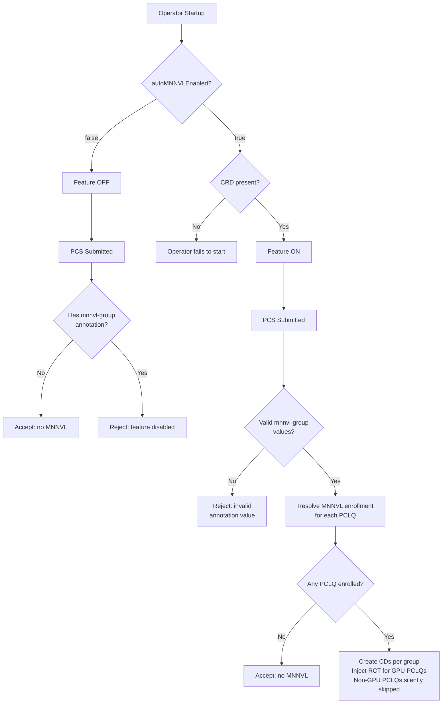

# GREP-417: Auto-MNNVL — Annotation-Based ComputeDomain Management

<!-- toc -->
- [Summary](#summary)
- [Motivation](#motivation)
  - [Goals](#goals)
  - [Non-Goals](#non-goals)
- [Proposal](#proposal)
  - [User Stories](#user-stories)
    - [Story 1: Simple Opt-In for a GPU Workload](#story-1-simple-opt-in-for-a-gpu-workload)
    - [Story 2: Partial MNNVL Within a PCS Replica](#story-2-partial-mnnvl-within-a-pcs-replica)
    - [Story 3: Multiple MNNVL Groups](#story-3-multiple-mnnvl-groups)
    - [Story 4: PCS-Level Default With PCLQ Override](#story-4-pcs-level-default-with-pclq-override)
  - [Limitations/Risks &amp; Mitigations](#limitationsrisks--mitigations)
    - [Limitation: Node scheduling constraints for enrolled PodCliques](#limitation-node-scheduling-constraints-for-enrolled-podcliques)
    - [Limitation: One IMEX channel per node](#limitation-one-imex-channel-per-node)
    - [Limitation: No ComputeDomain customization](#limitation-no-computedomain-customization)
- [Design Details](#design-details)
  - [Annotation Semantics](#annotation-semantics)
    - [<code>grove.io/mnnvl-group</code> — MNNVL group assignment](#groveiomnnvl-group--mnnvl-group-assignment)
  - [Operator Behavior](#operator-behavior)
    - [ComputeDomain Lifecycle](#computedomain-lifecycle)
    - [CD Naming Convention](#cd-naming-convention)
    - [Reconciliation Ordering](#reconciliation-ordering)
    - [ComputeDomain Resource Structure](#computedomain-resource-structure)
  - [Configuration](#configuration)
    - [Impact on Existing Workloads When Configuration Changes](#impact-on-existing-workloads-when-configuration-changes)
  - [Decision Flow](#decision-flow)
  - [Webhook Behavior](#webhook-behavior)
    - [Mutating Webhook (on Create)](#mutating-webhook-on-create)
    - [Validating Webhook (on Create)](#validating-webhook-on-create)
    - [Validating Webhook (on Update)](#validating-webhook-on-update)
  - [Backward Compatibility](#backward-compatibility)
  - [Monitoring](#monitoring)
  - [Dependencies (<em>Optional</em>)](#dependencies-optional)
  - [Test Plan](#test-plan)
  - [Graduation Criteria](#graduation-criteria)
    - [Alpha](#alpha)
    - [Beta](#beta)
    - [GA](#ga)
- [Implementation History](#implementation-history)
- [Open Questions](#open-questions)
  - [1. Annotation vs. label for group declaration](#1-annotation-vs-label-for-group-declaration)
  - [2. Reject vs. silently ignore annotations when the feature is disabled](#2-reject-vs-silently-ignore-annotations-when-the-feature-is-disabled)
- [Alternatives (<em>Optional</em>)](#alternatives-optional)
- [Appendix (<em>Optional</em>)](#appendix-optional)
  - [Background](#background)
    - [What is MNNVL?](#what-is-mnnvl)
    - [IMEX Channels](#imex-channels)
    - [Using MNNVL in Kubernetes](#using-mnnvl-in-kubernetes)
    - [ComputeDomain Status Lifecycle](#computedomain-status-lifecycle)
  - [Terminology](#terminology)
  - [Homogeneous vs. Heterogeneous Clusters](#homogeneous-vs-heterogeneous-clusters)
<!-- /toc -->

## Summary

Grove's auto-MNNVL feature allows users to leverage NVIDIA Multi-Node NVLink acceleration through a simple annotation — without manually authoring `ComputeDomain` resources or wiring `resourceClaims` in their pod specs. The operator automatically creates and manages ComputeDomains, injects RCT references, and handles scaling as PCS replicas scale up or down.

The feature is controlled by a single annotation:

- `grove.io/mnnvl-group`: `<group name>` — assigns a Grove primitive to a named MNNVL group (ComputeDomain). The user may choose any group name as the annotation value except the reserved string `"none"`. This reserved value explicitly opts out of MNNVL, overriding any parent-level setting.

The annotation can be placed on a **PodCliqueSet**, **PodCliqueScalingGroup**, or **PodClique**, and propagates downward (PCS → PCSG → PCLQ) with values on lower layers overriding higher ones.

The feature uses an **opt-in model**: no PCS receives MNNVL unless it or its sub-resources carry the `mnnvl-group` annotation. The cluster-level configuration (`autoMNNVLEnabled`) controls whether the feature is available — not whether individual workloads use it.

## Motivation

Managing MNNVL manually in Kubernetes requires significant effort: users must create `ComputeDomain` custom resources, and wire `resourceClaims` references into pod specs. This is error-prone, repetitive, and difficult to scale — when a PCS scales up or down, users must manually create or delete the corresponding ComputeDomains and keep the references in sync.

Grove's auto-MNNVL feature eliminates this overhead by letting users express MNNVL intent through a simple annotation. The operator handles the rest — creating ComputeDomains, injecting RCT references, managing the full lifecycle, and automatically scaling ComputeDomains as PCS replicas change.

Key motivations:

- **Simplicity:** A single annotation replaces multiple manual resources and spec changes.
- **Automatic scaling:** ComputeDomains are created and deleted automatically as PCS replicas scale up or down — no manual intervention required.
- **Granularity:** Users can control MNNVL at the PodClique level — only the pods that need NVLink are enrolled, others are unaffected.
- **Heterogeneous cluster support:** In clusters where only some nodes have NVIDIA IMEX driver support and some nodes don't, users can scope MNNVL to specific PodCliques, avoiding failures on unsupported nodes.
- **Composability:** Multiple MNNVL groups within a single PCS replica allow different PodCliques to participate in separate ComputeDomains.

### Goals

- Provide a **single annotation** (`grove.io/mnnvl-group`) that controls both MNNVL enrollment and group assignment — zero conflict states, one annotation to manage.
- Support **multi-layer propagation** — the annotation can be placed on PCS, PCSG, or PCLQ, with lower layers overriding higher ones.
- Use an **opt-in model** — no MNNVL is applied unless the annotation is present.
- Have the operator **automatically manage ComputeDomain lifecycle** (create, scale, delete, protect) per group per PCS replica.
- Support **heterogeneous clusters** — only annotated PodCliques need NVIDIA DRA-capable nodes.
- Support **multiple MNNVL groups** within a single PCS replica.
- Remove the Phase 1 `grove.io/auto-mnnvl` annotation — not backward compatible (acceptable in alpha).

### Non-Goals

- This GREP does **not** define scheduling or topology placement policy (e.g., which specific nodes or racks pods should land on).
- This GREP does **not** introduce support for user-provided custom `ComputeDomain` specs with arbitrary attributes — the annotation triggers operator-managed domains only.

## Proposal

Users opt into MNNVL using a single annotation: `grove.io/mnnvl-group`.

**Simple opt-in (all PCLQs in one ComputeDomain):**

```yaml
apiVersion: grove.io/v1alpha1
kind: PodCliqueSet
metadata:
  name: training-job
  annotations:
    grove.io/mnnvl-group: "my-group"    # all GPU PCLQs share a single CD per replica
```

**Grouped opt-in (multiple ComputeDomains):**

```yaml
spec:
  template:
    cliques:
      - name: workers
        annotations:
          grove.io/mnnvl-group: "training"
        spec: ...
      - name: encoders
        annotations:
          grove.io/mnnvl-group: "inference"
        spec: ...
      - name: param-servers    # no annotation — no MNNVL
        spec: ...
```

**PCS-level default with opt-out:**

```yaml
apiVersion: grove.io/v1alpha1
kind: PodCliqueSet
metadata:
  name: training-job
  annotations:
    grove.io/mnnvl-group: "my-group"    # MNNVL for all GPU PCLQs
spec:
  template:
    cliques:
      - name: workers              # inherits "my-group" from PCS
        spec: ...
      - name: param-servers
        annotations:
          grove.io/mnnvl-group: "none"  # override: no MNNVL for this PCLQ
        spec: ...
```

The operator discovers this annotation, determines the set of ComputeDomains required per replica, and:
- manages their full lifecycle — creation, deletion, scaling, and protection via finalizers.
- injects RCT references into the pod's spec of enrolled PodCliques.

**Key behavioral rules:**
- **Opt-in:** No MNNVL is applied unless `mnnvl-group` is present at some layer. Absence of the annotation at all layers means no MNNVL.
- **Propagation:** The annotation propagates downward (PCS → PCSG → PCLQ). A lower layer overrides a higher layer.
- **Opt-out:** Setting `mnnvl-group: "none"` explicitly opts out of MNNVL, overriding any parent-level setting. The `"none"` value is reserved and cannot be used as a group name.
- **Non-GPU PCLQs:** Non-GPU PCLQs that resolve to MNNVL enrollment (whether explicit or inherited) are silently skipped — no RCT injection, no error. This allows PCS-level defaults without requiring `"none"` overrides on every non-GPU PCLQ.
- **Immutability:** The annotation is immutable after PCS creation.

### User Stories

#### Story 1: Simple Opt-In for a GPU Workload

As a user, I want to enable MNNVL for my entire PodCliqueSet by adding a single annotation at the PCS level (`mnnvl-group: "my-group"`). All GPU PodCliques should share one ComputeDomain per replica.

```yaml
metadata:
  annotations:
    grove.io/mnnvl-group: "my-group"
```

#### Story 2: Partial MNNVL Within a PCS Replica

As a data scientist, my PCS has workers, parameter servers, and data loaders. Only the workers need NVLink. I annotate only the worker PodClique — the others are unaffected.

```yaml
cliques:
  - name: workers
    annotations:
      grove.io/mnnvl-group: "workers"
    spec: ...
  - name: param-servers    # no annotation — no MNNVL
    spec: ...
```

#### Story 3: Multiple MNNVL Groups

As a platform engineer, I have a PCS where decoders need to communicate with each other over NVLink, and encoders need to communicate separately. I assign them to different groups — each group gets its own ComputeDomain.

```yaml
cliques:
  - name: decoders
    annotations:
      grove.io/mnnvl-group: "decoders"
    spec: ...
  - name: encoders
    annotations:
      grove.io/mnnvl-group: "encoders"
    spec: ...
```

#### Story 4: PCS-Level Default With PCLQ Override

As a user, I want most of my PodCliques to use MNNVL, but one PodClique should be excluded. I set the default at the PCS level and override at the PCLQ level.

```yaml
metadata:
  annotations:
    grove.io/mnnvl-group: "my-group"    # applies to all PCLQs
spec:
  template:
    cliques:
      - name: workers              # inherits "my-group"
        spec: ...
      - name: encoders             # inherits "my-group"
        spec: ...
      - name: monitoring
        annotations:
          grove.io/mnnvl-group: "none"  # override: no MNNVL
        spec: ...
```

### Limitations/Risks & Mitigations

#### Limitation: Node scheduling constraints for enrolled PodCliques

In [heterogeneous clusters](#homogeneous-vs-heterogeneous-clusters), pods in PodCliques enrolled in an MNNVL group must be scheduled on nodes with NVIDIA IMEX driver support. If these pods land on unsupported nodes, they will fail to start.

**Mitigation:** Users must ensure that enrolled PodCliques include appropriate node scheduling constraints — either via node selector, node affinity, or Topology-Aware Scheduling (TAS) — to target NVIDIA IMEX-capable nodes.

#### Limitation: One IMEX channel per node

Each node can participate in only **one** IMEX channel at a time. If pods from different ComputeDomains are scheduled on the same node, the NVIDIA IMEX driver will prevent the second allocation. This applies to all MNNVL usage — not specific to this feature.

**Mitigation:** The NVIDIA IMEX driver participates in Kubernetes scheduling decisions and will avoid placing conflicting pods on the same node. Users can also employ pod anti-affinity or taints.

#### Limitation: No ComputeDomain customization

ComputeDomain and ResourceClaimTemplate configurations are automatically generated and cannot be customized. Power users who require custom configurations should not use this feature and instead specify their own `resourceClaims` directly in the pod spec template.

## Design Details

### Annotation Semantics

MNNVL participation is controlled by a single annotation:

#### `grove.io/mnnvl-group` — MNNVL group assignment

```yaml
grove.io/mnnvl-group: "<value>"
```

| Value | Meaning |
|---|---|
| String name (`"my-group"`, `"training"`, `"workers"`, ...) | Assign the PCLQ to a named MNNVL group. PodCliques with the same group name share a ComputeDomain per replica. |
| `"none"` | Explicit opt-out. Used to override a parent layer's group assignment. Reserved — cannot be used as a group name. |
| Absent | Inherit from parent layer. If no parent has it, no MNNVL. |

**Group name validation:** Values are **case-sensitive**, following the Kubernetes convention for annotation values. The value must be a valid Kubernetes name component: lowercase alphanumeric characters or dashes, must start and end with an alphanumeric character, max 63 characters. This is required because the group name becomes part of the ComputeDomain resource name. The reserved string `"none"` is used to opt out of MNNVL and cannot be used as a group name. Empty strings and values containing invalid characters are rejected.

**Non-GPU PCLQs:** Non-GPU PCLQs that resolve to MNNVL enrollment (whether explicit or inherited) are silently skipped — no RCT injection, no error. This allows PCS-level defaults without requiring `"none"` overrides on every non-GPU PCLQ.

**Immutability:** `grove.io/mnnvl-group` is **immutable** after PCS creation. The validating webhook rejects any update that attempts to add, modify, or remove the annotation at any level (PCS, PCSG, PCLQ). To change MNNVL assignment, the PCS must be deleted and recreated. The rationale is that modifying MNNVL assignment on a live workload would require tearing down existing ComputeDomains, re-wiring RCT references in already-running pods, and coordinating rescheduling — all while the workload is active. The complexity and risk of mid-flight changes far outweigh the benefit, especially since delete-and-recreate achieves the same result cleanly.

**Example — multiple groups with a non-enrolled PCLQ:**

```yaml
apiVersion: grove.io/v1alpha1
kind: PodCliqueSet
metadata:
  name: training-job
spec:
  replicas: 2
  template:
    cliques:
      - name: workers
        annotations:
          grove.io/mnnvl-group: "workers"
        spec:
          replicas: 1
          podSpec:
            containers:
              - name: worker
                resources:
                  limits:
                    nvidia.com/gpu: 8
      - name: encoders
        annotations:
          grove.io/mnnvl-group: "encoders"
        spec:
          replicas: 1
          podSpec:
            containers:
              - name: encoder
                resources:
                  limits:
                    nvidia.com/gpu: 4
      - name: param-servers
        spec:
          replicas: 1
          podSpec:
            containers:
              - name: ps
                resources:
                  limits:
                    cpu: "4"
```

Result per replica:
- `workers` → enrolled in group "workers" → CD `training-job-0-workers` / `training-job-1-workers`
- `encoders` → enrolled in group "encoders" → CD `training-job-0-encoders` / `training-job-1-encoders`
- `param-servers` → no annotation → no MNNVL

### Operator Behavior

#### ComputeDomain Lifecycle

When the operator reconciles a PodCliqueSet, it resolves the effective MNNVL enrollment for each PCLQ (from the `mnnvl-group` annotation) and performs the following per replica:

1. **Discovery:** Determine which PCLQs are enrolled in MNNVL and collect the set of distinct group names (ignoring non-GPU PCLQs). PCLQs with `mnnvl-group: "none"` or no annotation are not enrolled.

2. **ComputeDomain management:**
   - **Create:** For each unique group name, create a `ComputeDomain` resource per replica (if it does not already exist).
   - **Scale:** When replicas scale up/down, create/delete the corresponding CD instances.
   - **Delete:** When a PCS is deleted, clean up all associated CDs.
   - **Finalizer:** Add `grove.io/computedomain-finalizer` to prevent accidental deletion while workloads are using it. The finalizer is removed during PCS deletion or scale-in.

3. **RCT reference injection:** Injected into the PCLQ's pod spec template at **PCLQ creation time** (not at pod creation time). This early-binding approach ensures the decision is made once and baked into the PCLQ spec. The injection flow depends on whether the PCLQ is standalone or managed by a PCSG:
   - **PCS → standalone PCLQ:** For PCLQs defined directly in the PCS template (not managed by a PCSG), the PCS controller resolves the effective MNNVL state (from `mnnvl-group` annotations at PCS vs. PCLQ level) and injects `resourceClaims` if enrolled.
   - **PCS → PCSG:** The PCS controller propagates the `grove.io/mnnvl-group` annotation to the PCSG (if the PCSG doesn't already have its own value defined in the PCS template).
   - **PCSG → PCLQ:** For PCLQs managed by a PCSG, the PCSG controller resolves the effective MNNVL state (PCSG annotation vs. PCLQ template annotation) and injects the RCT reference.
   - **Pod creation:** No special logic — pods use the PCLQ's pod spec as-is.

4. **Non-enrolled PodCliques:** Left untouched — no CD reference injected.

#### CD Naming Convention

CD names include the group name and use the form `{pcs-name}-{replica-index}-{group-name}`.

| Example PCS | Annotation | Replica | CD Name |
|---|---|---|---|
| `training-job` | `mnnvl-group: "my-group"` | 0 | `training-job-0-my-group` |
| `training-job` | `mnnvl-group: "my-group"` | 1 | `training-job-1-my-group` |
| `training-job` | `mnnvl-group: "workers"` | 0 | `training-job-0-workers` |
| `training-job` | `mnnvl-group: "workers"` | 1 | `training-job-1-workers` |
| `training-job` | `mnnvl-group: "encoders"` | 0 | `training-job-0-encoders` |

Group names are scoped to the PCS — different PCS resources can use the same group names without conflict (the PCS name provides uniqueness).

#### Reconciliation Ordering

ComputeDomain resources must be synced **before** creating PCLQs and PCSGs, ensuring the CD exists before pods that reference its RCT are created. If CD creation fails, the sync stops and requeues for retry.

**Teardown ordering** follows the inverse pattern. On PCS deletion or scale-in, the PCS controller removes pods and PCLQs first, then removes the `grove.io/computedomain-finalizer` from the CD, allowing it to be garbage-collected via `ownerReferences`. The finalizer guarantees that the CD is not deleted while pods still reference its RCT — explicit teardown ordering logic is not required because the finalizer enforces it.

#### ComputeDomain Resource Structure

```yaml
apiVersion: resource.nvidia.com/v1beta1
kind: ComputeDomain
metadata:
  name: training-job-0-workers
  labels:
    app.kubernetes.io/managed-by: grove-operator
    app.kubernetes.io/part-of: training-job
    app.kubernetes.io/name: training-job-0-workers
    app.kubernetes.io/component: pcs-computedomain
    grove.io/podcliqueset-replica-index: "0"
    grove.io/mnnvl-group: "workers"
  finalizers:
    - grove.io/computedomain-finalizer
  ownerReferences:
    - apiVersion: grove.io/v1alpha1
      kind: PodCliqueSet
      name: training-job
      controller: true
spec:
  channel:
    resourceClaimTemplateName: training-job-0-workers
```

### Configuration

The auto-MNNVL feature is controlled via the existing `network.autoMNNVLEnabled` boolean in `OperatorConfiguration`. This field is **unchanged** from Phase 1:

| Value | Default | Behavior |
|---|---|---|
| `true` | No | Feature is active. The operator validates that the `ComputeDomain` CRD is installed at startup and **fails to start** if missing. |
| `false` | **Yes** | Feature is off. Any PCS with `grove.io/mnnvl-group` annotations is rejected at admission time. |

```yaml
# OperatorConfiguration example
apiVersion: grove.io/v1alpha1
kind: OperatorConfiguration
spec:
  network:
    autoMNNVLEnabled: true
```

**Important:** The configuration controls whether the feature is **available**, not whether individual workloads use it. MNNVL is always opt-in via the annotation — the operator never automatically applies MNNVL to any PCS.

**No configuration migration needed.** This GREP reuses the existing `autoMNNVLEnabled` field. Existing Helm values and operator configurations continue to work unchanged.

#### Impact on Existing Workloads When Configuration Changes

Changing `autoMNNVLEnabled` must **not** affect currently running workloads:

- Switching `autoMNNVLEnabled` from `true` to `false` does **not** delete existing ComputeDomains or modify existing PCS resources.
- New PCS submissions with `grove.io/mnnvl-group` annotations will be rejected after the change.
- To remove MNNVL from an existing workload, the PCS must be deleted and recreated.

### Decision Flow

Feature state is ON when `autoMNNVLEnabled: true` and OFF when `autoMNNVLEnabled: false`. When `autoMNNVLEnabled: true`, the CRD must be present — otherwise the operator fails to start (not a per-PCS decision).

The following flowchart shows the complete decision logic from operator startup through PCS admission:



### Webhook Behavior

#### Mutating Webhook (on Create)

In the opt-in model, the mutating webhook **does not** add any MNNVL-related annotations automatically. The user is responsible for providing `grove.io/mnnvl-group`.

#### Validating Webhook (on Create)

The validating webhook enforces:

- **Value validation (`mnnvl-group`):** Must be `"none"` (opt-out) or a valid Kubernetes name component (lowercase alphanumeric or dashes, starting and ending with alphanumeric, max 63 chars). Invalid values are rejected.
- **Feature disabled:** If the feature is off (`autoMNNVLEnabled: false`), reject any PCS that has `grove.io/mnnvl-group` at any level.

#### Validating Webhook (on Update)

`grove.io/mnnvl-group` is **immutable** after PCS creation at all levels (PCS, PCSG, PCLQ). Any attempt to add, modify, or remove the annotation is rejected.

### Backward Compatibility

This GREP is **not backward compatible** with Phase 1. The `grove.io/auto-mnnvl` annotation is removed and no longer recognized by the operator. Existing manifests that use `auto-mnnvl: enabled` will have no effect — MNNVL will not be applied unless the new `grove.io/mnnvl-group` annotation is used.

Since the feature is still in **alpha**, this is an acceptable breaking change. Users must update their manifests to use `grove.io/mnnvl-group` instead of `grove.io/auto-mnnvl`. To convert an existing PCS, replace `grove.io/auto-mnnvl: "enabled"` with `grove.io/mnnvl-group: "<group-name>"` (e.g. `"my-group"`) and delete/recreate the PCS (the annotation is immutable on update).

### Monitoring

ComputeDomain observability follows the same pattern as previous iterations: **Kubernetes Events** on the PodCliqueSet resource. The operator emits events when:

- A ComputeDomain is created or deleted.
- A PCS is rejected due to annotation validation errors or feature being disabled.
- ComputeDomain creation fails (sync stops and requeues for retry).

### Dependencies (*Optional*)

- NVIDIA IMEX drivers must be installed on nodes where enrolled PodClique pods are scheduled.
- The `ComputeDomain` CRD must be available in the cluster when `autoMNNVLEnabled: true`. See the [NVIDIA GPU driver installation guide](https://docs.nvidia.com/datacenter/cloud-native/gpu-operator/latest/gpu-operator-dra.html).

### Test Plan

- **Unit tests:** Cover annotation resolution (propagation, override, `"none"` opt-out), group name validation (valid K8s name component + `"none"` reserved), ComputeDomain lifecycle management (create/delete/scale), RCT injection logic, CD naming (`{pcs}-{replica}-{group}`), and configuration parsing.
- **E2E tests:**
  - PCS with `mnnvl-group: "my-group"` → single CD per replica, all GPU PCLQs enrolled.
  - PCS with `mnnvl-group` on some PCLQs → per-group CDs, only enrolled GPU PCLQs get RCT.
  - PCS with PCS-level `mnnvl-group: "my-group"` + PCLQ `mnnvl-group: "none"` → PCLQ excluded.
  - PCS with multiple group names → separate CDs per group per replica.
  - PCS with `mnnvl-group` on non-GPU PCLQ → silently skipped, no RCT for that PCLQ.
  - PCS scale-up/scale-down → CDs created/deleted accordingly.
  - `autoMNNVLEnabled: false` + annotations → rejected.
  - `autoMNNVLEnabled: true` + CRD absent → operator fails to start.
  - Annotation immutability: update attempts rejected.

### Graduation Criteria

#### Alpha
- `grove.io/mnnvl-group` annotation implemented and functional.
- Annotation propagation (PCS → PCSG → standalone PCLQ) working.
- CD naming (`{pcs}-{replica}-{group}`) working.
- `"none"` opt-out enforced.
- Boolean configuration (`autoMNNVLEnabled`) unchanged from Phase 1 — no migration required.
- Unit and basic integration tests passing.

#### Beta
- E2E tests covering all key scenarios from the test plan.
- Documentation for the single-annotation model and group-based MNNVL.
- Events fully implemented.

#### GA
- Production deployments validated.
- API and annotation semantics stable.
- Comprehensive test coverage.

## Implementation History

- **Phase 1 (completed):** Cluster-wide auto-MNNVL feature using `grove.io/auto-mnnvl` annotation and boolean `autoMNNVLEnabled` config. Single ComputeDomain per PCS replica, all GPU PCLQs enrolled. See [MNNVL Design Doc](../../designs/mnnvl-design.md).
- **This GREP (Phase 2):** Replaces `grove.io/auto-mnnvl` with a single `grove.io/mnnvl-group` annotation for group-based ComputeDomains, multi-layer propagation (PCS → PCSG → PCLQ), and opt-in model. Not backward compatible with Phase 1 — the `auto-mnnvl` annotation is removed.

## Open Questions

The following items require discussion with the broader team before finalizing the design:

### 1. Annotation vs. label for group declaration

This GREP proposes using an **annotation** (`grove.io/mnnvl-group`). An alternative is to use a **label**.

**Arguments for annotations (current proposal):**
- These are configuration directives that trigger operator behavior — the standard Kubernetes use case for annotations.
- Labels are for identity and selection; no one needs to select PodCliques by group name via label selectors.
- Consistent with Kubernetes conventions.

**Arguments for labels:**
- Labels propagate to pods and are queryable (`kubectl get pods -l grove.io/mnnvl-group=training`), which aids observability.
- However, the operator could add a label to pods as a secondary step even if the declaration is via annotation.

### 2. Reject vs. silently ignore annotations when the feature is disabled

When the feature is disabled and a user submits a PCS with `grove.io/mnnvl-group` annotations, the current proposal rejects the PCS. An alternative is to silently ignore the annotations. The benefit is **portability** — the same manifest works everywhere. The risk is **silent performance degradation** — the user requested MNNVL but the workload runs without it.

## Alternatives (*Optional*)

**Alternative 1: Two annotations (`auto-mnnvl` + `mnnvl-group`).**

Instead of a single annotation, use two annotations with cleanly separated responsibilities:

- `grove.io/auto-mnnvl`: `"enabled"` or `"disabled"` — controls whether MNNVL is active.
- `grove.io/mnnvl-group`: a string name — controls which MNNVL group the PCLQ belongs to. When present, implicitly enables MNNVL.

| `auto-mnnvl` | `mnnvl-group` | Result |
|---|---|---|
| absent | absent | No MNNVL |
| `enabled` | absent | MNNVL with default CD (`{pcs}-{replica}`) |
| `disabled` | absent | No MNNVL (explicit opt-out) |
| absent | `"training"` | MNNVL with group CD (`{pcs}-{replica}-training`) — group implies enabled |
| `enabled` | `"training"` | MNNVL with group CD (`{pcs}-{replica}-training`) |
| `disabled` | `"training"` | **Reject** — contradictory (disabled + group assignment) |

**Trade-offs vs. single annotation (current proposal):**

| Aspect | Single annotation (`mnnvl-group`) | Two annotations (`auto-mnnvl` + `mnnvl-group`) |
|---|---|---|
| Phase 1 backward compat | Not backward compatible — `auto-mnnvl` is removed | Zero changes — existing manifests work as-is |
| Simple opt-in (one CD) | `mnnvl-group: "my-group"` | `auto-mnnvl: enabled` |
| Group assignment | `mnnvl-group: "training"` | `mnnvl-group: "training"` |
| Opt-out override | `mnnvl-group: "none"` | `auto-mnnvl: disabled` |
| Reserved values | 1 (`"none"`) | 0 |
| Conflict states | 0 | 1 (disabled + group → reject) |
| CD naming schemes | 1 (always `{pcs}-{replica}-{group}`) | 2 (`{pcs}-{replica}` without group, `{pcs}-{replica}-{group}` with group) |
| Annotations to manage | 1 | 2 |

The two-annotation approach provides full Phase 1 backward compatibility but introduces a conflict state, dual CD naming schemes, and requires managing two annotations. Since the feature is still in alpha, the single-annotation approach was chosen for its simplicity.

**Alternative 2: Three-value configuration with `auto` mode.**
Instead of a boolean `autoMNNVLEnabled`, introduce a three-value `mnnvl.mode` field (`auto`, `enabled`, `disabled`):

| Value | Behavior |
|---|---|
| `auto` (default) | Feature is active **if** the `ComputeDomain` CRD is present at startup. If absent, the operator starts normally but rejects MNNVL-annotated PCS at admission time. |
| `enabled` | Feature is always active. Operator fails to start if CRD is missing. |
| `disabled` | Feature is off. MNNVL-annotated PCS are rejected. |

The `auto` mode removes the need for administrators to explicitly enable the feature — it "just works" when the CRD is installed. This comes at the cost of additional complexity (CRD detection at startup, caching the result, three code paths instead of two) and a configuration migration from the existing `autoMNNVLEnabled` boolean to the new `mnnvl.mode` string.

This alternative was discussed and rejected in the DR meeting. The presence of the `ComputeDomain` CRD does not guarantee that MNNVL is operational on the cluster — the CRD may be installed without the underlying IMEX hardware or driver being functional. By keeping `autoMNNVLEnabled` as an explicit boolean, the responsibility to declare that MNNVL is available and working rests with the cluster administrator, who has the knowledge to make that determination. The `auto` mode would silently imply MNNVL readiness based on CRD presence alone, which could lead to workloads being enrolled in MNNVL on clusters that cannot actually support it.

## Appendix (*Optional*)

### Background

#### What is MNNVL?

**MNNVL (Multi-Node NVLink)** is an NVIDIA technology that extends NVLink-class, high-bandwidth GPU-to-GPU communication across **multiple physical nodes**, rather than being limited to GPUs within a single server. It uses specialized hardware and software mechanisms to allow GPUs on different nodes to access each other's memory with much lower latency and higher bandwidth than traditional network-based approaches like TCP or even standard RDMA. In Kubernetes, MNNVL is exposed through NVIDIA's DRA driver so distributed workloads (for example, large-scale training or tightly coupled inference) can treat GPUs across nodes as part of a single, high-performance compute fabric while preserving isolation and security between workloads.

#### IMEX Channels

**IMEX (Import/Export)** is the underlying mechanism that enables secure GPU memory sharing across nodes in an MNNVL fabric. Each IMEX channel represents a logical connection that allows GPUs on different nodes to import and export memory regions for direct access.

**Key constraint: One IMEX channel per node.** Each node can participate in only **one** IMEX channel at a time. This means:

- A node's GPUs can only belong to a single ComputeDomain simultaneously.
- Multiple independent MNNVL-enabled workloads cannot share the same node.
- When a node is allocated to one ComputeDomain, its NVLink fabric participation is exclusive to that domain.

#### Using MNNVL in Kubernetes

To use MNNVL in Kubernetes with NVIDIA's DRA driver, you start by creating a **ComputeDomain (CD)**. The ComputeDomain represents a logical GPU fabric spanning multiple nodes and defines how inter-node NVLink/IMEX channels are allocated. The `ComputeDomainSpec.Channel` references a `ResourceClaimTemplate`; this template describes the DRA resource class that will be used to provision the interconnect.

Next, pods that want to use MNNVL **reference the ResourceClaimTemplate** in their pod spec. Each pod declares a `resourceClaims` entry pointing to the template name, and the container lists that claim under `resources.claims`. Kubernetes then automatically creates a ResourceClaim per pod from the template. These per-pod claims are handled by the NVIDIA DRA driver, which allocates the necessary MNNVL/IMEX channels for each pod within the ComputeDomain.

As a result, multiple pods — possibly scheduled on different nodes — are joined into the same ComputeDomain and can communicate using multi-node NVLink semantics without manually wiring GPUs or fabric resources.

#### ComputeDomain Status Lifecycle

When a ComputeDomain is first created, it exists without an operational status. The CD only becomes active once pods referencing its RCT are scheduled. At that point, the NVIDIA DRA driver deploys a DaemonSet on the nodes where those pods are scheduled to establish the MNNVL fabric. The CD's status is then derived from the aggregate health of these DaemonSet pods.

### Terminology

| Term | Definition |
|---|---|
| **MNNVL** | Multi-Node NVLink — NVIDIA's technology for extending NVLink connectivity across multiple nodes. |
| **ComputeDomain** | An NVIDIA CRD that defines a set of pods sharing a high-bandwidth NVLink domain. |
| **RCT** | ResourceClaimTemplate — a Kubernetes DRA resource used to claim hardware resources for a pod. |
| **DRA** | Dynamic Resource Allocation — a Kubernetes API for managing hardware resources. |
| **IMEX** | Import/Export — the underlying mechanism for MNNVL, representing a logical connection for cross-node GPU memory sharing. |
| **PCS** | PodCliqueSet — the Grove workload abstraction that groups PodCliques into replicas. |
| **PCSG** | PodCliqueScalingGroup — manages scaling of PodCliques within a PCS. |
| **PCLQ** | PodClique — a group of related pods within a PCS replica. |

### Homogeneous vs. Heterogeneous Clusters

For the purpose of this document, the distinction is based on NVIDIA IMEX driver support:

- **Homogeneous cluster:** All nodes support the NVIDIA IMEX driver. Auto-MNNVL can be used without concern about pod scheduling failures.
- **Heterogeneous cluster:** Some nodes support the NVIDIA IMEX driver and some do not. Users must scope MNNVL participation to specific PodCliques and ensure those pods are scheduled on IMEX-capable nodes.
