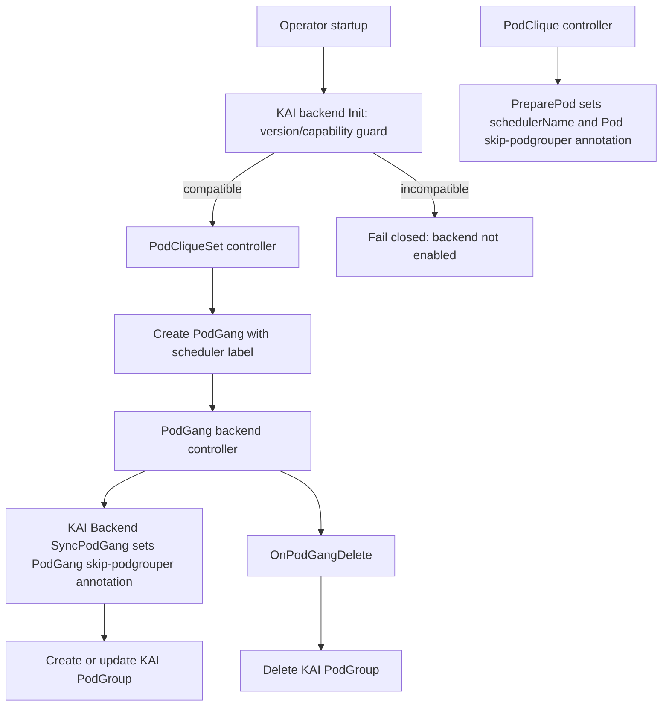

# GREP-525: KAI Scheduler Backend for Scheduler Backend Framework

<!-- toc -->
- [Summary](#summary)
- [Motivation](#motivation)
  - [Goals](#goals)
  - [Non-Goals](#non-goals)
- [Proposal](#proposal)
  - [User Stories](#user-stories)
    - [Story 1: Platform Operator Enables KAI Backend](#story-1-platform-operator-enables-kai-backend)
    - [Story 2: Workload Owner Uses KAI Scheduler](#story-2-workload-owner-uses-kai-scheduler)
  - [Limitations/Risks &amp; Mitigations](#limitationsrisks--mitigations)
    - [Minimum Supported KAI Version](#minimum-supported-kai-version)
- [Design Details](#design-details)
  - [Architecture Overview](#architecture-overview)
  - [Backend Lifecycle Contract](#backend-lifecycle-contract)
  - [Precondition: KAI Backend Enabled](#precondition-kai-backend-enabled)
  - [KAI Backend Responsibilities](#kai-backend-responsibilities)
  - [PodCliqueSet to PodGroup Mapping](#podcliqueset-to-podgroup-mapping)
    - [SubGroup Mapping Rules](#subgroup-mapping-rules)
  - [Pod Preparation](#pod-preparation)
  - [PodGroup Update Semantics](#podgroup-update-semantics)
  - [Reconciliation Flow](#reconciliation-flow)
  - [API and Registration Requirements](#api-and-registration-requirements)
  - [RBAC Matrix](#rbac-matrix)
  - [Dynamic RBAC Strategy](#dynamic-rbac-strategy)
  - [Test Plan](#test-plan)
    - [Phase 1 (Current): Unit Tests](#phase-1-current-unit-tests)
    - [Phase 2 (Follow-up): E2E Tests](#phase-2-follow-up-e2e-tests)
  - [Graduation Criteria](#graduation-criteria)
    - [Alpha](#alpha)
    - [Beta](#beta)
    - [GA](#ga)
- [Appendix](#appendix)
<!-- /toc -->

## Summary

This proposal adds a dedicated KAI scheduler backend to Grove's Scheduler Backend Framework so Grove can natively create, update, and delete KAI PodGroup resources for Grove PodGang workloads. This proposal is intentionally limited to PodGroup creation and management; it does not add new topology-aware scheduling support and does not change existing KAI Topology synchronization behavior from Grove ClusterTopology. The change improves maintainability, clarifies ownership boundaries, and enables predictable KAI-specific lifecycle handling for PodGang workloads by relying on KAI-Scheduler's externally-created PodGroup support.

## Motivation

GREP-375 introduced a generic Scheduler Backend Framework, but the KAI integration still needs a concrete backend implementation pattern and operational contract for production use. Without this backend, KAI support depends on legacy behavior that can cause ambiguous ownership of PodGroup resources and complicate migration as Grove evolves.

### Goals

- Define the KAI backend behavior under the Scheduler Backend Framework lifecycle.
- Define `PreparePod` behavior so Pods are scheduled by KAI consistently with Grove's scheduling gate flow and opt out of KAI podgrouper reconciliation when Grove owns the PodGroup.
- Specify PodGang to KAI PodGroup translation and reconciliation responsibilities.
- Define deletion-time cleanup behavior for KAI-owned scheduling resources.
- Document the minimum supported KAI-Scheduler version and required PodGroup capabilities.
- Clarify required RBAC, scheme registration, and dependency/version expectations for KAI resources.
- Establish test expectations for pod preparation, PodGroup sync, and delete paths.

### Non-Goals

- Redesigning the Scheduler Backend Framework introduced by GREP-375.
- Introducing new user-facing scheduling APIs in PodCliqueSet or PodGang for this phase.
- Covering support for all third-party schedulers; this proposal only scopes KAI backend behavior.
- Defining advanced KAI-only scheduling semantics beyond existing PodGang intent.
- Replacing or deprecating non-KAI backends.
- Defining how scheduler backends are enabled, selected, or resolved from operator configuration and workload templates. This proposal assumes the `kai-scheduler` backend is already enabled by the Scheduler Backend Framework.
- Requiring PodGang status-only updates to trigger backend reconciliation. The current backend controller reacts to create, delete, and generation-changing updates.
- Extending or refactoring existing KAI Topology resource management from Grove `ClusterTopology`/`ClusterTopologyBinding`.
- Defining topology-aware scheduling behavior for KAI. That functionality is out of scope for this proposal and should be covered separately.

## Proposal

Grove will ship a built-in `kai-scheduler` backend that implements the Scheduler Backend Framework lifecycle hooks needed to manage KAI PodGroups. The backend is responsible for converting Grove PodGang intent to KAI PodGroup resources, preparing Pods to use KAI, participating in admission validation, and keeping KAI PodGroups in sync with Grove lifecycle events.

This proposal only covers KAI PodGroup creation and management. It does not propose any KAI Topology creation/update flow, does not add startup-time topology synchronization, and does not define topology-aware scheduling behavior.

At a high level, the proposal introduces:

1. **KAI backend ownership model**: Grove backend controller is the single owner of KAI PodGroup reconciliation for PodGang resources that select `kai-scheduler`.
2. **Deterministic lifecycle behavior**: backend initialization happens during operator startup, `PreparePod` sets the scheduler name and pod-level podgrouper skip annotation during Pod construction, `SyncPodGang` ensures the PodGang-level podgrouper skip annotation and handles create/update reconciliation, and `OnPodGangDelete` handles cleanup.
3. **KAI version dependency**: This backend requires KAI-Scheduler `v0.15.0` or newer, because that version supports both PodGroup subgroups and externally-created PodGroups, including `kai.scheduler/skip-podgrouper`.
4. **Operator readiness requirements**: KAI PodGroup API types are registered in Grove scheme and RBAC allows backend operations on KAI PodGroups.
5. **Update safety**: Grove preserves fields that KAI runtime components own so backend reconciliation does not erase scheduler decisions or mutable runtime state.

### User Stories

#### Story 1: Platform Operator Enables KAI Backend

As a platform operator, I want Grove to manage KAI scheduling resources through its backend framework so that KAI integration follows a consistent operator lifecycle and is easier to operate and troubleshoot.

#### Story 2: Workload Owner Uses KAI Scheduler

As a workload owner, I want my PodGang workloads targeting KAI to automatically produce and maintain the required KAI PodGroup resources so that gang scheduling intent is enforced without manual intervention.

### Limitations/Risks & Mitigations

The KAI backend depends on KAI scheduler features that are not available in older KAI releases.

#### Minimum Supported KAI Version

The minimum supported KAI-Scheduler version for this backend is **v0.15.0**.

KAI-Scheduler v0.15.0 is required because it provides both capabilities this backend relies on:

- **PodGroup subgroups**: Grove maps PodGang pod groups to KAI PodGroup subgroups so KAI can preserve per-group gang semantics.
- **Externally-created PodGroup support**: Grove owns PodGroup creation and reconciliation, while KAI consumes those PodGroups without recreating or overwriting them. This includes the `kai.scheduler/skip-podgrouper` behavior introduced by [KAI PR #1552](https://github.com/kai-scheduler/KAI-Scheduler/pull/1552).

Operational behavior:

- During backend `Init()`, Grove checks that the detected KAI version is `v0.15.0` or newer.
- If KAI is below `v0.15.0`, backend startup returns an unsupported-version error and does not enable KAI PodGroup ownership reconciliation.
- Grove release notes MUST publish and maintain a Grove-to-KAI compatibility matrix whenever the minimum supported KAI version changes.

## Design Details

### Architecture Overview

The KAI backend extends GREP-375 by implementing KAI-specific translations and lifecycle handling while preserving framework-level control flow.



### Backend Lifecycle Contract

The backend must cover the PodGroup-related backend surface from GREP-375:

| Lifecycle surface | Trigger | KAI backend responsibility |
| --- | --- | --- |
| Backend initialization | Operator startup | Validate KAI-Scheduler version is `v0.15.0` or newer; otherwise fail closed and do not enable backend ownership mode. |
| Pod preparation | PodClique controller builds a Pod | Set Pod `schedulerName` to `kai-scheduler` and ensure Pod annotation `kai.scheduler/skip-podgrouper` is present. |
| PodGang sync | PodGang create or generation-changing update | Ensure PodGang annotation `kai.scheduler/skip-podgrouper` is present and reconcile the Grove-owned KAI PodGroup. |
| PodGang deletion | PodGang delete event | Delete associated KAI PodGroup, ignoring not-found errors. |

### Precondition: KAI Backend Enabled

This proposal assumes the Scheduler Backend Framework has already enabled and initialized the `kai-scheduler` backend. The mechanics of enabling scheduler profiles, default scheduler selection, and validation of scheduler names are defined by GREP-375 and are not redefined here.

Under that assumption, this proposal only relies on the resolved backend identity:

- Pods prepared by this backend are scheduled with `schedulerName: kai-scheduler`.
- PodGang resources routed to this backend are reconciled into KAI PodGroups.

### KAI Backend Responsibilities

- Resolve only workloads assigned to `kai-scheduler`.
- Rely on KAI-Scheduler external PodGroup support, ensure prepared Pods and Grove PodGangs have `kai.scheduler/skip-podgrouper` annotation so KAI podgrouper does not create or overwrite PodGroups that Grove owns.
- Enforce compatibility guardrails during `Init()`: require KAI-Scheduler `v0.15.0` or newer and fail closed when the minimum supported version is not met.
- Translate Grove Base PodGang and Scaled PodGang semantics to KAI PodGroup subgroup semantics.
- Reconcile KAI PodGroup state on PodGang create and update.
- Handle KAI resource cleanup on PodGang delete.

### PodCliqueSet to PodGroup Mapping

The KAI backend creates one Grove-owned KAI PodGroup for the PodCliqueSet scheduling unit, then maps Grove PodGang structure into the KAI PodGroup subgroup layer. This follows Grove's existing PodGang construction model:

- **Base PodGang (BPG)**: the foundational PodGang created for each PodCliqueSet replica. It contains standalone PodCliques and the PodCliqueScalingGroup replicas that are within `[0, minAvailable-1]`.
- **Scaled PodGang (SPG)**: a PodGang created for a PodCliqueScalingGroup replica above `minAvailable`. These are the scaled-out PCSG replicas that Grove schedules as independent PodGang resources today.

In the KAI representation, BPG and SPG are not separate KAI PodGroups. They are subgroup branches under the same PCS-level KAI PodGroup.

| Grove source | KAI PodGroup target |
| --- | --- |
| PodCliqueSet scheduling unit | One KAI PodGroup name and namespace |
| PodCliqueSet and PodGang labels/annotations | PodGroup labels and annotations, preserving existing target-only keys |
| Sum of all mapped subgroup minimum replicas | PodGroup `minMember` |
| PodGang priority class | PodGroup priority class |
| Queue label or annotation | PodGroup queue on initial creation |
| Base PodGang | Top-level KAI subgroup, usually named from the BPG name |
| Scaled PodGang collection for a PCSG | Top-level KAI subgroup that groups scaled PodGang replicas |
| Individual Scaled PodGang replica | Child KAI subgroup under the SPG collection subgroup |
| PodGang `spec.podgroups[]` / constituent PodCliques | Leaf KAI subgroups with `name`, `minMember`, and `parent` |
| PodGang owner reference | Preserved through PodGroup ownership metadata so cleanup follows Grove lifecycle |

This mapping focuses on PodGroup ownership and gang membership. KAI Topology resources and topology-aware scheduling semantics are outside the scope of this proposal.

#### SubGroup Mapping Rules

SubGroup mapping is always used for KAI backend PodGroup generation.

The intended subgroup tree is:

```text
KAI PodGroup for one PCS scheduling unit
├── BPG
│   ├── PodClique / PodGang podgroup leaf
│   ├── PodClique / PodGang podgroup leaf
│   └── PodClique / PodGang podgroup leaf
└── SPG
    ├── SPG-1
    │   ├── PodClique / PodGang podgroup leaf
    │   ├── PodClique / PodGang podgroup leaf
    │   └── PodClique / PodGang podgroup leaf
    ├── SPG-2
    │   └── ...
    └── SPG-N
        └── ...
```

This mirrors Grove's current split between base PodGangs and scaled PodGangs while giving KAI one hierarchical PodGroup for the PCS-level scheduling unit.

Mapping contract:

- The Base PodGang maps to a top-level KAI subgroup.
- The Scaled PodGang collection maps to a top-level KAI subgroup when scaled PodGangs exist.
- Each individual Scaled PodGang maps to a child subgroup under the SPG collection subgroup by setting the KAI subgroup `parent` to the SPG collection subgroup name.
- Each constituent Grove PodGang `spec.podgroups[]` entry maps to a leaf KAI subgroup under its BPG or SPG replica subgroup.
- Subgroup names must be DNS-label compatible, lowercase, and unique within the generated KAI PodGroup.
- Grove `minAvailable` / `minReplicas` requirements map to the appropriate KAI subgroup threshold:
  - BPG and SPG branch-level requirements map to KAI subgroup `minSubGroup`.
  - Leaf PodGang `spec.podgroups[]` requirements map to KAI subgroup `minMember`.
- Pod references in each Grove PodGang group are labeled with `kai.scheduler/subgroup-name=<subgroup-name>` during pod preparation/patching flow so every pod is assigned to a valid leaf subgroup.

Validation behavior:

- Because KAI-Scheduler `v0.15.0` is the minimum supported version, subgroup support is assumed to be available when this backend is enabled.
- If a pod points to a subgroup name that does not exist in the generated KAI PodGroup spec, backend treats this as configuration error and surfaces an event (do not silently remap).
- If the backend cannot derive a valid Base PodGang / Scaled PodGang subgroup tree, backend validation fails.

Out of scope for this GREP:

- Defining arbitrary user-authored multi-level subgroup trees beyond the Base PodGang / Scaled PodGang structure represented by Grove PodGang semantics. Future GREP can extend parent/minSubGroup authoring semantics if Grove needs direct user-facing control.

### Pod Preparation

When the KAI backend prepares a Pod, it must:

- Set `pod.spec.schedulerName` to `kai-scheduler`.
- Ensure `pod.metadata.annotations["kai.scheduler/skip-podgrouper"]` is present when missing.
- Preserve any existing user or controller annotations on the Pod.

The KAI backend must also ensure the routed PodGang itself has `podGang.metadata.annotations["kai.scheduler/skip-podgrouper"]` during `SyncPodGang()`.

The skip-podgrouper annotation is required because the KAI PodGroup is created externally by Grove. It must be present on both the Pods and the Grove PodGang so KAI podgrouper does not infer or reconcile PodGroup membership through either object path and compete with the Grove-owned PodGroup.

### PodGroup Update Semantics

After creation, some PodGroup fields are owned or mutated by KAI runtime components. The KAI backend must not blindly overwrite them on every Grove reconciliation. Existing runtime-managed values are inherited before comparison and update. This includes:

- Scheduler backoff state.
- Mark-unschedulable state.
- Existing queue value.
- Runtime-assigned KAI queue and node-pool labels.

For source-owned labels and annotations, Grove ensures values from the desired PodGang are present on the PodGroup while preserving unrelated existing keys.

### Reconciliation Flow

1. During startup, backend `Init()` checks that KAI-Scheduler is `v0.15.0` or newer; initialization fails closed when the minimum supported version is not met.
2. Backend controller receives PodGang event and resolves `kai-scheduler` backend.
3. KAI backend ensures the PodGang has `kai.scheduler/skip-podgrouper`.
4. KAI backend computes the desired PCS-level PodGroup representation from PodGang state, including Base PodGang and Scaled PodGang subgroup translation.
5. Backend creates the KAI PodGroup if none exists.
6. Backend inherits KAI runtime-managed fields from the existing PodGroup before comparing desired and actual state.
7. Backend updates only when source-owned fields or desired scheduling intent changed.
8. On PodGang deletion, backend removes the associated KAI PodGroup and ignores not-found errors.

The backend controller only handles PodGang create, delete, and generation-changing update events. Status-only transitions, such as the PodGang `Initialized` condition, do not trigger backend reconciliation. The KAI backend design must therefore rely on spec and metadata changes for PodGroup reconciliation.

### API and Registration Requirements

- Grove runtime scheme includes KAI PodGroup API types for backend client operations.
- Phase 1 uses static minimal RBAC for enabled `kai-scheduler` support. Dynamic RBAC generation is planned for Phase 2 (Beta).
- KAI-Scheduler version is `v0.15.0` or newer, which includes subgroup and externally-created PodGroup support.
- Backend initialization must validate required API availability and the minimum supported KAI version before normal reconciliation.
- KAI dependency imports should consistently use the same module path and version across backend code, scheme registration, unit tests, and e2e helpers (canonical module path: `github.com/kai-scheduler/KAI-scheduler`).

### RBAC Matrix

| Backend | API group | Resource | Scope | Required verbs | Purpose |
| --- | --- | --- | --- | --- | --- |
| `kai-scheduler` | `scheduling.run.ai` | `podgroups` | Namespaced | create, get, list, watch, patch, update, delete | PodGang to KAI PodGroup reconciliation and cleanup. |

### Dynamic RBAC Strategy

This strategy is intentionally deferred to **Phase 2 (Beta)**. Phase 1 keeps static minimal RBAC for `kai-scheduler`.

In Phase 2, RBAC permissions are derived from enabled scheduler backends (`operatorConfig.scheduler.profiles`) rather than statically granting all backend permissions.

Design:

- Maintain a backend-to-rule registry in operator code (for example: `kai-scheduler` -> PodGroup CRUD rules, `default-scheduler` -> no extra scheduler CR rules).
- At startup and on scheduler profile configuration updates, the operator computes the union of rules for currently enabled backends.
- Operator reconciles a managed RBAC object set (`ClusterRole`/`Role` plus binding) containing only computed rules and marks them with Grove ownership labels/annotations.
- Rules for disabled backends are removed from the managed RBAC set on next reconcile.

Safety behavior:

- RBAC reconcile failures are treated as fatal for backend activation: backend initialization fails closed and scheduler-specific reconciliation does not start.
- Drift detection compares live managed RBAC rules with computed desired rules; drift triggers update and warning event.
- Unmanaged RBAC objects are not modified unless explicitly marked as Grove-managed.

Operational implications:

- Enabling `kai-scheduler` backend adds KAI PodGroup permissions automatically.
- Disabling `kai-scheduler` backend removes KAI PodGroup permissions from the managed RBAC set.
- Multi-backend deployments receive the union of enabled backend rules only, not blanket permissions for all supported backends.

### Test Plan

#### Phase 1 (Current): Unit Tests

- Validate `PreparePod` sets Pod `schedulerName` to `kai-scheduler` and adds Pod annotation `kai.scheduler/skip-podgrouper` when missing without dropping existing annotations.
- Validate `Init()` compatibility guardrails: KAI versions below `v0.15.0` fail closed.
- Validate `SyncPodGang` creates and updates KAI PodGroup state, including required field mapping and runtime-managed field preservation.
- Validate `SyncPodGang` adds PodGang annotation `kai.scheduler/skip-podgrouper` when missing without dropping existing annotations.
- Validate subgroup translation: Base PodGang and Scaled PodGang structure maps to KAI subgroups with correct `name`, `minSubGroup` / `minMember`, and parent relationships.
- Validate subgroup-name constraints (lowercase/unique/valid label) and explicit error surfacing on invalid subgroup references.
- Validate `OnPodGangDelete` removes the associated KAI PodGroup and ignores already-deleted resources.

#### Phase 2 (Follow-up): E2E Tests

Phase 2 adds two deliverables that are explicitly out of scope for Phase 1:

- Dynamic RBAC implementation:
  - synthesize RBAC rules from enabled scheduler backends only,
  - remove rules when a backend is disabled,
  - fail closed when managed RBAC reconciliation fails.
- E2E coverage in cluster environments for PodGroup create/update/delete, subgroup behavior, and ownership/compatibility guardrails.

Phase 2 test plan includes unit/integration tests for dynamic RBAC and E2E tests for end-to-end scheduler-backend behavior.

### Graduation Criteria

#### Alpha

- KAI backend is implemented behind framework lifecycle hooks.
- Phase 1 unit tests cover pod preparation, PodGroup translation, sync, and delete behavior.

#### Beta

- Phase 2 delivers dynamic RBAC strategy and corresponding tests.
- Phase 2 E2E coverage validates KAI backend behavior in realistic cluster environments.

#### GA

- KAI backend is stable across multiple releases with no unresolved critical issues.

## Appendix

- Scheduler Backend Framework baseline: GREP-375.
- Minimum supported KAI-Scheduler version: `v0.15.0`.
- KAI scheduler dependency context: [kai-scheduler/KAI-Scheduler PR #1552](https://github.com/kai-scheduler/KAI-Scheduler/pull/1552), which adds support for externally-created PodGroups and allows Grove to own PodGroup creation through this backend.
