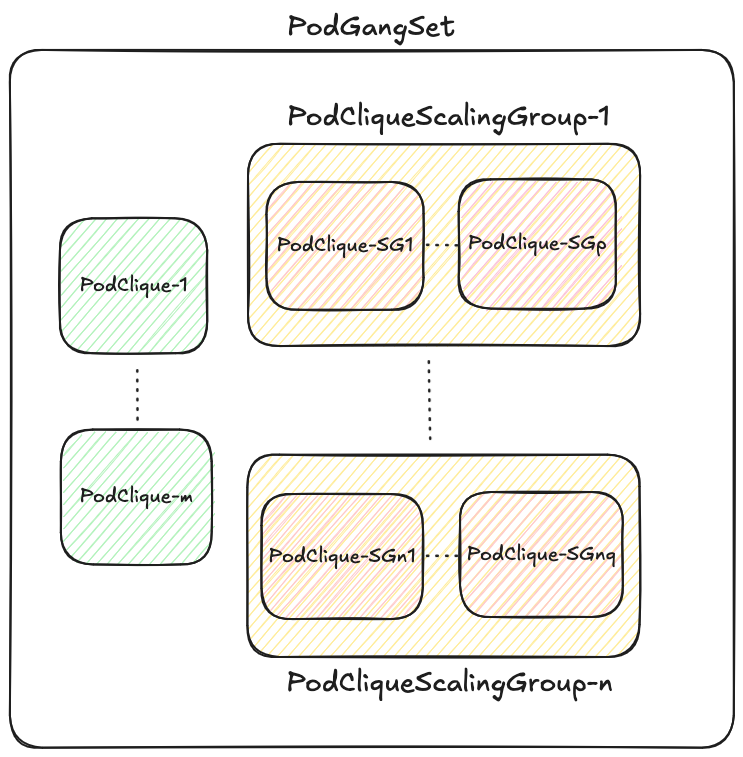

# Rolling Update

## Overview

`Grove` offers a hierarchical and a flexible API to define AI inference workloads. There are primarily three groupings, namely `PodGangSet`, `PodCliqueScalingGroup` and `PodClique` as depicted below.



Grove's rolling update mechanism is designed to maintain service availability while updating components of the AI inference workload. It implements a controlled, hierarchical update strategy that ensures minimal disruption to running services. The rolling update process follows a top-down approach, starting from the `PodGangSet` (PGS), through `PodCliqueScalingGroup`s (PCSG), down to individual `PodClique`s (PCLQ) and their constituent `Pod`s.

Rolling updates are triggered when there's a change in the specification of the `PodGangSet`. The updates are performed one replica at a time, ensuring that the minimum available replicas requirement is always met before moving on to the next replica, at each level of the resource hierarchy.

## Abbreviations

We will be using the following `short-names` in the document for brevity:

| Abbreviation / Short Name | Long Form / Description                                      |
| ------------------------- | ------------------------------------------------------------ |
| PGS                       | PodGangSet                                                   |
| PCLQ                      | PodClique                                                    |
| PCSG                      | PodCliqueScalingGroup                                        |
| PCLQ-S                    | Standalone PodClique, is a PodClique that is not associated to any PodCliqueScalingGroup |
| PCLQ-G                    | PodClique that is associated to a PodCliqueScalingGroup      |

## Requirements

Rolling update is an evolving feature. In the initial version of rolling updates following are the requirements:

* `Scale` subresource has been exposed for PGS, PCLQ-S and PCSG. Scale-in and Scale-out at all levels should be supported during rolling update.
* Availability is paramount for deployed AI workloads. It is therefore advised that multiple replica deployments for each of PGS, PCLQ and PCSG have more than one replica. Keeping availability in view folling requirements are defined:
  * Only one PGS replica should be updated at a time. If update of the currently updating replica is not complete then the rolling update will get paused till the time the criteria for update completion is met.
  * For PCSG and PCLQ:
    * During the rolling update if there are any replicas in `Pending` or in `Unhealthy` state then they should be force updated and rolling update should not wait for them to be ready.
    * Only one ready replica should be updated at a time. The update of each replica is done by recreating the entire replica. Rolling update must progress to the next replica only when the criter for update completion for a replica is met.
* Partial rolling updates for the PGS should be supported. Since each `PodClique` can have a different `PodSpec`, it is possible that updates are only available for a subset of `PodClique`s in a `PodGangSet`. Since each PodClique can utilize large number of GPUs (e.g. wide-EP deployment), relinquishing GPU resources (which are scarce resource) for PodCliques that have no updates is not desirable as it can lead to unexpected and longer unavailability.
* It can take a long time (from seconds to several minutes) to update each constituent `Pod`.  Thus it is important that the update progress be indicated via appropriate custom resource status fields.

## How to identify if there are pending updates?

Grove uses a generation-based approach to track changes and identify when resources need to be updated. This is implemented through generation hashes that are computed and propagated through the resource hierarchy.

### Generation Hash

When a change is made to a PodGangSet (PGS) specification, a new `CurrentGenerationHash` is computed and stored in the PGS status. This hash represents the current desired state of the PGS and all its child resources.

The generation hash is propagated down the resource hierarchy:

1. PodGangSet (PGS) computes and stores its `CurrentGenerationHash` based on its specification
2. PodClique (PCLQ) and PodCliqueScalingGroup (PCSG) receive this hash through their `CurrentPodGangSetGenerationHash` field
3. Additionally, each resource computes its own template hash:
   * PCLQs have a `CurrentPodTemplateHash` that reflects their pod template specification
   * PCSGs track the pod template hash for each PCLQ they manage

### Identifying Pending Updates

An update is considered pending when:

1. For a PGS: When its specification changes, causing a new `CurrentGenerationHash` to be generated
2. For a PCSG: When either the PGS generation hash changes or the PCSG's own specification changes
3. For a PCLQ: When either the PGS generation hash changes or the PCLQ's pod template changes

The system identifies resources requiring updates by comparing their current hash with the expected hash. For example:

```go
// For PodClique updates
isPCLQUpdateComplete(&pclq, *pgs.Status.CurrentGenerationHash)

// For PCSG updates
componentutils.IsPCSGUpdateComplete(&pcsg, *pgs.Status.CurrentGenerationHash)
```

This hashing mechanism ensures that only resources with actual changes are updated, allowing for partial updates within the resource hierarchy.

## Tracking Rolling Update Progress

Grove tracks rolling update progress through the `RollingUpdateProgress` field added to the status of each resource type (PGS, PCSG, and PCLQ). This allows users to monitor the update progress and helps the controllers manage the update process.

### RollingUpdateProgress Structure

Each resource type implements its own variation of the `RollingUpdateProgress` structure:

#### PodGangSet (PGS) RollingUpdateProgress

```go
// In PodGangSet Status
RollingUpdateProgress *PodGangSetRollingUpdateProgress

// Structure
type PodGangSetRollingUpdateProgress struct {
    UpdateStartedAt *metav1.Time
    UpdateEndedAt *metav1.Time
    CurrentlyUpdating *PodGangSetReplicaRollingUpdateProgress
    UpdatedPodCliques []string
    UpdatedPodCliqueScalingGroups []string
}

type PodGangSetReplicaRollingUpdateProgress struct {
    ReplicaIndex int32
    UpdateStartedAt metav1.Time
}
```

#### PodCliqueScalingGroup (PCSG) RollingUpdateProgress

```go
// In PodCliqueScalingGroup Status
RollingUpdateProgress *PodCliqueScalingGroupRollingUpdateProgress

// Structure
type PodCliqueScalingGroupRollingUpdateProgress struct {
    UpdateStartedAt *metav1.Time
    UpdateEndedAt *metav1.Time
    ReadyReplicaIndicesSelectedToUpdate *PodCliqueScalingGroupReplicaRollingUpdateProgress
}

type PodCliqueScalingGroupReplicaRollingUpdateProgress struct {
    Current int32
    Completed []int32
}
```

#### PodClique (PCLQ) RollingUpdateProgress

```go
// In PodClique Status
RollingUpdateProgress *PodCliqueRollingUpdateProgress

// Structure
type PodCliqueRollingUpdateProgress struct {
    UpdateStartedAt *metav1.Time
    UpdateEndedAt *metav1.Time
    ReadyPodsSelectedToUpdate *PodsSelectedToUpdate
}

type PodsSelectedToUpdate struct {
    Current string
    Completed []string
}
```

### When Updates Are Considered Complete

#### PGS Replica Update Completion

A PGS replica update is considered complete when all of its constituent PCLQs and PCSGs have been updated:

```go
progress.done = len(progress.updatedPCLQFQNs) == len(componentutils.GetPodCliqueFQNsForPGSReplicaNotInPCSG(pgs, pri.replicaIndex)) &&
    len(progress.updatedPCSGFQNs) == len(pgs.Spec.Template.PodCliqueScalingGroupConfigs)
```

The controller tracks each PCLQ and PCSG that has been successfully updated and compares it with the expected resources for that PGS replica.

#### PCSG Replica Update Completion

A PCSG replica update is considered complete when all of its constituent PCLQs have been updated to the new template:

```go
isCurrentReplicaUpdateComplete(sc) {
    // ...checks if all PCLQs for the replica have the new PodTemplateHash
    // and the PGS generationHash, and are ready
}
```

#### PCLQ Update Completion

A PCLQ update is considered complete when:

1. The current pod being updated is no longer present (deleted)
2. New pods with the updated template hash have been created
3. The number of ready pods with the new template hash is greater than or equal to the number of pods that were selected for update

```go
isCurrentPodUpdateComplete(sc *syncContext, work *updateWork) bool {
    // Check if the currently updating pod is deleted
    // Check if enough new pods are ready with the new template hash
}
```

### Update Initialization and Completion

* **Initialization**: The rolling update is initialized when a change is detected in the resource specification that affects the generation hash.
* **Completion**:
  * For PCLQ: The update is marked complete when all pods have the new template hash and are ready.
  * For PCSG: The update is complete when all its replica PCLQs have been updated.
  * For PGS: The update is complete when all its replicas (both standalone PCLQs and PCSGs) have been updated.

In each case, the `UpdateEndedAt` timestamp is set in the status to indicate completion.

### Detecting Stuck Updates

A rolling update may become stuck in the following scenarios:

1. **Resource Unavailability**: When there aren't enough resources (e.g., GPUs) to create new pods while old ones are still running.
2. **MinAvailable Constraint**: When the system can't delete older pods because the number of ready pods would fall below `MinAvailable`.
3. **Pod Scheduling Issues**: When new pods fail to schedule due to node affinity, taints, or other constraints.

You can identify stuck updates by:

1. Checking if `RollingUpdateProgress.UpdateEndedAt` remains `nil` for an extended period.
2. Examining if `CurrentlyUpdating` (PGS) or `ReadyReplicaIndicesSelectedToUpdate` (PCSG) or `ReadyPodsSelectedToUpdate` (PCLQ) remains unchanged for a long time.
3. Checking pod events and logs to identify scheduling or resource issues.

## Order in which resources are selected for update

Grove applies specific prioritization logic at each level of the hierarchy to determine the optimal order for updating replicas. This ensures that the system maintains maximum availability while efficiently progressing through the update.

### PodGangSet (PGS) Replica Selection

When selecting which PGS replica to update next, the system follows this priority order:

```go
func orderPGSReplicaInfoForPGS(pgs *grovecorev1alpha1.PodGangSet, minAvailableBreachedPGSReplicaIndices []int) func(a, b pgsReplicaInfo) int {
    // Priority order:
    // 1. Replicas with no scheduled pods
    // 2. Replicas with minAvailableBreached condition (but terminationDelay not expired)
    // 3. Healthy replicas in reverse ordinal order (higher indices first)
}
```

The selection logic prioritizes:

1. **Replicas with no scheduled pods**: These are updated first since they're not serving traffic
2. **Replicas with MinAvailable breach**: Replicas that don't meet their minimum availability requirements but haven't reached their termination delay are updated next
3. **Healthy replicas**: If all replicas are healthy, they're updated in reverse ordinal order (highest index first)

### PodCliqueScalingGroup (PCSG) Replica Selection

For PCSG replicas, the update prioritization follows:

1. **Pending replicas**: Replicas in pending state are immediately deleted for update
2. **Unavailable replicas**: Replicas that are scheduled but not ready are deleted next
3. **Ready replicas**: Only one ready replica is updated at a time, starting with the oldest one

The controller ensures that the PCSG's `MinAvailable` constraint is satisfied before selecting a ready replica for update:

```go
if pcsg.Status.AvailableReplicas < *pcsg.Spec.MinAvailable {
    // Pause update until MinAvailable constraint is satisfied
}
```

### PodClique (PCLQ) Pod Selection

Within a PodClique, pods are selected for update in the following order:

1. **Pods with old template hash in Pending state**: These are immediately deleted
2. **Pods with old template hash in Unhealthy state**: These are deleted next
3. **Pods with old template hash in Ready state**: Only one ready pod is updated at a time

Similar to PCSG, the PCLQ controller ensures the `MinAvailable` constraint is satisfied before updating a ready pod:

```go
if pclq.Status.ReadyReplicas < *pclq.Spec.MinAvailable {
    // Pause update until MinAvailable constraint is satisfied
}
```

For ready pods, the controller selects the oldest pod first (based on creation timestamp) to ensure consistent update behavior.

## Flow

### Actors Participating in Rolling Update

The rolling update process in Grove involves several controller components working together:

1. **PodGangSet Controller**: Manages the top-level update orchestration
2. **PodCliqueScalingGroup Controller**: Handles updates of PCLQs within a scaling group
3. **PodClique Controller**: Manages updates of pods within a clique
4. **Pod Lifecycle Management**: Kubernetes core controllers that handle pod creation and termination

### Update Flow Control

The rolling update follows a cascading pattern from top to bottom in the resource hierarchy:

#### 1. PodGangSet Update Initiated

When a PGS specification is updated:

1. The controller computes a new generation hash and stores it in the PGS status
2. The controller initializes `RollingUpdateProgress` with `UpdateStartedAt` timestamp
3. It selects the first PGS replica to update based on the prioritization logic
4. The selected replica index is stored in `RollingUpdateProgress.CurrentlyUpdating`

#### 2. PGS Replica Update Process

For each PGS replica being updated:

1. The controller identifies all PCLQs and PCSGs belonging to the replica
2. It tracks the update progress of all PCLQs and PCSGs within the replica
3. The update is considered complete when all PCLQs and PCSGs are updated
4. Once the current replica update is complete, the next replica is selected
5. When all replicas are updated, `UpdateEndedAt` is set in the PGS status

```go
func (r _resource) orchestrateRollingUpdate(ctx context.Context, logger logr.Logger, pgs *grovecorev1alpha1.PodGangSet, pgsIndicesToTerminate, minAvailableBreachedPGSReplicaIndices []int) error {
    // Compute pending update work
    // Update the currently updating replica if there is one
    // If current update is complete, pick the next replica
    // If no more replicas to update, mark update as complete
}
```

#### 3. PCSG Update Process

When a PCSG needs to be updated:

1. The controller identifies all replicas needing updates
2. It immediately deletes any pending or unavailable replicas
3. It selects one ready replica for update if available
4. The selected replica index is stored in `RollingUpdateProgress.ReadyReplicaIndicesSelectedToUpdate.Current`
5. The selected replica's PCLQs are deleted to trigger recreation with the new template
6. The controller waits until the replica is recreated and ready before selecting the next one

```go
func (r _resource) processPendingUpdates(logger logr.Logger, sc *syncContext) error {
    // Compute update work
    // Delete pending and unavailable replicas
    // Check if currently selected replica update is complete
    // Select next replica for update if available
    // Mark update as complete when all replicas are updated
}
```

#### 4. PCLQ Update Process

When a PCLQ needs to be updated:

1. The controller identifies pods with old template hash
2. It immediately deletes pending and unhealthy pods
3. It selects one ready pod for update if available
4. The selected pod name is stored in `RollingUpdateProgress.ReadyPodsSelectedToUpdate.Current`
5. The selected pod is deleted to trigger recreation with the new template
6. The controller waits until enough new pods are ready before selecting the next pod
7. The update is marked complete when all pods have the new template hash

```go
func (r _resource) processPendingUpdates(logger logr.Logger, sc *syncContext) error {
    // Compute update work
    // Delete pending and unhealthy pods
    // Check if currently selected pod update is complete
    // Select next pod for update if available
    // Mark update as complete when all pods are updated
}
```

This cascading update mechanism ensures that changes propagate through the system in a controlled manner while maintaining the availability requirements at each level of the hierarchy.
